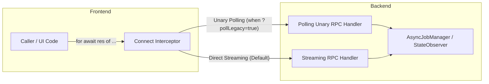

# Streaming & Polling API Design Guidelines in KHI

This skill provides guidelines and implementation patterns for creating Server-Side Streaming RPCs with transparent polling fallbacks in KHI (supporting non-streaming hosting environments like Google App Engine Standard).

---

## 1. High-Level Architecture Overview

To support environments where Server-Side Streaming is unavailable, KHI defines paired RPCs in Protobuf and uses a client-side Connect Interceptor to map streaming calls to polling Unary calls transparently.



---

## 2. API Classification & Naming Conventions

Streaming RPCs in KHI fall into two distinct categories:

### A. State Observation (Watch-style)

Monitors an ongoing state or resource without triggering background computation.

- **Streaming RPC**: `Watch<Resource>` (e.g., `WatchPopup`, `WatchServerStat`, `WatchInspections`, `WatchIndexProgress`).
- **Polling RPC**: `Pull<Resource>` (e.g., `PullPopup`, `PullServerStat`, `PullInspections`, `PullIndexProgress`).
- **Semantics**: Returns the current snapshot of the resource state.

### B. Heavy Processing / Job Execution (Job-style)

Initiates a long-running, CPU/IO-heavy calculation or session-loading task.

- **Streaming RPC**: `<Action>` (e.g., `OpenWorkbench`, `FilterTimeline`).
- **Polling RPC**: `<Action>Sync` (e.g., `OpenWorkbenchSync`, `FilterTimelineSync`).
- **Cancellation RPC**: `Cancel<Action>Sync` (e.g., `CancelOpenWorkbenchSync`, `CancelFilterTimelineSync`).
- **Request Parameters**:
  - Initial poll: `job_id = ""` plus request payload (parameters, queries).
  - Subsequent polls: `job_id = "<returned_id>"`.
- **Response Parameters**:
  - `job_id`: Identifier for subsequent poll requests.
  - `is_done`: Boolean indicating task completion.
  - `progress`: Optional intermediate progress message.
  - `result`: Optional final result payload (populated when `is_done = true`).
  - `error_message`: Populated if the background job failed.

---

## 3. Backend Implementation Patterns

Utility packages for state observation and async jobs reside in `pkg/server/streamingutil/`.

### A. Snapshot Observation (`streamingutil.StateObserver`)

Use `StateObserver[T]` when subscribers need to be notified of atomic state changes:

```go
observer := streamingutil.NewStateObserver[MyState](initialState)

// Update state
observer.SetState(newState)

// Poll current state
current := observer.GetState()

// Subscribe for changes (used in streaming RPC)
ch, unsubscribe := observer.Subscribe()
defer unsubscribe()
```

### B. Long-Running Job Execution (`streamingutil.AsyncJobManager`)

Use `AsyncJobManager` when managing background tasks:

```go
mgr := streamingutil.NewAsyncJobManager()
defer mgr.Close() // Cancels all running jobs and evicts finished jobs
```

#### Key Lifecycle Management Rules

1. **Abandonment Timeout**:
   - If a client abruptly stops polling (e.g., network drop, tab closed without cancellation), the job's context is canceled after a timeout (default 15 seconds) to prevent CPU resource leaks.
2. **TTL Eviction**:
   - After a job reaches completion or error, its cached result is evicted via `ttlcleaner.TTLCleaner` (default 1 minute) to free memory.
3. **Superceded Job Cancellation**:
   - When a new request arrives for the same manager/session with `job_id == ""`, any currently active job in that manager is immediately canceled.
4. **Independent Job Context**:
   - In polling mode, HTTP request contexts are short-lived. Always run background jobs under a detached context (`context.WithCancel(context.Background())`), tied to the job's cancellation lifecycle.

---

## 4. Frontend Connect Interceptor Pattern

Located in `web/src/app/services/api/legacy-polling.interceptor.ts`.

### A. Transparent Streaming Adapter

The interceptor detects `req.stream === true` and wraps polling unary calls into an `AsyncIterable<Message>`:

```ts
return {
  stream: true,
  service: req.service,
  method: req.method,
  header: new Headers(),
  trailer: new Headers(),
  message: adapter(req, unaryTransport),
};
```

This guarantees zero code changes at the client call-sites (`for await (const res of client.openWorkbench(...))`).

### B. Extracting the Initial Request Message

> [!WARNING]
> Do NOT use `for await (const msg of req.message) { return msg; }`.
> Returning early from `for await` triggers the iterator `return()` protocol. In Angular/esbuild environments, Connect wraps unary inputs in `[input]`, whose iterator does not implement `.return()`, resulting in `TypeError: obj[k] is not a function`.
>
> **Always use direct iterator access**:
>
> ```ts
> const iterator = iterable[Symbol.asyncIterator]();
> const res = await iterator.next();
> if (res.done || res.value === undefined) {
>   throw new Error("No request message received.");
> }
> return res.value;
> ```

### C. Automatic Cancellation on Client Abort

Inside async generator adapters, always wire up cancellation in a `finally` block when `req.signal.aborted` is true:

```ts
try {
  while (!req.signal.aborted) {
    const res = await wbClient.filterTimelineSync(...);
    yield ...;
    if (res.isDone) return;
    await delay(300, req.signal);
  }
} finally {
  if (req.signal.aborted && jobId) {
    void wbClient.cancelFilterTimelineSync({ workbenchId, jobId });
  }
}
```

### D. Mode Toggling

Legacy polling mode is activated via:

- URL query parameter: `?pollLegacy=true` (for testing and debugging).
- Environment flag: `environment.usePollingLegacy` (in `environment.ts` / `environment.prod.ts`).
