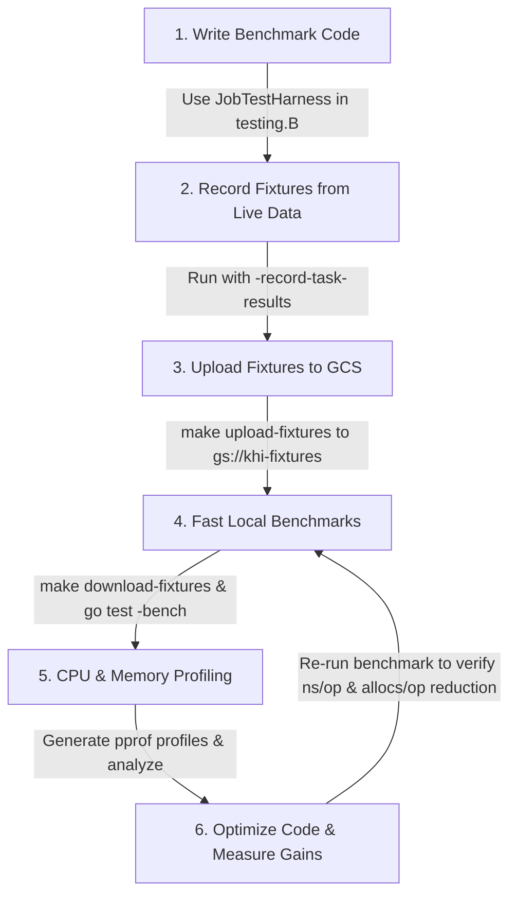

# KHI Task Benchmark & Performance Profiling Guidelines

This guide outlines how to write, record, replay, benchmark, and profile tasks in KHI using the `taskrecord` utility (`pkg/testutil/taskrecord`).

---

## 1. Overview & Workflow

KHI inspection jobs run as a DAG (Directed Acyclic Graph) of concurrent tasks. To optimize or benchmark a specific task (such as a Log Ingester, Log Grouper, or Timeline Mapper), you should isolate it from external network dependencies (e.g. Cloud Logging API calls) and background task concurrency noise.

The `taskrecord` framework provides a **Record & Replay** mechanism tailored for Go microbenchmarks:



> [!IMPORTANT]
> **Benchmarking Only (`testing.B`):**
> Test fixtures and `JobTestHarness` are intended specifically for local developer benchmarks (`Benchmark*`) and performance analysis. Standard unit tests (`Test*`) must NOT depend on external fixture files.

---

## 2. Quickstart: Benchmark Boilerplate

Here is the standard copy-pasteable pattern for benchmarking any KHI task:

```go
package mypackage_impl

import (
 "context"
 "testing"

 coreinspection "github.com/GoogleCloudPlatform/khi/pkg/core/inspection"
 "github.com/GoogleCloudPlatform/khi/pkg/core/inspection/logger"
 "github.com/GoogleCloudPlatform/khi/pkg/core/task/taskid"
 "github.com/GoogleCloudPlatform/khi/pkg/generated"
 inspectioncore_contract "github.com/GoogleCloudPlatform/khi/pkg/task/inspection/inspectioncore/contract"
 "github.com/GoogleCloudPlatform/khi/pkg/testutil/taskrecord"

 // Import task contracts required by your pipeline
 mycontract "github.com/GoogleCloudPlatform/khi/pkg/task/inspection/mypackage/contract"
)

// setupInspectionServer initializes the test server with all required plugins registered.
func setupInspectionServer(t testing.TB) *coreinspection.InspectionTaskServer {
 t.Helper()
 logger.InitGlobalKHILogger()
 ioConfig, err := inspectioncore_contract.NewIOConfigForTest()
 if err != nil {
  t.Fatalf("failed to create ioConfig: %v", err)
 }
 server, err := coreinspection.NewServer(ioConfig)
 if err != nil {
  t.Fatalf("failed to create server: %v", err)
 }

 // Register all inspection tasks into the server
 if err := generated.RegisterAllInspectionTasks(server); err != nil {
  t.Fatalf("failed to register tasks: %v", err)
 }
 return server
}

// getJobTestConfig defines the pipeline parameters, recorded upstream tasks, and target task.
func getJobTestConfig() *taskrecord.JobTestConfig {
 return &taskrecord.JobTestConfig{
  InspectionType: "gke", // ID of the target inspection type
  InspectionFeatures: []string{
   "khi.google.com/my-feature-id",
  },
  InspectionValues: map[string]any{
   "cloud.google.com/common/input-duration":   "4h",
   "cloud.google.com/common/input-end-time":   "2026-02-18T09:53:08Z",
   "cloud.google.com/common/input-project-id": "my-test-project",
   "cloud.google.com/k8s/input-cluster-name":  "my-cluster",
   "timezoneShift":                            "0",
  },
  RecordedTasks: []taskid.UntypedTaskReference{
   upstreamLogTaskID.Ref(), // Upstream tasks to cache (e.g. log query task)
  },
  TargetTask: mycontract.MyTargetTaskID.Ref(), // Single task to benchmark
 }
}

func BenchmarkMyTask(b *testing.B) {
 server := setupInspectionServer(b)
 cfg := getJobTestConfig()
 harness := taskrecord.NewJobTestHarness(b, server, cfg)

 // Step 1: Record Mode (Captures live upstream task output to JSON fixture)
 if harness.IsRecordMode() {
  if _, err := harness.Run(context.Background()); err != nil {
   b.Fatalf("failed to record fixture: %v", err)
  }
  return
 }

 // Step 2: Replay Mode (Injects fixture stubs and benchmarks TargetTask repeatedly)
 b.ResetTimer()
 b.ReportAllocs()
 for b.Loop() {
  _, err := harness.Run(context.Background())
  if err != nil {
   b.Fatalf("failed to run target task: %v", err)
  }
 }
}
```

---

## 3. Practical Task Recipes

### Recipe A: Benchmarking a Log Ingester or Log Grouper Task

When measuring the performance of a log ingester or grouper task:

1. Set `RecordedTasks` to the upstream log query task (e.g. `GCPK8sAuditLogListLogEntriesTaskID.Ref()`).
2. Set `TargetTask` to the `LogIngesterTaskID.Ref()` or `LogGrouperTaskID.Ref()`.

```go
func getAuditLogIngesterConfig() *taskrecord.JobTestConfig {
 return &taskrecord.JobTestConfig{
  InspectionType: googlecloudclustergke_contract.InspectionTypeID,
  InspectionFeatures: []string{
   "khi.google.com/k8s-common-auditlog/k8s-auditlog-parser-tail#gcp",
  },
  InspectionValues: map[string]any{
   "cloud.google.com/common/input-duration":   "4h",
   "cloud.google.com/common/input-end-time":   "2026-02-18T09:53:08Z",
   "cloud.google.com/common/input-location":   "us-central1-a",
   "cloud.google.com/common/input-project-id": "khi-testing-with-auditlog",
   "cloud.google.com/common/input-query-resource-names/cloud.google.com/log/k8s-audit/audit-list-log-entries": "projects/khi-testing-with-auditlog",
   "cloud.google.com/k8s/input-cluster-name": "p0-gke-basic-1",
   "cloud.google.com/k8s/input-kinds":        []any{"@default"},
   "cloud.google.com/k8s/input-namespaces":   []any{"@all_cluster_scoped", "@all_namespaced"},
  },
  RecordedTasks: []taskid.UntypedTaskReference{
   googlecloudlogk8saudit_contract.GCPK8sAuditLogListLogEntriesTaskID.Ref(),
  },
  TargetTask: commonlogk8saudit_contract.K8sAuditLogIngesterTaskID.Ref(),
 }
}
```

---

### Recipe B: Benchmarking a Timeline Mapper Task

To benchmark a timeline mapper:

1. Put the upstream log query or ingester task in `RecordedTasks`.
2. Set `TargetTask` to your mapper task reference.

```go
func getTimelineMapperConfig() *taskrecord.JobTestConfig {
 return &taskrecord.JobTestConfig{
  InspectionType: googlecloudclustergke_contract.InspectionTypeID,
  InspectionFeatures: []string{
   "khi.google.com/k8s-common-auditlog/k8s-auditlog-parser-tail#gcp",
  },
  InspectionValues: map[string]any{
   // ...
  },
  RecordedTasks: []taskid.UntypedTaskReference{
   googlecloudlogk8saudit_contract.GCPK8sAuditLogListLogEntriesTaskID.Ref(),
  },
  TargetTask: commonlogk8saudit_contract.PodTimelineMapperTaskID.Ref(),
 }
}
```

---

### Recipe C: Handling Custom / Non-Log Task Return Types & Custom Codecs

`taskrecord` automatically resolves the return type `T` of any recorded task directly from the task definitions registered in `server.RootTaskSet` (such as via `generated.RegisterAllInspectionTasks(server)`). Standard Go types (e.g. `[]*log.Log`, `[]string`, `map[string]any`, or custom structs) require no manual type registration.

If a task result requires specialized serialization logic (instead of standard JSON marshalling):

1. Implement the `taskrecord.TaskResultCodec` interface.
2. Register the codec via `taskrecord.RegisterCodec[MyCustomData](myCodec)`.

```go
func init() {
 // Optional: register custom codec for specialized serialization
 taskrecord.RegisterCodec[MyCustomData](&MyCustomCodec{})
}
```

---

## 4. Command Cheat Sheet & Workflows

### Step 1: Download Existing Fixtures from GCS

Before running benchmarks locally, download cached fixtures without needing Cloud Logging credentials:

```bash
make download-fixtures
```

### Step 2: Record a New Fixture from Live GCP Data

When creating a new benchmark or updating dataset fixtures, run with `-record-task-results` (requires GCP credentials):

```bash
go test -bench=BenchmarkMyTask -record-task-results ./pkg/task/inspection/mypackage/impl/...
# Alternatively using environment variable:
KHI_RECORD_TASK_RESULTS=1 go test -bench=BenchmarkMyTask ./pkg/task/inspection/mypackage/impl/...
```

This saves JSON fixtures into `pkg/.../impl/testdata/fixtures/BenchmarkMyTask/<TaskRefID>.json`.

### Step 3: Upload New Fixtures to GCS

Sync your newly recorded fixtures to `gs://khi-fixtures` to share with the team and CI:

```bash
make upload-fixtures
```

### Step 4: Run Fast Local Microbenchmarks

Run the benchmark repeatedly offline:

```bash
go test -bench=BenchmarkMyTask -benchmem -run=^$ ./pkg/task/inspection/mypackage/impl/...
```

Example output:

```text
BenchmarkMyTask-12           48   24856012 ns/op  5148016 B/op    42890 allocs/op
```

### Step 5: CPU Profiling

Generate a CPU profile (`pprof/<BenchmarkName>/cpu.pprof`) strictly during `TargetTask` execution:

```bash
go test -bench=BenchmarkMyTask -task-cpuprofile -run=^$ ./pkg/task/inspection/mypackage/impl/...
```

Analyze via interactive Web UI:

```bash
go tool pprof -http=:8080 ./pprof/BenchmarkMyTask/cpu.pprof
```

### Step 6: Memory / Heap Allocation Profiling

Generate a heap profile (`pprof/<BenchmarkName>/mem.pprof`) strictly after `TargetTask` execution:

```bash
go test -bench=BenchmarkMyTask -task-memprofile -run=^$ ./pkg/task/inspection/mypackage/impl/...
```

Analyze memory allocation hotspots:

```bash
go tool pprof -http=:8080 -sample_index=alloc_space ./pprof/BenchmarkMyTask/mem.pprof
```

---

## 5. `JobTestConfig` Configuration Guide

| Field | Purpose | Recommendation |
| :--- | :--- | :--- |
| `InspectionType` | Specifies the inspection pipeline ID. | Use the ID from contract (e.g. `googlecloudclustergke_contract.InspectionTypeID`). |
| `InspectionFeatures` | List of feature IDs to enable. | Include only the features necessary for the target task to minimize setup overhead. |
| `InspectionValues` | Input parameters map passed to the inspection runner. | Set query duration, end-time, cluster name, and project ID matching the recording environment. |
| `RecordedTasks` | List of task references to record and replace with stubs. | Usually the upstream data fetcher task (e.g. `ListLogEntriesTaskID`). |
| `TargetTask` | The single task under test. | Set to the specific task you are measuring. Enables isolated execution, exclusive pprof profiling, and early cancellation. |

---

## 6. Troubleshooting & FAQ

### `failed to read fixture file: open testdata/fixtures/.../xxx.json: no such file or directory`

- **Cause:** The JSON fixture file has not been downloaded or recorded yet.
- **Solution:** Run `make download-fixtures` to pull cached fixtures from GCS, or run `go test -bench=BenchmarkMyTask -record-task-results` with live credentials.

### `TargetTask executed with context.Canceled error`

- **Cause:** When `TargetTask` finishes, `JobTestHarness` intentionally cancels the inspection runner to prevent running downstream tasks.
- **Solution:** This is normal behavior. `JobTestHarness` catches `context.Canceled` and returns the target task results cleanly.

### `Large JSON fixtures causing git / jj warnings`

- **Cause:** Raw JSON logs can be 50MB+ in size.
- **Solution:** Fixture JSON files (`**/testdata/fixtures/**/*.json`) and pprof files (`pprof/`, `*.pprof`) are gitignored. Do not force-add them to git; use `make upload-fixtures` to store them in GCS.
