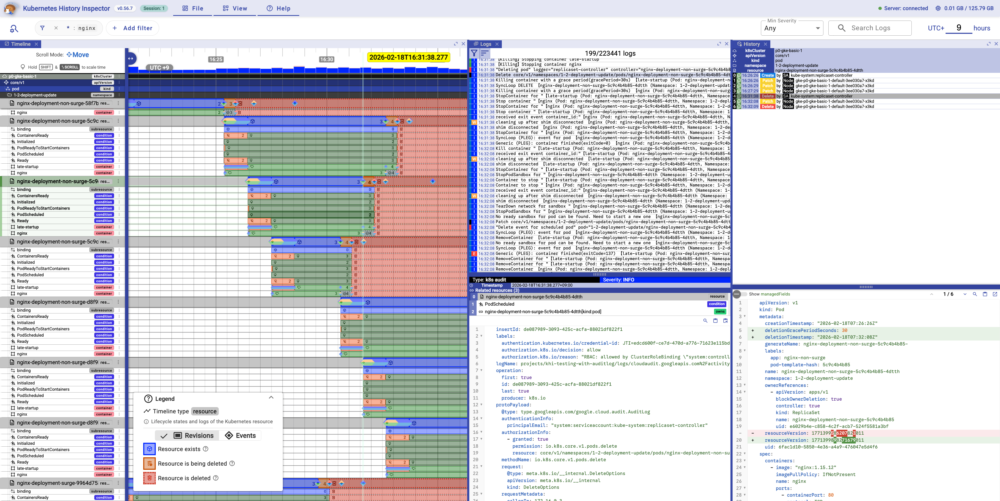
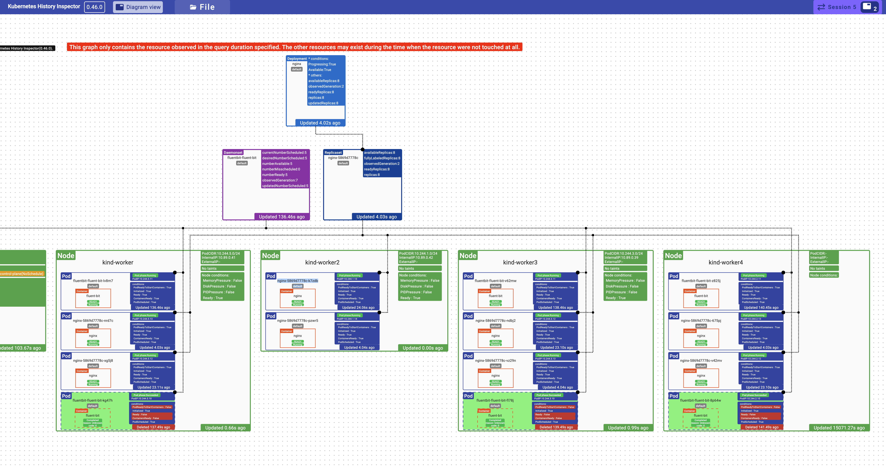
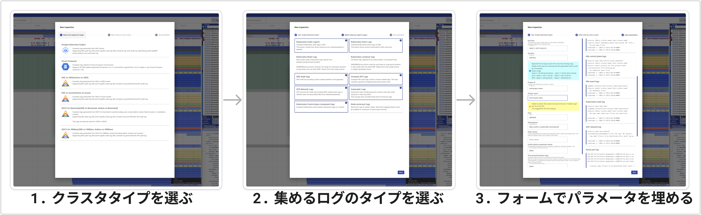

<p style="text-align: center;">
  <picture>
    <source media="(prefers-color-scheme: dark)" srcset="./docs/images/logo-dark.svg">
    
  </picture>
</p>

Language: [English](./README.md) | 日本語

<hr/>

# Kubernetes History Inspector

[](https://golang.org/doc/devel/release.html)
[](https://github.com/GoogleCloudPlatform/khi/blob/main/LICENSE)
[](https://github.com/GoogleCloudPlatform/khi/releases)

Kubernetes History Inspector (KHI) は、複雑なKubernetesのトラブルシューティングを強力にサポートするインタラクティブなログ可視化ツールです。

|タイムラインビュー|クラスタダイアグラム|
|---|---|
|||
|監査ログ等から特定期間の複数リソースに対する変更、ステータス等の遷移をわかりやすくタイムライン、差分として表示。|kube-apiserverの監査ログから復元した特定タイミングのリソースの関係性をわかりやすく可視化。|

## ✨ KHIの特徴

### 📊 直感的なログの可視化 (Rich Visualization)
従来のテキストベースのログ分析とは異なり、各リソースのアクティビティを**タイムラインベースのグラフ**として可視化します。
*   **一目で把握**: 複数のリソースを横断したイベントの流れを視覚的に理解。
*   **詳細な深掘り**: 特定の瞬間の生ログ（テキスト形式）や、イベント発生時の YAML マニフェストの差分（Diff）もシームレスに確認可能。
*   **トポロジーの把握**: 特定時点におけるクラスタのリソース状態と関係性を示す「クラスタダイアグラム」の生成。

### 🚀 エージェントレスで簡単導入 (Agentless & Easy Setup)
*   対象の Kubernetes クラスタに**エージェントをインストールする必要はありません**。
*   複雑な事前設定なしで、誰でもすぐに使い始めることができます。
*   ログの取得は GUI 操作で完結し、複雑なクエリの記述は不要です。



### 💡 プロの知見を凝縮 (Built from Real Experience)
Google Cloud のサポートエンジニアが、日々の Kubernetes トラブルシューティング業務で直面した課題を解決するために開発されました。現場の深い専門知識がツールに組み込まれています。

## 🚀 クイックスタート

KHI は Docker があればすぐに使い始めることができます。

1. 以下のコマンドを実行します。
```bash
docker run -p 127.0.0.1:8080:8080 gcr.io/kubernetes-history-inspector/release:latest
```
2. ブラウザで `http://localhost:8080` を開きます。

> **Note:** メタデータサーバが利用できないローカル環境などで Google Cloud の認証情報をマウントして実行する方法や、その他の詳細な起動方法については [Getting Started](/docs/en/tutorial/getting-started.md) をご参照ください。

## 📚 ドキュメント

より詳細な設定や情報については、以下のドキュメントを参照してください。

*   [**ユーザーガイド**](/docs/ja/visualization-guide/user-guide.md) - 基本的な操作方法
*   [**よくあるトラブル (Troubleshooting)**](/docs/ja/troubleshooting.md) - 画面が正しく表示されない等の問題が発生した場合
*   [**マネージド環境毎の設定**](/docs/ja/setup-guide/managed-environments.md) - Google Cloud (GKE) 環境等での IAM 権限や監査ログの推奨設定
*   [**OSS Kubernetesクラスタのログの可視化 (Loki)**](/docs/ja/setup-guide/oss-kubernetes-clusters.md) - 独自クラスタ等からのログの読み込み方法
*   [**KHIプロジェクトへの貢献**](/docs/en/development-contribution/contributing.md) - ソースコードからのビルド・開発ガイド

## ⚠️ 免責事項

KHI は Google Cloud の公式製品ではございません。不具合のご報告や機能に関するご要望がございましたら、お手数ですが当リポジトリの[Github issues](https://github.com/GoogleCloudPlatform/khi/issues/new?template=Blank+issue)にご登録ください。可能な範囲で対応させていただきます。