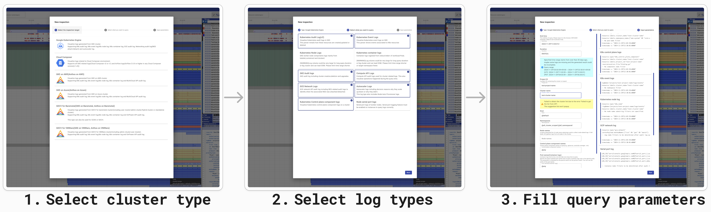

<p style="text-align: center;">
  <picture>
    <source media="(prefers-color-scheme: dark)" srcset="./docs/images/logo-dark.svg">
    
  </picture>
</p>

Language: English | [日本語](./README.ja.md)

<hr/>

# Kubernetes History Inspector

[](https://golang.org/doc/devel/release.html)
[](https://github.com/GoogleCloudPlatform/khi/blob/main/LICENSE)
[](https://github.com/GoogleCloudPlatform/khi/releases)

Kubernetes History Inspector (KHI) is a rich log visualization tool that powerfully supports troubleshooting complex issues spanning multiple components within your Kubernetes clusters.

|Timeline view|Cluster diagram view|
|---|---|
|||
|Timeline view visualizes resource status change timings with timeline charts and manifest diffs from Kubernetes audit logs.|Cluster diagram visualizes relationships among Kubernetes resources, solely from kube-apiserver audit logs.|

## ✨ Features

### 📊 Insightful Log Visualization

Unlike traditional text-based log analysis, KHI visualizes numerous activities associated with each Kubernetes resource as **timeline-based graphs**.
*   **Grasp at a glance**: Visually understand the flow of events across multiple resources.
*   **Deep dive**: Review raw log data in text format for a specific moment, or seamlessly examine YAML manifest differences (diffs) when an event occurred.
*   **Topology insight**: Generate "Cluster Diagrams" that depict the state of your resources and their relationships at a specific point in time.

### 🚀 Agentless & Easy Setup

*   **No agents to install** on your target Kubernetes clusters.
*   Anyone can easily begin using it without any complicated prior setup.
*   Retrieve logs through intuitive GUI operations—no complex queries or commands needed.



### 💡 Developed from Real Troubleshooting Experience

Originally developed by the Google Cloud Support team, KHI emerged from the practical experience of engineers analyzing Kubernetes logs daily. It encapsulates their deep expertise in troubleshooting.

## 🚀 Quick Start

You can quickly start using KHI if you have Docker installed.

1. Run the following command:
```bash
docker run -p 127.0.0.1:8080:8080 gcr.io/kubernetes-history-inspector/release:latest
```
2. Open `http://localhost:8080` in your web browser.

> **Note:** For more detailed instructions, including how to mount Application Default Credentials (ADC) if you are running locally without a metadata server, please see the [Getting Started](/docs/en/tutorial/getting-started.md) guide.

## 📚 Documentation

For detailed configurations and comprehensive guides, refer to the following documents:

*   [**User Guide**](/docs/en/visualization-guide/user-guide.md) - Basic operations and visualization features.
*   [**Troubleshooting**](/docs/en/troubleshooting.md) - Solutions for common issues, such as timelines not rendering correctly.
*   [**Settings for Managed Environments**](/docs/en/setup-guide/managed-environments.md) - Recommended IAM permissions and Audit Logging setups for Google Cloud (GKE) and others.
*   [**Using KHI with OSS Kubernetes Clusters (Loki)**](/docs/en/setup-guide/oss-kubernetes-clusters.md) - How to load logs from custom or self-managed clusters.
*   [**Contribution Guide**](/docs/en/development-contribution/contributing.md) - Instructions for building from source and contributing to the project.

## ⚠️ Disclaimer

Please note that this tool is not an officially supported Google Cloud product. If you find any issues or have a feature request, please [file a Github issue on this repository](https://github.com/GoogleCloudPlatform/khi/issues/new?template=Blank+issue). We are happy to check them on a best-effort basis.
