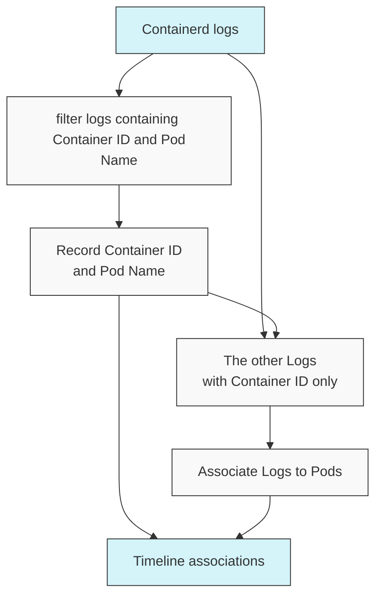

# Extending KHI

## The complexity in log visualization system

Before discussing how to extend KHI, let's explain the complexity inherent in log visualization systems.
KHI takes a large volume of logs as input and associates each log with one or more "events" or "revisions" on a timeline.
At first glance, this might seem like a simple function that takes a log as input and outputs an array of locations on timelines.

However, in reality, there are logs that cannot be associated without first examining other logs.

- The "revisions" of resources generated from PATCH requests cannot be reconstructed at that point without first parsing previous requests to restore the state of the resource.
- Container IDs included in Containerd logs cannot be linked to specific Pods without examining the logs that associate Pod names, which are only output once during Pod sandbox creation.
- IPs appearing in various logs can be associated with different resources depending on timing, and logs containing only IPs cannot be linked to resources without first parsing logs that confirm the association between resource names and IPs.

Linking a large volume of logs to resources in a meaningful way is a meticulous operation that requires dividing the logs into groups, parsing them in a predetermined order, and linking them to resources.
To efficiently handle these complex dependencies, KHI implements a system described by a unique DAG (Directed Acyclic Graph) that encompasses "generating input fields for user input," "generating log queries," "collecting logs," and "executing various parsers."

> Example: a sub-graph of DAG parsing containerd logs to associate these logs to pod names.

To learn how to extend KHI, you need to understand this DAG system.

