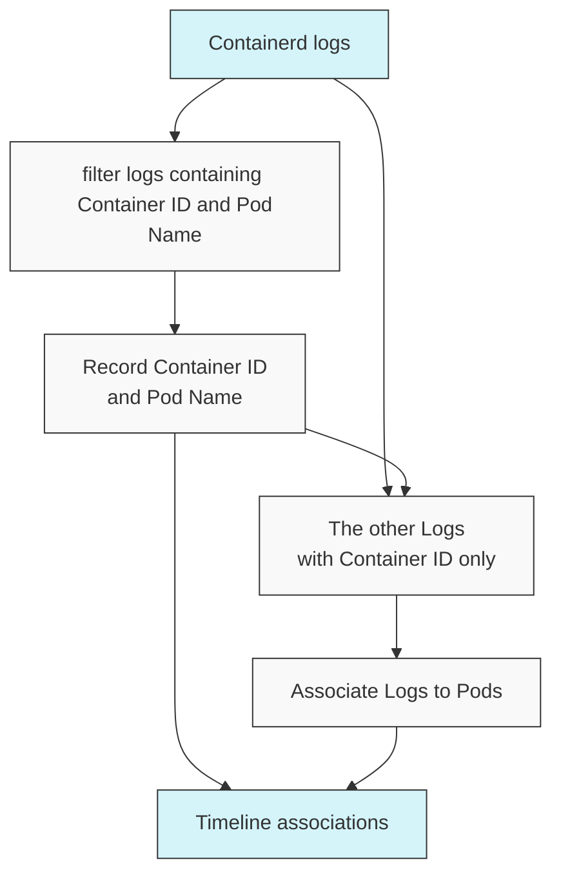
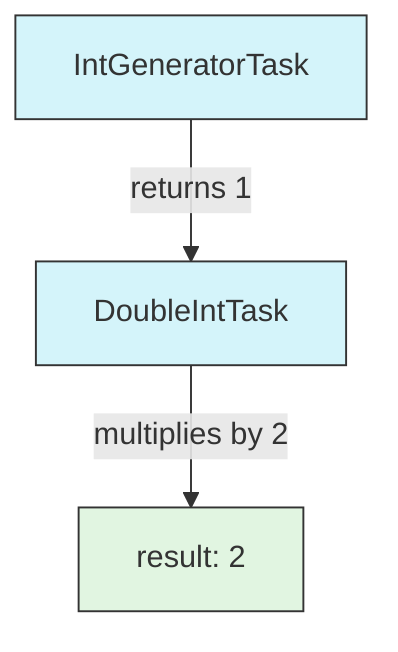
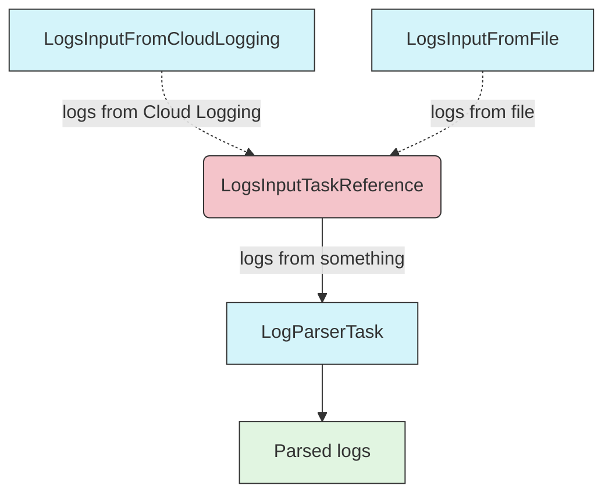

# KHI Task system concept

> [!WARNING]
> 🚧 This reference document is under construction. 🚧

## The complexity in log visualization system

Before discussing how to extend KHI, let's explain the complexity inherent in log visualization systems.
KHI takes a large volume of logs as input and associates each log with one or more "events" or "revisions" on a timeline.
At first glance, this might seem like a simple function that takes a log as input and outputs an array of locations on timelines.

However, in reality, there are logs that cannot be associated without first examining other logs.

- The "revisions" of resources generated from PATCH requests cannot be reconstructed at that point without first parsing previous requests to restore the state of the resource.
- Container IDs included in Containerd logs cannot be linked to specific Pods without examining the logs that associate Pod names, which are only output once during Pod sandbox creation.
- IPs appearing in various logs can be associated with different resources depending on timing, and logs containing only IPs cannot be linked to resources without first parsing logs that confirm the association between resource names and IPs.

Linking a large volume of logs to resources in a meaningful way is a meticulous operation that requires dividing the logs into groups, parsing them in a predetermined order, and linking them to resources.
To efficiently handle these complex dependencies, KHI implements a system described by a unique DAG (Directed Acyclic Graph) that encompasses "generating input fields for user input," "generating log queries," "collecting logs," and "executing various parsers."



> Example: a sub-graph of DAG parsing containerd logs to associate these logs to pod names.

To learn how to extend KHI, you need to understand this DAG system.

## Basic Forms Used in DAG

A Directed Acyclic Graph (DAG) is a graph that flows in one direction without cycles. In KHI's context, this represents a workflow where tasks are executed in a specific order based on their dependencies. Each node in the graph is a task, and edges represent dependencies between tasks.

### The task type

In the DAG task system used by KHI, each task is created to implement the `task.Definition[T]` interface.
(See `pkg/task/definition.go` for detailed implementation.)

This interface is defined roughly as the following type:
(In reality, elements where you don't need to worry about the TaskResult type are implemented in the `UntypedDefinition` interface, and there is a slightly more complex type definition to handle any `task.Definition[T]` uniformly, but the following fields are sufficient for a general understanding.)

```go
type Definition[TaskResult any] interface {
    // ID returns the unique identifier of the task.
	ID() taskid.TaskImplementationID[TaskResult]

    // Labels returns the labels associated with the task. KHI uses this value to various purpose(e.g document generation, filtering tasks by cluster types,...etc)
	Labels() *typedmap.ReadonlyTypedMap

    // Dependencies returns the IDs of tasks that needs to be done beforethis task.
	Dependencies() []taskid.UntypedTaskReference

    // Run is the actual function called to run this task.
    Run(ctx context.Context) (TaskResult, error)
}
```

Normally, you don't need to implement this interface directly. You can create a task using the task.NewTask function.
For example, let's say there is an IntGeneratorTask that generates a fixed integer value and a DoubleIntTask that doubles the value from the previous task.

```go
var IntGeneratorTaskID = taskid.NewDefaultImplementationID[int]("example.khi.google.com/int-generator")
var DoubleIntTaskID = taskid.NewDefaultImplementationID[int]("example.khi.google.com/double-int")

var IntGeneratorTask = task.NewTask(IntGeneratorTaskID,[]taskid.UntypedTaskReference{}, func(ctx context.Context) (int, error){
    return 1, nil
})

var DoubleIntTask = task.NewTask(DoubleIntTaskID,[]taskid.UntypedTaskReference{IntGeneratorID.GetTaskReference()}, func(ctx context.Context, reference taskid.TaskReference[int]) (int, error){
    intGeneratorResult := task.GetTaskResult(ctx, IntGeneratorID.GetTaskReference())
    return intGeneratorResult * 2, nil
})
```



#### Task ID and Task Reference

In KHI, each task has a unique ID of type `taskid.TaskImplementationID[T]`.
Typically, this is generated by the user calling `taskid.NewDefaultImplementationID[T](id string)`.

The type parameter is the type returned by the task using this ID. The `taskid.TaskImplementationID[T]` type needs to be created by the person defining the task,
but those referencing the task need to use `taskid.TaskReference[T]`.

This is used to specify dependency list of a task, and also in `GetTaskResult[T](ctx context.Context, reference taskid.TaskReference[T])` to retrieve the value from a previous task depending on.

In many cases, TaskReference[T] will be obtained from TaskImplementationID[T] through GetTaskReference(). 
However, KHI's task system has a mechanism to abstract inputs in the ID itself.
For example, let's say we want to create a task graph that processes "logs collected from Cloud Logging" or "logs uploaded from a file" with "a certain parser".

```go
var LogsInputTaskReference = taskid.NewTaskReference[[]Log]("example.khi.google.com/log-input")
var LogsInputFromCloudLoggingTaskID = taskid.NewImplementationID(LogsInputTaskReference, "cloud-logging")
var LogsInputFromFileTaskID = taskid.NewImplementationID(LogsInputTaskReference, "file")

var LogParserTaskID = taskid.NewDefaultImplementationID[[]ParsedLog]("example.khi.google.com/log-parser")

var LogsInputFromCloudLoggingTask = task.NewTask(LogsInputFromCloudLoggingTaskID, []taskid.UntypedTaskReference{}, func(ctx context.Context) ([]Log, error) {
	// Get logs from Cloud Logging
	return logs, nil
})

var LogsInputFromFileTask = task.NewTask(LogsInputFromFileTaskID, []taskid.UntypedTaskReference{}, func(ctx context.Context) ([]Log, error) {
	// Get logs from file
	return logs, nil
})

var LogParserTask = task.NewTask(LogParserTaskID, []taskid.UntypedTaskReference{LogsInputTaskReference}, func(ctx context.Context) ([]ParsedLog, error) {
	logs := task.GetTaskResult(ctx, LogsInputTaskReference)
	// Parse logs
	return parsedLogs, nil
})
```




A TaskReference does not specify a particular concrete implementation of a task, allowing you to reuse parts of a DAG graph by simply rearranging the tasks included in the task graph.

### Getting a value from task inside

#### Getting a result from a previous task

Values output by your task's dependencies can be retrieved using the `task.GetTaskResult` function, with the context passed to the task and the TaskReference.
The context must be the exact context value passed to the task function itself.

#### Getting a value outside from task graph

In KHI, values are passed to the task graph by including them in the context.
Additionally, to perform common operations in KHI task definitions in a type-safe manner, we use functions defined in the `khictx` package.

```go
contextValueID := typedmap.NewTypedKey[string]("a-string-value") // This is a key associating string value.
theValue := typedmap.GetValue(ctx, contextValueID)
```

### Logging in a task

KHI uses the `log/slog` package for logging. KHI's logging handlers automatically associate logs with task names by extracting information from the task context, making it clear which task generated each log entry. For this reason, you should always use context-aware logging methods such as `slog.InfoContext`, `slog.WarnContext`, or `slog.ErrorContext` rather than their non-context counterparts when logging within tasks.

Example:
```go
task.NewTask(TaskID, []taskid.UntypedTaskReference{}, func(ctx context.Context) (Result, error) {
    // Good: Using context-aware logging
    slog.InfoContext(ctx, "Processing started")
    
    // Bad: Using non context-aware logging
    // slog.Info("Processing started")
    // fmt.Printf("Processing started")
    
    // ... task implementation ...
    return result, nil
})
```

### Testing tasks

For testing tasks, use one of the following two helper functions:

* `task_test.RunTask`: Used to call a specific task and receive the resulting value and error
* `task_test.RunTaskWithDependency`: Used to resolve dependencies with the given task list, execute a specific task, and receive the resulting value and error

#### task_test.RunTask

Use `task_test.RunTask` when you simply want to execute a task with specific inputs and test its result.

```go

var ReturnSomeNumberReference = taskid.NewTaskReference[int]("example.khi.google.com/some-number")
var DoubleNumberTaskID = taskid.NewDefaultImplementationID[int]("example.khi.google.com/double-number")

var DoubleNumberTask = task.NewTask(DoubleNumberTaskID, []taskid.UntypedTaskReference{}, func(ctx context.Context) (int, error) {
    number := task.GetTaskResult(ctx, ReturnSomeNumberReference)
	return number * 2, nil
})

func TestRunTask(t *testing.T) {
	result,err := task_test.RunTask(context.Background(), DoubleNumberTaskID, task_test.NewTaskDependencyPair(ReturnSomeNumberReference, 5))
	if err != nil {
		t.Fatalf("failed to run task: %v", err)
	}
	if result != 10 {
		t.Fatalf("unexpected result: %v", result)
	}
}
```

#### task_test.RunTaskWithDependency

In some cases, tasks may have inputs that are difficult to create for test cases, and you may want to actually execute the dependent tasks as well.


```go
var SimpleInputTaskReference = taskid.NewTaskReference[int]("example.khi.google.com/simple-input")
var ComplexOutputTaskID = taskid.NewDefaultImplementationID[ComplexOutput]("example.khi.google.com/complex-output")
var TestingTargetTaskID = taskid.NewDefaultImplementationID[int]("example.khi.google.com/testing-target") 

var ComplexOutputTask = task.NewTask(ComplexOutputTaskID, []taskid.UntypedTaskReference{SimpleInputTaskReference}, func(ctx context.Context) ([]int, error) {
	input := task.GetTaskResult(ctx, SimpleInputTaskReference)
    // Do the complex processing
	return complex,nil
})

var TestingTargetTask = task.NewTask(TestingTargetTaskID, []taskid.UntypedTaskReference{ComplexOutputTaskID.GetTaskReference()}, func(ctx context.Context) (int, error) {
	complexOutput := task.GetTaskResult(ctx, ComplexOutputTaskID.GetTaskReference())
    // Consume the complex output and produce a comperable output
    return testOutput, nil
})

func TestRunTaskWithDependency(t *testing.T) {
	result, err := task_test.RunTaskWithDependency(context.Background(), TestingTargetTaskID,[]typedmap.UntypedTaskReference{ComplexOutputTask,task_test.StubTaskFromReferenceID(SimpleInputTaskReference, 5, nil)})
	if err != nil {
		t.Fatalf("failed to run task: %v", err)
	}
	if result != EXPECTED_VALUE {
		t.Fatalf("unexpected result: %v", result)
	}
}
```

In the example above, we create a test task that returns the fixed value 5 as `SimpleInputTaskReference` and passed this stub task as a dependency.

With `RunTaskWithDependency`, the stub task generated by `task_test.StubTaskFromReferenceID` is executed, then ComplexOutputTask is actually executed, and finally TestingTargetTask is executed to obtain and compare the execution results.