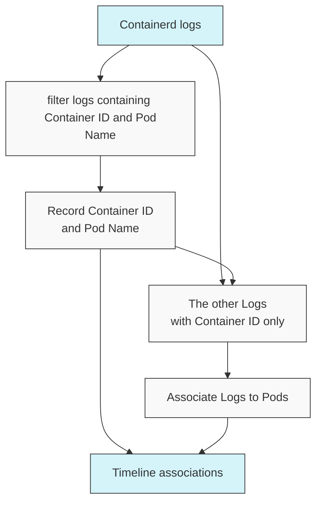
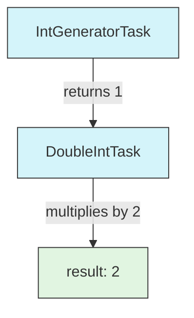
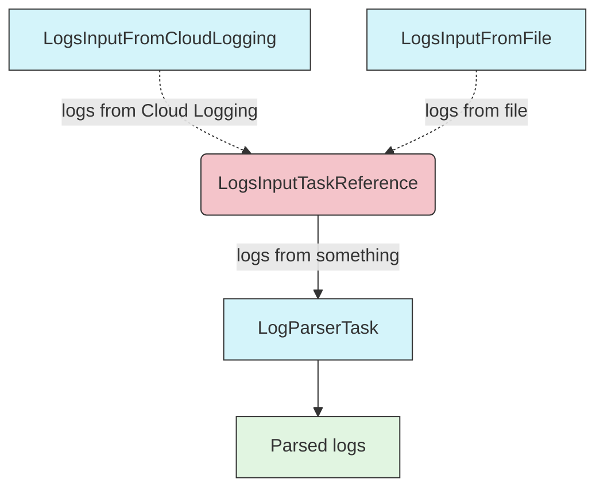
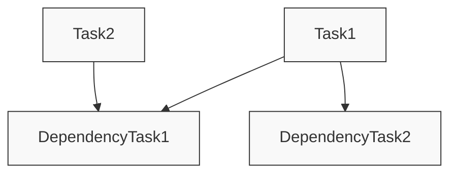
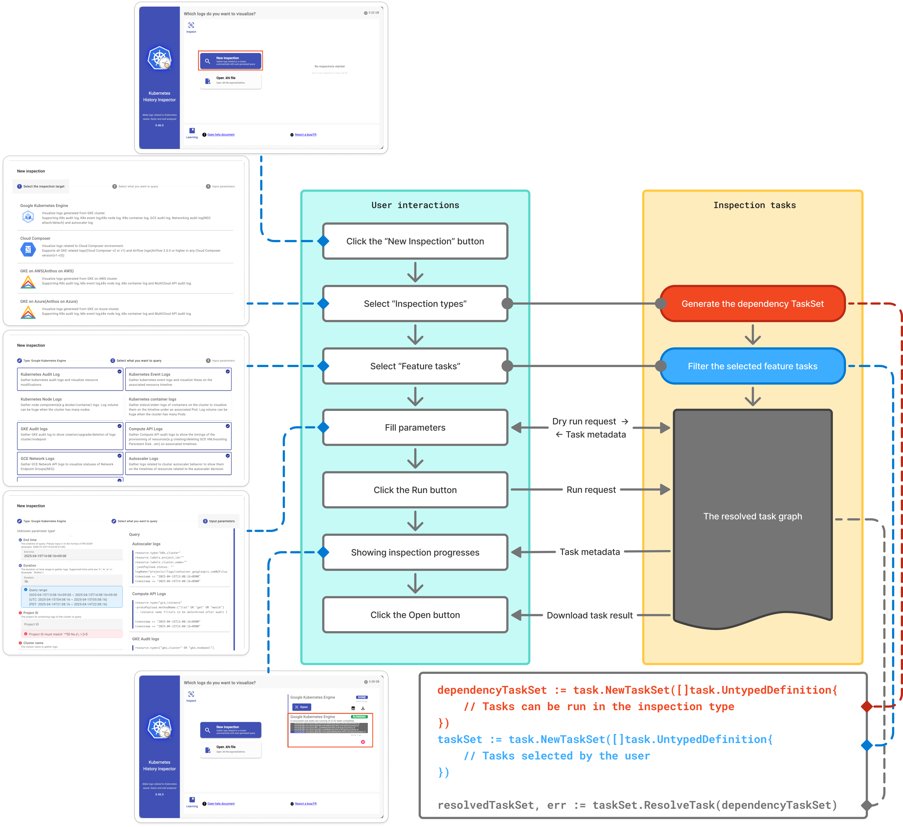

# KHI Task system concept

> [!WARNING]
> 🚧 This reference document is under construction. 🚧

## The complexity in log visualization system

Before discussing how to extend KHI, let's explain the complexity inherent in log visualization systems.
KHI takes a large volume of logs as input and associates each log with one or more "events" or "revisions" on a timeline.
At first glance, this might seem like a simple function that takes a log as input and outputs an array of locations on timelines.

However, in reality, there are logs that cannot be associated without first examining other logs.

- The "revisions" of resources generated from PATCH requests cannot be reconstructed at that point without first parsing previous requests to restore the state of the resource.
- Container IDs included in Containerd logs cannot be linked to specific Pods without examining the logs that associate Pod names, which are only output once during Pod sandbox creation.
- IPs appearing in various logs can be associated with different resources depending on timing, and logs containing only IPs cannot be linked to resources without first parsing logs that confirm the association between resource names and IPs.

Linking a large volume of logs to resources in a meaningful way is a meticulous operation that requires dividing the logs into groups, parsing them in a predetermined order, and linking them to resources.
To efficiently handle these complex dependencies, KHI implements a system described by a unique DAG (Directed Acyclic Graph) that encompasses "generating input fields for user input," "generating log queries," "collecting logs," and "executing various parsers."



> Example: a sub-graph of DAG parsing containerd logs to associate these logs to pod names.

To learn how to extend KHI, you need to understand this DAG system.

## Basic Forms Used in DAG

A Directed Acyclic Graph (DAG) is a graph that flows in one direction without cycles. In KHI's context, this represents a workflow where tasks are executed in a specific order based on their dependencies. Each node in the graph is a task, and edges represent dependencies between tasks.

### The task type

In the DAG task system used by KHI, each task is created to implement the `task.Task[T]` interface.
(See `pkg/task/task.go` for detailed implementation.)

This interface is defined roughly as the following type:
(In reality, elements where you don't need to worry about the TaskResult type are implemented in the `UntypedTask` interface, and there is a slightly more complex type definition to handle any `task.Task[T]` uniformly, but the following fields are sufficient for a general understanding.)

```go
type Task[TaskResult any] interface {
    // ID returns the unique identifier of the task.
	ID() taskid.TaskImplementationID[TaskResult]

    // Labels returns the labels associated with the task. KHI uses this value to various purpose(e.g document generation, filtering tasks by cluster types,...etc)
	Labels() *typedmap.ReadonlyTypedMap

    // Dependencies returns the IDs of tasks that needs to be done beforethis task.
	Dependencies() []taskid.UntypedTaskReference

    // Run is the actual function called to run this task.
    Run(ctx context.Context) (TaskResult, error)
}
```

Normally, you don't need to implement this interface directly. You can create a task using the task.NewTask function.
For example, let's say there is an IntGeneratorTask that generates a fixed integer value and a DoubleIntTask that doubles the value from the previous task.

```go
var IntGeneratorTaskID = taskid.NewDefaultImplementationID[int]("example.khi.google.com/int-generator")
var DoubleIntTaskID = taskid.NewDefaultImplementationID[int]("example.khi.google.com/double-int")

var IntGeneratorTask = task.NewTask(IntGeneratorTaskID,[]taskid.UntypedTaskReference{}, func(ctx context.Context) (int, error){
    return 1, nil
})

var DoubleIntTask = task.NewTask(DoubleIntTaskID,[]taskid.UntypedTaskReference{IntGeneratorID.GetTaskReference()}, func(ctx context.Context, reference taskid.TaskReference[int]) (int, error){
    intGeneratorResult := task.GetTaskResult(ctx, IntGeneratorID.GetTaskReference())
    return intGeneratorResult * 2, nil
})
```



#### Task ID and Task Reference

In KHI, each task has a unique ID of type `taskid.TaskImplementationID[T]`.
Typically, this is generated by the user calling `taskid.NewDefaultImplementationID[T](id string)`.

The type parameter is the type returned by the task using this ID. The `taskid.TaskImplementationID[T]` type needs to be created by the person defining the task,
but those referencing the task need to use `taskid.TaskReference[T]`.

This is used to specify dependency list of a task, and also in `GetTaskResult[T](ctx context.Context, reference taskid.TaskReference[T])` to retrieve the value from a previous task depending on.

In many cases, TaskReference[T] will be obtained from TaskImplementationID[T] through GetTaskReference(). 
However, KHI's task system has a mechanism to abstract inputs in the ID itself.
For example, let's say we want to create a task graph that processes "logs collected from Cloud Logging" or "logs uploaded from a file" with "a certain parser".

```go
var LogsInputTaskReference = taskid.NewTaskReference[[]Log]("example.khi.google.com/log-input")
var LogsInputFromCloudLoggingTaskID = taskid.NewImplementationID(LogsInputTaskReference, "cloud-logging")
var LogsInputFromFileTaskID = taskid.NewImplementationID(LogsInputTaskReference, "file")

var LogParserTaskID = taskid.NewDefaultImplementationID[[]ParsedLog]("example.khi.google.com/log-parser")

var LogsInputFromCloudLoggingTask = task.NewTask(LogsInputFromCloudLoggingTaskID, []taskid.UntypedTaskReference{}, func(ctx context.Context) ([]Log, error) {
	// Get logs from Cloud Logging
	return logs, nil
})

var LogsInputFromFileTask = task.NewTask(LogsInputFromFileTaskID, []taskid.UntypedTaskReference{}, func(ctx context.Context) ([]Log, error) {
	// Get logs from file
	return logs, nil
})

var LogParserTask = task.NewTask(LogParserTaskID, []taskid.UntypedTaskReference{LogsInputTaskReference}, func(ctx context.Context) ([]ParsedLog, error) {
	logs := task.GetTaskResult(ctx, LogsInputTaskReference)
	// Parse logs
	return parsedLogs, nil
})
```




A TaskReference does not specify a particular concrete implementation of a task, allowing you to reuse parts of a DAG graph by simply rearranging the tasks included in the task graph.

### Getting a value from task inside

#### Getting a result from a previous task

Values output by your task's dependencies can be retrieved using the `task.GetTaskResult` function, with the context passed to the task and the TaskReference.
The context must be the exact context value passed to the task function itself.

#### Getting a value outside from task graph

In KHI, values are passed to the task graph by including them in the context.
Additionally, to treat values provided in the context in a type-safe manner, we use functions defined in the `khictx` package.

```go
contextValueID := typedmap.NewTypedKey[string]("a-string-value") // This is a key associating string value.
theValue := typedmap.GetValue(ctx, contextValueID)
```

### Logging in a task

KHI uses the `log/slog` package for logging. KHI's logging handlers automatically associate logs with task names by extracting information from the task context, making it clear which task generated each log entry. For this reason, you should always use context-aware logging methods such as `slog.InfoContext`, `slog.WarnContext`, or `slog.ErrorContext` rather than their non-context counterparts when logging within tasks.

Example:
```go
task.NewTask(TaskID, []taskid.UntypedTaskReference{}, func(ctx context.Context) (Result, error) {
    // Good: Using context-aware logging
    slog.InfoContext(ctx, "Processing started")
    
    // Bad: Using non context-aware logging
    // slog.Info("Processing started")
    // fmt.Printf("Processing started")
    
    // ... task implementation ...
    return result, nil
})
```

### Testing tasks

For testing tasks, use one of the following two helper functions:

* `task_test.RunTask`: Used to call a specific task and receive the resulting value and error
* `task_test.RunTaskWithDependency`: Used to resolve dependencies with the given task list, execute a specific task, and receive the resulting value and error

#### task_test.RunTask

Use `task_test.RunTask` when you simply want to execute a task with specific inputs and test its result.

```go

var ReturnSomeNumberReference = taskid.NewTaskReference[int]("example.khi.google.com/some-number")
var DoubleNumberTaskID = taskid.NewDefaultImplementationID[int]("example.khi.google.com/double-number")

var DoubleNumberTask = task.NewTask(DoubleNumberTaskID, []taskid.UntypedTaskReference{}, func(ctx context.Context) (int, error) {
    number := task.GetTaskResult(ctx, ReturnSomeNumberReference)
	return number * 2, nil
})

func TestRunTask(t *testing.T) {
	result,err := task_test.RunTask(context.Background(), DoubleNumberTaskID, task_test.NewTaskDependencyPair(ReturnSomeNumberReference, 5))
	if err != nil {
		t.Fatalf("failed to run task: %v", err)
	}
	if result != 10 {
		t.Fatalf("unexpected result: %v", result)
	}
}
```

#### task_test.RunTaskWithDependency

In some cases, tasks may have inputs that are difficult to create for test cases, and you may want to actually execute the dependent tasks as well.


```go
var SimpleInputTaskReference = taskid.NewTaskReference[int]("example.khi.google.com/simple-input")
var ComplexOutputTaskID = taskid.NewDefaultImplementationID[ComplexOutput]("example.khi.google.com/complex-output")
var TestingTargetTaskID = taskid.NewDefaultImplementationID[int]("example.khi.google.com/testing-target") 

var ComplexOutputTask = task.NewTask(ComplexOutputTaskID, []taskid.UntypedTaskReference{SimpleInputTaskReference}, func(ctx context.Context) ([]int, error) {
	input := task.GetTaskResult(ctx, SimpleInputTaskReference)
    // Do the complex processing
	return complex,nil
})

var TestingTargetTask = task.NewTask(TestingTargetTaskID, []taskid.UntypedTaskReference{ComplexOutputTaskID.GetTaskReference()}, func(ctx context.Context) (int, error) {
	complexOutput := task.GetTaskResult(ctx, ComplexOutputTaskID.GetTaskReference())
    // Consume the complex output and produce a comperable output
    return testOutput, nil
})

func TestRunTaskWithDependency(t *testing.T) {
	result, err := task_test.RunTaskWithDependency(context.Background(), TestingTargetTaskID,[]typedmap.UntypedTaskReference{ComplexOutputTask,task_test.StubTaskFromReferenceID(SimpleInputTaskReference, 5, nil)})
	if err != nil {
		t.Fatalf("failed to run task: %v", err)
	}
	if result != EXPECTED_VALUE {
		t.Fatalf("unexpected result: %v", result)
	}
}
```

In the example above, we create a test task that returns the fixed value 5 as `SimpleInputTaskReference` and passed this stub task as a dependency.

With `RunTaskWithDependency`, the stub task generated by `task_test.StubTaskFromReferenceID` is executed, then ComplexOutputTask is actually executed, and finally TestingTargetTask is executed to obtain and compare the execution results.

## Running a task graph

### Resolving the task graph dependency and order

When extending KHI, you typically don't need to be concerned with the execution of task graphs. However, understanding how KHI executes task graphs will make subsequent explanations clearer.
In KHI, multiple tasks are grouped and executed together as a `TaskSet` type.

```go
taskSet := task.NewTaskSet([]task.UntypedTask{
    Task1,
    Task2,
    Task3
})
```

Typically, a `TaskSet` cannot be executed directly. It needs to be processed through topological sorting and have necessary dependent tasks added to construct an executable graph.

```go
dependencyTaskSet := task.NewTaskSet([]task.UntypedTask{
    DependencyTask1,
    DependencyTask2,
    DependencyTask3
})
taskSet := task.NewTaskSet([]task.UntypedTask{
    Task1,
    Task2
})

resolvedTaskSet, err := taskSet.ResolveTask(dependencyTaskSet)
```

The `ResolveTask` method of the `TaskSet` type sorts its contained tasks into an executable order. If there are missing dependencies for these tasks, it includes only the necessary tasks from another `TaskSet` passed as an argument. If tasks have circular references or if the provided `TaskSet` doesn't satisfy necessary dependencies, `ResolveTask` will return an error.

Let's assume these tasks have the following dependency relationships:



In this case, since `DependencyTask1` and `DependencyTask2` have no dependencies between them, they are executed first and can run in parallel. After `DependencyTask1` completes, `Task2` is executed, and after `DependencyTask2` completes, `Task1` is executed, forming the complete graph structure.
`DependencyTask3` is not referenced by either `Task1` or `Task2`, so it is not included in the `resolvedTaskSet`.


### Running the task graph

A `TaskSet` with resolved dependencies and execution order can be executed by a type that implements the `TaskRunner` interface.
Currently, only `LocalRunner` is implemented, so you can execute a resolved `TaskSet` as follows:

```go
taskRunner := task.NewLocalRunner(resolvedTaskSet)

err := taskRunner.Run(context.Background())

<- taskRunner.Wait()

result, err := taskRunner.Result()
```

As shown above, you can execute tasks, wait for their completion, and retrieve the results.
The result is returned as a `typedmap` containing the output of each task, but if you want the result of a specific task, use `task.GetTaskResultFromLocalRunner`.

```go
taskRunner := task.NewLocalRunner(resolvedTaskSet)

err := taskRunner.Run(context.Background())

<- taskRunner.Wait()

_, err := taskRunner.Result() // make sure the task graph ended without error

result := task.GetTaskResultFromLocalRunner(taskRunner, TaskID)
```

## Inspection tasks

The task mechanism explained so far is not solely dependent on KHI's log analysis purpose.
However, KHI analyzes various types of logs while maintaining extensibility through a log processing task graph mechanism implemented on top of this system specifically for KHI.

### Relationship between UI Flow and Task Graph in KHI

When using KHI, users follow a workflow like the one shown below:



Various tasks used for actual log processing are registered to the `InspectionServer` during KHI's initialization.
When a user clicks the `New Inspection` button, they first need to select an `Inspection Type`. KHI then filters the registered tasks to include only those that can operate with the selected `Inspection Type`. This includes not only the tasks that users can enable or disable but also all tasks used in their dependency relationships.
Next, users select log types, which internally in KHI are represented as a list of special tasks called Feature tasks. KHI displays only those tasks that are Feature tasks and are available for the selected Inspection type, allowing users to choose whether to include each task.

To execute the tasks selected by the user, KHI first resolves dependencies using the set of available tasks filtered by the Inspection Type, performs topological sorting, and constructs a task graph.
When executing a task graph for log analysis, KHI passes a JSON-serializable value called `Metadata` through the context. This `Metadata` can be accessed from outside the execution at any point during task execution.
For example, when a task is performing time-consuming processing, it can edit the Progress metadata stored in this `Metadata`. When the frontend retrieves the task list, this `Metadata` is read, and the progress status is displayed on the frontend.
The same applies to form editing. Each task executed in Dryrun mode during form editing embeds the information needed for the frontend to display the form in the `Metadata`. The frontend retrieves this information to render the actual frontend.

### Registering tasks on the inspection task server

During initialization, KHI registers tasks used for log parsing and Inspection Types.
These registrations occur by receiving the `InspectionTaskServer` and calling the `AddTask` method, as shown in `pkg/inspection/common/task_registerer.go`.
The methods performing these registrations are registered to `taskSetRegisterer` in the `init()` function within `cmd/kubernetes-history-inspector/main.go`.

To add your own custom tasks, create your own Go file under the `cmd/kubernetes-history-inspector` directory, implement the `init()` function there, and add your defined tasks to the `taskSetRegisterer` from there.

### Labels on inspection tasks

When discussing tasks earlier, we did not go into depth about Labels, but each task in KHI has a map of labels.
KHI utilize this feature to select specific set of tasks from the set of all tasks registered on KHI.

#### InspectionType Label

The InspectionType label applied to tasks has a value of []string type. These are arrays of InspectionType IDs, and they determine whether a task is included as a candidate for dependency relationships based on the following criteria when a user selects an Inspection Type in the UI:

* The task does not have an InspectionType label (interpreted as a task that can be used with any InspectionType)
* The task includes the ID of the user-selected InspectionType as one of its InspectionType labels

For example, you can define tasks with these labels as follows:

```go
var IntGeneratorTaskID = taskid.NewDefaultImplementationID[int]("example.khi.google.com/int-generator")

var IntGeneratorTask = task.NewTask(IntGeneratorTaskID, []taskid.UntypedTaskReference{}, func(ctx context.Context) (int, error) {
	return 1, nil
}, task.InspectionTypeLabel("gcp-gke","gcp-gdcv-for-baremetal")) // This task is only available when user selected GKE or GDCV for Baremetal on the inspection type selection

var DoubleIntTaskID = taskid.NewDefaultImplementationID[int]("example.khi.google.com/double-int")

var DoubleIntTask = task.NewTask(DoubleIntTaskID, []taskid.UntypedTaskReference{IntGeneratorTaskID.GetTaskReference()}, func(ctx context.Context, reference taskid.TaskReference[int]) (int, error) {
	intGeneratorResult := task.GetTaskResult(ctx, IntGeneratorTaskID.GetTaskReference())
	return intGeneratorResult * 2, nil
}) // This task is available for any inspection type

```

#### FeatureTask Label

In KHI, tasks that users can enable or disable are called Feature tasks. These are also just regular tasks, but with specific labels attached to them.
Since Feature tasks need to be selected by users in the UI, they are given additional labels such as title and description. These can be assigned all at once using the `task.FeatureTaskLabel` function.


```go

var ContainerdLogFeatureTaskID = taskid.NewDefaultImplementationID[[]Log]("example.khi.google.com/containerd-log-feature")

var ContainerdLogFeatureTask = task.NewTask(ContainerdLogFeatureTaskID, []taskid.UntypedTaskReference{}, func(ctx context.Context) ([]Log, error) {
	// Get logs from containerd
	return logs, nil
}, task.FeatureTaskLabel("title","description",/*Log type*/,/*is default feature or not */, "gcp-gke","gcp-gdcv-for-baremetal"))

```

When implementing a new parser, you will often need to register tasks with labels generated by this `FeatureTaskLabel` function.
Note that in FeatureTaskLabel, the InspectionType must be specified as a required variadic parameter at the end.

### Task mode

KHI runs tasks for inspection in `run` or `dryrun` mode. Once the graph is built, KHI periodically runs the task graph as `dryrun` mode during user editing the form values. Tasks only running on the `run` mode need to read this task mode from the context value to skip processing when it is in `dryrun` mode.

```go
taskMode := khictx.MustGetValue(ctx, inspection_task_contextkey.InspectionTaskMode)
// taskMode hould be inspection_task_interface.TaskModeDryRun or inspection_task_interface.TaskModeRun
```

Users typically don't need to get task mode from the context with using `inspection_task.NewInspectionTask()` which is a wrapper of `task.NewTask`.

```go
var Task = inspection_task.NewInspectionTask(TestTaskID, []taskid.UntypedTaskReference{}, func(ctx context.Context, taskMode inspection_task_interface.TaskMode) (Result, error) {
	if taskMode == inspection_task_interface.TaskModeDryRun { // Skip the task processing when the mode is dryrun.
		return nil, nil
	}
	// ...
})
```

### The task metadata

Each task in KHI can output various additional information beyond just the task results.
For example, this might include queries used for log collection or logs output by the task.

In KHI, data that is not the main output of a task is managed in a single map called Metadata. When a task graph is executed, an empty map is initially passed, and each task adds values as needed.
Metadata can be read even while a task is executing. This is important because, for example, progress bar values are continuously written by tasks and need to be retrievable as task metadata even during execution.

To get the metadata map, you can retrieve it from the context using `khictx` as follows:

```go
metadata := khictx.MustGetValue(ctx, inspection_task_contextkey.InspectionRunMetadata)
```

Developers performing normal extensions do not need to be aware of the existence of metadata. Typically, these are wrapped by various utilities, and values are set automatically.

#### Input fields

One major use of Metadata is for forms when creating log filters.
Each task writes the metadata required for its form to the form metadata, which the frontend receives to render the form.

However, users do not need to understand the specifics of handling metadata. For example, if it's a text form, use `form.NewTextFormTaskBuilder`.

Below is a practical example of a form task for entering a Duration value. Since forms are also tasks, they can have prerequisite tasks.

```go
var InputDurationTask = form.NewTextFormTaskBuilder(InputDurationTaskID, PriorityForQueryTimeGroup+4000, "Duration").
	WithDependencies([]taskid.UntypedTaskReference{
		common_task.InspectionTimeTaskID,
		InputEndTimeTaskID,
		TimeZoneShiftInputTaskID,
	}).
	WithDescription("The duration of time range to gather logs. Supported time units are `h`,`m` or `s`. (Example: `3h30m`)").
	WithDefaultValueFunc(func(ctx context.Context, previousValues []string) (string, error) {
		if len(previousValues) > 0 {
			return previousValues[0], nil
		} else {
			return "1h", nil
		}
	}).
	WithHintFunc(func(ctx context.Context, value string, convertedValue any) (string, form_metadata.ParameterHintType, error) {
		inspectionTime := task.GetTaskResult(ctx, common_task.InspectionTimeTaskID.GetTaskReference())
		endTime := task.GetTaskResult(ctx, InputEndTimeTaskID.GetTaskReference())
		timezoneShift := task.GetTaskResult(ctx, TimeZoneShiftInputTaskID.GetTaskReference())

		duration := convertedValue.(time.Duration)
		startTime := endTime.Add(-duration)
		startToNow := inspectionTime.Sub(startTime)
		hintString := ""
		if startToNow > time.Hour*24*30 {
			hintString += "Specified time range starts from over than 30 days ago, maybe some logs are missing and the generated result could be incomplete.\n"
		}
		if duration > time.Hour*3 {
			hintString += "This duration can be too long for big clusters and lead OOM. Please retry with shorter duration when your machine crashed.\n"
		}
		hintString += fmt.Sprintf("Query range:\n%s\n", toTimeDurationWithTimezone(startTime, endTime, timezoneShift, true))
		hintString += fmt.Sprintf("(UTC: %s)\n", toTimeDurationWithTimezone(startTime, endTime, time.UTC, false))
		hintString += fmt.Sprintf("(PDT: %s)", toTimeDurationWithTimezone(startTime, endTime, time.FixedZone("PDT", -7*3600), false))
		return hintString, form_metadata.Info, nil
	}).
	WithSuggestionsConstant([]string{"1m", "10m", "1h", "3h", "12h", "24h"}).
	WithValidator(func(ctx context.Context, value string) (string, error) {
		d, err := time.ParseDuration(value)
		if err != nil {
			return err.Error(), nil
		}
		if d <= 0 {
			return "duration must be positive", nil
		}
		return "", nil
	}).
	WithConverter(func(ctx context.Context, value string) (time.Duration, error) {
		d, err := time.ParseDuration(value)
		if err != nil {
			return 0, err
		}
		return d, nil
	}).
	Build()
```

These form field configurations are stored in the form metadata.

```go
metadata := khictx.MustGetValue(ctx, inspection_task_contextkey.InspectionRunMetadata)
formFields, found := typedmap.Get(metadata, form_metadata.FormFieldSetMetadataKey)
```