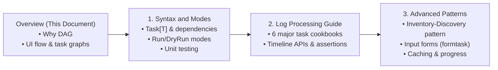
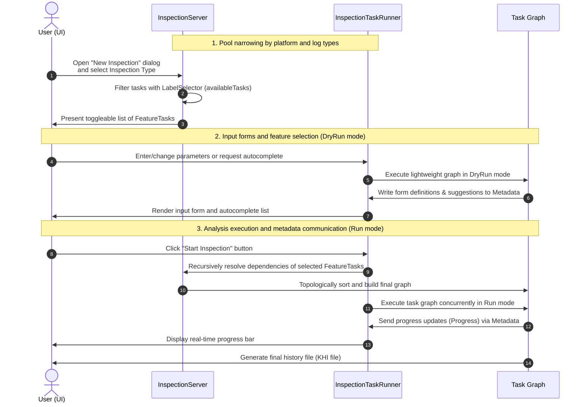

# KHI Task System Concepts (Overview)

Kubernetes History Inspector (KHI) uses a powerful and flexible **Directed Acyclic Graph (DAG) task system** to automatically build timeline-based history files from massive and diverse container and cloud logs.

This documentation suite covers everything from fundamental concepts of the task system—the core of KHI's architecture—to practical syntax and cookbooks for developers implementing plugins and log parsers.

---

## Task System Guide Index

Refer to the following specialized guides depending on your learning stage or development goal:

```mermaid
flowchart LR
    Portal["Overview (This Document)<br>• Why DAG<br>• UI flow & task graphs"]
    P1["1. Syntax and Modes<br>• Task[T] & dependencies<br>• Run/DryRun modes<br>• Unit testing"]
    P2["2. Log Processing Guide<br>• 6 major task cookbooks<br>• Timeline APIs & assertions"]
    P3["3. Advanced Patterns<br>• Inventory-Discovery pattern<br>• Input forms (formtask)<br>• Caching & progress"]

    Portal --> P1
    P1 --> P2
    P2 --> P3
```

1. **[Task System Syntax and Execution Modes](./task-system/01-syntax-and-modes.md)**
   - Covers DAG basics, task type (`Task[T]`) declarations, dependency model (`Dependency`: point-to-point and tag fan-in, required/optional, data/order-only, scopes), reading values from dependencies (`GetTaskResult`, `GetOptionalTaskResult`, `GetTaskResultsWithTag`), structured logging (`slog`), package structures and naming conventions (`_contract`/`_impl`), **inspection execution modes (`Run` and `DryRun`)**, and **unit testing (`tasktest`)**.
2. **[Log Processing Task Implementation Patterns (Cookbook)](./task-system/02-log-processing-cookbook.md)**
   - Covers the overall log processing pipeline, practical recipes for the **4 major task creation utilities (`LogFilterTask`, `LogGrouperTask`, `LogIngesterTask`, `LogToTimelineMapperTask`)**, and timeline mapping using modern `*khifilev6.TimelinePath` and `testchangeset.AssertTimeline` objects.
3. **[Advanced Task Patterns and Utilities](./task-system/03-advanced-and-form-tasks.md)**
   - Covers automatic inspection server registration (`Register`), label selectors (`LabelSelector`, `FeatureTask`), the **`Inventory`-`Discovery` task pattern (`InventoryTaskBuilder` and merge strategies)** for resolving names across multiple log sources, **form tasks (`formtask` / autocomplete)** for rich UI input fields, and **progress reporting / cache control (`NewGlobalCachedTask`, `NewInspectionCachedTask`)**.

---

## 1. Basic Concepts of the KHI Task System

### 1.1 Complexity of Log Visualization Systems

To diagnose issues in Kubernetes clusters, you need to collect many different types of logs from various systems (e.g., Kubernetes Control Plane logs, cluster node logs, Kubelet logs, container runtime logs, host kernel logs, etc.).

A single log alone cannot explain what happened. To get from a symptom to the actual root cause, you must combine and link relationships between logs from multiple systems.
This introduces several challenges for log analysis and visualization tools:

- **Asynchrony and uncertain ordering**: Logs in distributed systems do not guarantee strict time ordering.
- **Complex data dependencies**: To interpret one log, you often need metadata extracted from another log (e.g., mapping tables between container IDs and Pod names).
- **Customization and plugin needs**: Not all users use the same environments or log types (e.g., on-premises vs. cloud-managed clusters).

To address these challenges, KHI uses a **Directed Acyclic Graph (DAG)** task system that explicitly declares data flow dependencies rather than relying on sequential scripts or static procedural code. This achieves both high concurrency performance and loosely coupled plugin design.

### 1.2 Relationship Between UI Flow and Task Graphs in KHI

In KHI, the task system dynamically controls overall system state and execution flow from inspection environment initialization through user interactions in the UI to analysis execution.

```mermaid
sequenceDiagram
    autonumber
    actor U as User (UI)
    participant S as InspectionServer
    participant R as InspectionTaskRunner
    participant G as Task Graph

    Note over S,R: 1. Pool narrowing by platform and log types
    U->>S: Open "New Inspection" dialog<br>and select Inspection Type
    S->>S: Filter tasks with LabelSelector (availableTasks)
    S->>U: Present toggleable list of FeatureTasks

    Note over U,G: 2. Input forms and feature selection (DryRun mode)
    U->>R: Enter/change parameters or request autocomplete
    R->>G: Execute lightweight graph in DryRun mode
    G->>R: Write form definitions & suggestions to Metadata
    R->>U: Render input form and autocomplete list

    Note over U,G: 3. Analysis execution and metadata communication (Run mode)
    U->>R: Click "Start Inspection" button
    R->>S: Recursively resolve dependencies of selected FeatureTasks
    S->>G: Topologically sort and build final graph
    R->>G: Execute task graph concurrently in Run mode
    G->>R: Send progress updates (Progress) via Metadata
    R->>U: Display real-time progress bar
    G->>U: Generate final history file (KHI file)
```

#### 1. Task Graph Construction from Platform and Feature Selection (Build Phase)

1. **Narrowing the entire pool by platform and log types**:
   All tasks used for log processing are registered in the root task set of `InspectionServer` during initialization.
   When the user clicks the "New Inspection" button and selects an **Inspection Type** in the first dropdown, KHI evaluates label selector expressions across all registered tasks to filter only those compatible with the selected inspection environment (`availableTasks`).
2. **Presenting feature selection UI based on FeatureTask labels**:
   Next, KHI extracts tasks tagged with **`FeatureTask`** labels (feature flags) from `availableTasks` and presents them on the screen.
   Users can toggle these checkboxes to choose which log parsing features to include in the inspection.
3. **Recursively resolving dependency tasks and building the task graph**:
   Starting from the `FeatureTask`s selected by the user, KHI recursively resolves all dependency tasks required for processing (such as log collection tasks, parsers, and inventory tasks) from `availableTasks`. During this resolution, the **dependency scope (`DependencyScope`)** of each dependency strictly governs which upstream tasks are pulled into the graph. Finally, it topologically sorts the tasks to build the final execution task graph.

#### 2. UI Communication and Metadata Sharing During Task Execution (Runtime Phase)

After the task graph is built, KHI passes a JSON-serializable shared data store called **`Metadata`** to each task through the context.
You can access this `Metadata` from outside the server or from the frontend (UI) during and after task execution. It is used primarily for the following purposes:

- **Real-time progress display**:
  Tasks that perform long log queries or heavy parsing continuously update progress information (`Progress`) in `Metadata` during execution. When the frontend polls task status periodically, it reads these values to update progress bars.
- **Rendering dynamic input forms and autocomplete lists**:
  During form interactions on the "New Inspection" screen (`DryRun` mode), parameter input tasks and autocomplete tasks write required field definitions and suggestion lists to `Metadata`. The frontend reads this information to render interactive input forms.

### 1.3 Task Graph Edge and Dependency Model (`Dependency`)

In KHI, connections (edges) between tasks in the DAG are represented by the `Dependency` interface (`coretask.Dependency` / `taskid.DependencyDescriptor`). Rather than simple unconstrained references, dependencies declare rich attributes that govern how the task graph is resolved and executed:

#### 1. Cardinality: Point-to-Point vs Tag Fan-In

- **Point-to-Point (`TaskReference[T]`)**:
  Represents a direct 1-to-1 dependency on a specific task reference (`taskID.Ref()`). Downstream tasks read the upstream task's return value using `coretask.GetTaskResult(ctx, ref)`.
- **Tag Fan-In (`TagReference[T]`)**:
  Represents a 1-to-N aggregated dependency. Producer tasks declare the tags they provide using the `coretask.ProvidesTag(tag, opts...)` label option. You can optionally specify `coretask.WithTagPriority(priority)` to assign precedence to the producer's contribution (default: 100, where lower numerical values indicate higher precedence). A consumer task declares a dependency on the tag using `tag.Ref()`. During execution, the consumer retrieves a combined slice of results (`[]T`) from all active producer tasks using `coretask.GetTaskResultsWithTag(ctx, tag.Ref())`. This allows new log parsers or metadata producers to be added without modifying downstream consumer tasks.
  When cross-inventory dependencies between multiple producers cause circular dependencies, pure aggregator tasks annotated with `coretask.AllowMultiStageExecution()` can be split into multiple execution stages by the graph resolver to automatically resolve cycles. For details on prerequisites and resolution mechanisms, see [6. Prerequisites of Fan-In Cycles and Graph Stabilization via Priority](#6-prerequisites-of-fan-in-cycles-and-graph-stabilization-via-priority).

#### 2. Edge Kind: Data vs Order-Only

- **Data Edge (`taskid.EdgeKindData`)**:
  The default kind. The dependency passes typed data results from upstream to downstream.
- **Order-Only Edge (`taskid.EdgeKindOrderOnly`)**:
  Enforces execution order (the upstream task must complete before the downstream task starts) without passing data results. Created with `taskid.OrderOnly`, `coretask.ToOrderOnly(dep)`, or barrier tasks such as `coretask.NewTailTask(id, dependencies)`.

#### 3. Condition: Required vs Optional

- **Required (`taskid.ConditionRequired`)**:
  The default condition. The dependency must be present in the task graph and execute successfully; otherwise, the dependent task cannot run.
- **Optional (`taskid.ConditionOptional`)**:
  Specified with `taskid.Optional`. If the dependency task is not present in the resolved graph (e.g., when an optional log feature is disabled by the user), the dependent task still executes. The consumer checks for presence using `coretask.GetOptionalTaskResult(ctx, ref)`, which returns `(T, bool)`.

#### 4. Scope: Resolution Boundaries (`DependencyScope`)

##### Why Scopes Exist

KHI is a modular platform that integrates many cloud providers, log types, and analysis parsers. Hundreds of tasks may exist in the available task pool (`availableTasks`) for an inspection.

If every dependency searched and pulled in tasks from the entire pool without constraint, several issues would arise:

- **Graph explosion and unintended task execution**:
  For example, if a timeline mapper aggregates "all parsers that produce log entries" using tag fan-in (`TagReference`), an unconstrained search would pull in every parser and log source in the repository (such as GCP audit queries in an on-premises cluster), causing unnecessary API queries or failures.
- **Undermining feature flags (`FeatureTask`)**:
  Even if a user disables a specific feature in the UI, an unconstrained downstream aggregator would inadvertently reactivate it by pulling in its producer tasks.

To prevent this, KHI introduces **scopes (`DependencyScope`)** to define **how far graph resolution searches when binding and pulling upstream tasks into the active graph**.

##### Semantics of the Three Scope Levels

1. **`ScopeActiveGraph` (Passive / Lazy Binding)**:
   - **Behavior**: Binds only to tasks that are already included in the active execution graph (`currentGraphTasks`) by other feature selections or required dependencies.
   - **Characteristics**: This dependency itself never pulls new upstream tasks into the graph. If no matching producer exists in the active graph, a tag fan-in safely resolves to an empty slice, and an optional dependency is safely skipped.
   - **Use cases**: The default for tag fan-in (`tag.Ref()`) and optional dependencies (`taskID.Ref(taskid.Optional)`). It expresses: "If this task is already running in this inspection, give me its result; otherwise, do not start it."

2. **`ScopeActiveFeatures` (Active Feature Boundary)**:
   - **Behavior**: Resolves against producer tasks belonging to features (`FeatureTask`) that are enabled for the current inspection.
   - **Characteristics**: Pulls in a producer task only if all of its upstream dependencies merge into tasks already present in the active graph.
   - **Use cases**: Serves as an intermediate scope to coordinate producers across enabled features without pulling in tasks whose prerequisites are missing.

3. **`ScopeAll` (Aggressive / Eager Binding)**:
   - **Behavior**: Searches the entire registered pool (`availableTasks`) and eagerly pulls matching tasks and their upstream dependencies into the active graph.
   - **Characteristics**: Guarantees that the dependency is included in the graph unless the target task is missing from the pool.
   - **Use cases**: The default for required point-to-point dependencies (`taskID.Ref()`). It expresses: "Task B strictly requires the output of Task A to execute."

##### Default Scope Resolution Rules (`ResolvedScope`)

When a dependency does not explicitly specify a scope (`ScopeUnspecified`), KHI automatically applies a safe default based on its edge attributes:

- **Required Point-to-Point (`taskID.Ref()`)**: `ScopeAll` (ensures required upstream tasks are pulled in).
- **Optional Point-to-Point (`taskID.Ref(taskid.Optional)`)**: `ScopeActiveGraph` (only receives data if the task was activated elsewhere).
- **Tag Fan-In (`tag.Ref()`)**: `ScopeActiveGraph` (aggregates only from producers that are active in the current inspection).

#### 5. Automatic Dependency Deduplication and Merging

When a task declares multiple dependencies targeting the same task reference or tag (either directly or via shared definitions), KHI automatically merges them into a single edge:

- **Kind**: `Data` is preferred over `Order-Only`.
- **Condition**: `Required` is preferred over `Optional`.
- **Scope**: The broader scope is preferred (`ScopeAll` > `ScopeActiveFeatures` > `ScopeActiveGraph`).

#### 6. Prerequisites of Fan-In Cycles and Graph Stabilization via Priority

##### Why Fan-In Cycles Occur (Prerequisites of Cycles)

Each individual log parser or pipeline (for example, the audit log parser alone or container log parser alone) is designed as an independent, one-directional acyclic DAG. However, in KHI where multiple log parsers work together, **cross-inventory mutual dependencies** can trigger circular dependencies (cycles) at runtime:

1. **Cross-Referencing Metadata Inventories**:
   Suppose parser A (e.g. audit log) generates a concrete IP address inventory and contributes to `IPAddressTag`, but wants to consume container IDs (`ContainerIDTag`) to filter its query.
   Conversely, parser B (e.g. container log) generates container IDs and contributes to `ContainerIDTag`, but wants to consume IP addresses (`IPAddressTag`) to filter its query.
2. **Dynamic Feature Selection and Latent Loop Emergence**:
   In isolation, each parser is a valid acyclic DAG. However, when the user enables both features simultaneously, fan-in aggregation (`TagReference`) dynamically creates the following dependency loop:
   `Audit Log Parser -> IPAddressTag Fan-In -> Container Log Parser -> ContainerIDTag Fan-In -> Audit Log Parser`
   The circular dependency only manifests dynamically based on the specific combination of features selected by the user.

##### Deterministic Pruning with Priority to Obtain a Stable Graph

To break a cycle, the graph resolver must prune certain fan-in edges. If edges were pruned arbitrarily, the resulting graph structure and data flow would vary depending on task registration order or execution environment, resulting in an **unstable graph**.

KHI achieves an always unique, deterministic, and stable graph through the following mechanisms:

1. **Producer Precedence Declaration (`WithTagPriority`)**:
   Producer tasks declare their contribution certainty and priority using `ProvidesTag(tag, WithTagPriority(priority))` (default: 100, where lower numerical values indicate higher precedence).
   - For example: A parser providing definitive metadata early in execution has high precedence (`Priority: 10`), whereas a parser supplementing metadata later as a byproduct of parsing has low precedence (`Priority: 100`).
2. **Priority-Based Deterministic Pruning**:
   When a cycle is detected across fan-in dependencies, the graph resolver deterministically prunes the fan-in edge with the **lowest priority (highest numerical value)** within the cycle, restoring an acyclic DAG.
3. **Strict Fail-Fast on Priority Ties**:
   If edges in a cycle share identical priorities and the resolver cannot deterministically pick which edge to prune, it does not guess. Graph resolution fails fast immediately with an error.
4. **Data Preservation via Multi-Stage Execution (`AllowMultiStageExecution`)**:
   For pure, side-effect-free aggregator tasks (such as in-memory inventory aggregators), annotating them with `AllowMultiStageExecution()` permits the resolver to automatically split and clone them into early and late execution stages. The early stage receives high-priority inputs, while the late stage collects feedback inputs from dependent parsers, safely resolving cycles without dropping data.

---

## 2. Next Steps

To learn task syntax and see practical code examples, proceed to the following specialized guides:

- **[1. Task System Syntax and Execution Modes](./task-system/01-syntax-and-modes.md)** — Task (`Task[T]`) syntax, `Run`/`DryRun` modes, and unit testing
- **[2. Log Processing Task Implementation Patterns (Cookbook)](./task-system/02-log-processing-cookbook.md)** — Log processing pipeline and 6 major task cookbooks
- **[3. Advanced Task Patterns and Utilities](./task-system/03-advanced-and-form-tasks.md)** — Automatic registration, labels, Inventory-Discovery, and form tasks (`formtask`)
