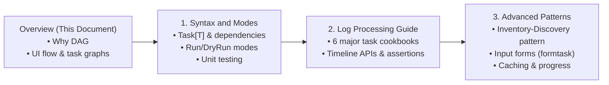
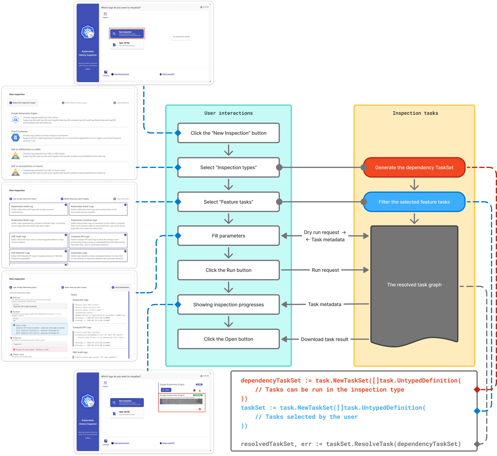
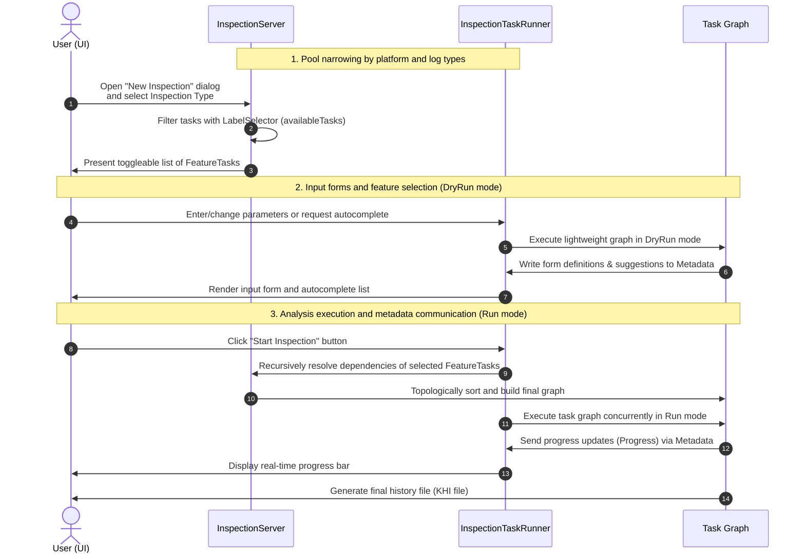

# KHI Task System Concepts (Overview)

Kubernetes History Inspector (KHI) uses a powerful and flexible **Directed Acyclic Graph (DAG) task system** to automatically build timeline-based history files from massive and diverse container and cloud logs.

This documentation suite covers everything from fundamental concepts of the task system—the core of KHI's architecture—to practical syntax and cookbooks for developers implementing plugins and log parsers.

---

## Task System Guide Index

Refer to the following specialized guides depending on your learning stage or development goal:

```mermaid
flowchart LR
    Portal["Overview (This Document)<br>• Why DAG<br>• UI flow & task graphs"]
    P1["1. Syntax and Modes<br>• Task[T] & dependencies<br>• Run/DryRun modes<br>• Unit testing"]
    P2["2. Log Processing Guide<br>• 6 major task cookbooks<br>• Timeline APIs & assertions"]
    P3["3. Advanced Patterns<br>• Inventory-Discovery pattern<br>• Input forms (formtask)<br>• Caching & progress"]

    Portal --> P1
    P1 --> P2
    P2 --> P3
```

1. **[Task System Syntax and Execution Modes](./task-system/01-syntax-and-modes.md)**
   - Covers DAG basics, task type (`Task[T]`) declarations, reading values from dependencies (`GetTaskResult`), structured logging (`slog`), package structures and naming conventions (`_contract`/`_impl`), **inspection execution modes (`Run` and `DryRun`)**, and **unit testing (`tasktest`)**.
2. **[Log Processing Task Implementation Patterns (Cookbook)](./task-system/02-log-processing-cookbook.md)**
   - Covers the overall log processing pipeline, practical recipes for the **5 major task creation utilities (`FieldSetReadTask`, `LogGrouperTask`, `LogFilterTask`, `LogIngesterTask`, `LogToTimelineMapperTask`)**, and timeline mapping using modern `*khifilev6.TimelinePath` and `testchangeset.AssertTimeline` objects.
3. **[Advanced Task Patterns and Utilities](./task-system/03-advanced-and-form-tasks.md)**
   - Covers automatic inspection server registration (`Register`), label selectors (`LabelSelector`, `FeatureTask`), the **`Inventory`-`Discovery` task pattern (`InventoryTaskBuilder` and merge strategies)** for resolving names across multiple log sources, **form tasks (`formtask` / autocomplete)** for rich UI input fields, and **progress reporting / cache control (`NewGlobalCachedTask`, `NewInspectionCachedTask`)**.

---

## 1. Basic Concepts of the KHI Task System

### 1.1 Complexity of Log Visualization Systems

To diagnose issues in Kubernetes clusters, you need to collect many different types of logs from various systems (e.g., Kubernetes Control Plane logs, cluster node logs, Kubelet logs, container runtime logs, host kernel logs, etc.).

A single log alone cannot explain what happened. To get from a symptom to the actual root cause, you must combine and link relationships between logs from multiple systems.
This introduces several challenges for log analysis and visualization tools:

- **Asynchrony and uncertain ordering**: Logs in distributed systems do not guarantee strict time ordering.
- **Complex data dependencies**: To interpret one log, you often need metadata extracted from another log (e.g., mapping tables between container IDs and Pod names).
- **Customization and plugin needs**: Not all users use the same environments or log types (e.g., on-premises vs. cloud-managed clusters).

To address these challenges, KHI uses a **Directed Acyclic Graph (DAG)** task system that explicitly declares data flow dependencies rather than relying on sequential scripts or static procedural code. This achieves both high concurrency performance and loosely coupled plugin design.

### 1.2 Relationship Between UI Flow and Task Graphs in KHI

In KHI, the task system dynamically controls overall system state and execution flow from inspection environment initialization through user interactions in the UI to analysis execution.

```mermaid
sequenceDiagram
    autonumber
    actor U as User (UI)
    participant S as InspectionServer
    participant R as InspectionTaskRunner
    participant G as Task Graph

    Note over S,R: 1. Pool narrowing by platform and log types
    U->>S: Open "New Inspection" dialog<br>and select Inspection Type
    S->>S: Filter tasks with LabelSelector (availableTasks)
    S->>U: Present toggleable list of FeatureTasks

    Note over U,G: 2. Input forms and feature selection (DryRun mode)
    U->>R: Enter/change parameters or request autocomplete
    R->>G: Execute lightweight graph in DryRun mode
    G->>R: Write form definitions & suggestions to Metadata
    R->>U: Render input form and autocomplete list

    Note over U,G: 3. Analysis execution and metadata communication (Run mode)
    U->>R: Click "Start Inspection" button
    R->>S: Recursively resolve dependencies of selected FeatureTasks
    S->>G: Topologically sort and build final graph
    R->>G: Execute task graph concurrently in Run mode
    G->>R: Send progress updates (Progress) via Metadata
    R->>U: Display real-time progress bar
    G->>U: Generate final history file (KHI file)
```

#### 1. Task Graph Construction from Platform and Feature Selection (Build Phase)

1. **Narrowing the entire pool by platform and log types**:
   All tasks used for log processing are registered in the root task set of `InspectionServer` during initialization.
   When the user clicks the "New Inspection" button and selects an **Inspection Type** in the first dropdown, KHI evaluates label selector expressions across all registered tasks to filter only those compatible with the selected inspection environment (`availableTasks`).
2. **Presenting feature selection UI based on FeatureTask labels**:
   Next, KHI extracts tasks tagged with **`FeatureTask`** labels (feature flags) from `availableTasks` and presents them on the screen.
   Users can toggle these checkboxes to choose which log parsing features to include in the inspection.
3. **Recursively resolving dependency tasks and building the task graph**:
   Starting from the `FeatureTask`s selected by the user, KHI recursively resolves all dependency tasks required for processing (such as log collection tasks, parsers, and inventory tasks) from `availableTasks`. It then topologically sorts them to build the final execution task graph.

#### 2. UI Communication and Metadata Sharing During Task Execution (Runtime Phase)

After the task graph is built, KHI passes a JSON-serializable shared data store called **`Metadata`** to each task through the context.
You can access this `Metadata` from outside the server or from the frontend (UI) during and after task execution. It is used primarily for the following purposes:

- **Real-time progress display**:
  Tasks that perform long log queries or heavy parsing continuously update progress information (`Progress`) in `Metadata` during execution. When the frontend polls task status periodically, it reads these values to update progress bars.
- **Rendering dynamic input forms and autocomplete lists**:
  During form interactions on the "New Inspection" screen (`DryRun` mode), parameter input tasks and autocomplete tasks write required field definitions and suggestion lists to `Metadata`. The frontend reads this information to render interactive input forms.

---

## 2. Next Steps

To learn task syntax and see practical code examples, proceed to the following specialized guides:

- **[1. Task System Syntax and Execution Modes](./task-system/01-syntax-and-modes.md)** — Task (`Task[T]`) syntax, `Run`/`DryRun` modes, and unit testing
- **[2. Log Processing Task Implementation Patterns (Cookbook)](./task-system/02-log-processing-cookbook.md)** — Log processing pipeline and 6 major task cookbooks
- **[3. Advanced Task Patterns and Utilities](./task-system/03-advanced-and-form-tasks.md)** — Automatic registration, labels, Inventory-Discovery, and form tasks (`formtask`)
