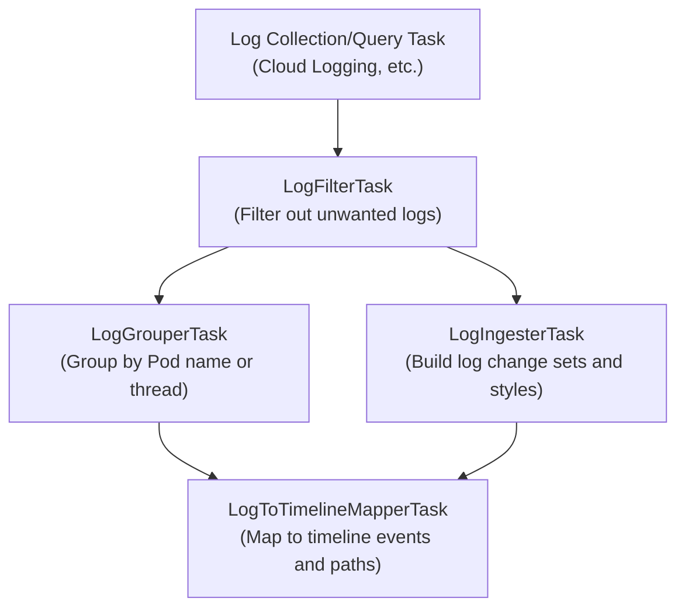

# Log Processing Task Implementation Patterns (Cookbook)

[< Previous: Syntax and Modes](./01-syntax-and-modes.md) | [Back to Index](../khi-task-system-concept.md) | [Next: Advanced Patterns >](./03-advanced-and-form-tasks.md)

---

This document explains the overall log processing pipeline in KHI and provides **practical cookbooks for 4 high-level task utilities** that developers use to implement new log parsers and timeline mappers.

## 1. Overview of the Log Processing Pipeline

KHI uses its robust task system to perform log processing. This architecture makes KHI highly extensible (you can add new features just by creating new tasks) and allows it to fully leverage Go's concurrency.
Because log processing shares many common patterns, you should implement log processing tasks using the high-level task creation utilities provided by KHI.

KHI provides the following high-level task creation utilities to cover basic log processing use cases:

- **`LogFilterTask`** : Filters logs based on conditions.
- **`LogGrouperTask`** : Groups logs by specific keys (e.g., entity name, correlation ID).
- **`LogIngesterTask`** : Ingests logs into the final history data, generating log-level metadata (`LogChangeSet`).
- **`LogToTimelineMapperTask`** : Maps ingested logs to timeline events and resource revisions displayed on the KHI UI (`TimelineChangeSet`).

The following is an example dependency graph showing how these task types work together to parse Kubernetes node audit logs fetched from Cloud Logging and render them on the UI timeline:



When developers add support for a new log type, they declare tasks along this pipeline and connect them to the task graph.
You create all of these using utility functions in the `pkg/core/inspection/taskbase` package.

---

## 2. Field Extraction with Extractor Functions

Logs in KHI provide a fast, zero-copy `*structured.NodeReader` via `l.NodeReader`.
To extract structured fields from raw logs, define an extractor function and a typed struct in the `contract` package:

```go
package myapp_contract

import (
    "github.com/GoogleCloudPlatform/khi/pkg/common/structured"
)

var (
    pathFoo = structured.CompileFieldPath("jsonPayload.foo")
    pathBar = structured.CompileFieldPath("jsonPayload.bar")
)

type MyFields struct {
    Foo string
    Bar int
}

func ExtractMyFields(reader *structured.NodeReader) (MyFields, error) {
    return MyFields{
        Foo: reader.ReadStringOrDefaultByPath(pathFoo, ""),
        Bar: reader.ReadIntOrDefaultByPath(pathBar, 0),
    }, nil
}
```

Tasks can then call `ExtractMyFields(l.NodeReader)` directly without intermediate task overhead or per-log hash table allocations.

---

## 3. Filtering Logs (`LogFilterTask`)

Use `LogFilterTask` to filter out noise logs (such as routine health check logs) in advance that are not needed for visualization or analysis.

```go
var MyFilterTask = inspectiontaskbase.NewLogFilterTask(
    MyFilterTaskID,
    SourceLogsTaskID.Ref(),
    func(ctx context.Context, l *log.Log) (bool, error) {
        fields, err := myapp_contract.ExtractMyFields(l.NodeReader)
        if err != nil {
            return false, err
        }
        return fields.Bar > 0, nil
    },
)
```

---

## 4. Grouping Logs (`LogGrouperTask`)

When an individual log message is not enough to identify a cause, you need to group related logs across time (e.g., a sequence of events from Pod creation to termination).
`LogGrouperTask` groups logs based on a specific key:

```go
var MyGrouperTask = inspectiontaskbase.NewLogGrouperTask(
    MyGrouperTaskID,
    SourceLogsTaskID.Ref(),
    func(ctx context.Context, l *log.Log) string {
        fields, err := myapp_contract.ExtractMyFields(l.NodeReader)
        if err == nil && fields.Foo != "" {
            return fields.Foo
        }
        return "unknown"
    },
)
```

---

## 5. Ingesting Logs (`LogIngesterTask`)

`LogIngesterTask` is an ingestion task that configures log-level metadata (such as log type, timestamp, severity, and summary) into a `*khifilev6.LogChangeSet`.

### 1. Declaring the `LogIngester` Interface

When defining an ingestion task, first implement a struct that satisfies the `inspectiontaskbase.LogIngester` interface:

```go
type MyLogIngester struct{}

// RawLogTask returns the raw log source or parent task reference ID
func (i *MyLogIngester) RawLogTask() taskid.TaskReference[[]*log.Log] {
    return SourceLogsTaskID.Ref()
}

// Dependencies returns the list of dependencies required by the parser
func (i *MyLogIngester) Dependencies() []taskid.UntypedTaskReference {
    return []taskid.UntypedTaskReference{}
}

// ProcessLog implements initial processing or transformation logic for each log
func (i *MyLogIngester) ProcessLog(ctx context.Context, l *log.Log) (*khifilev6.LogChangeSet, error) {
    cs, err := khifilev6.NewLogChangeSet(l)
    if err != nil {
        return nil, err
    }

    cs.SetTimestamp(l.Timestamp)
    cs.SetLogType(myapp_contract.LogTypeMyApp)

    if fields, err := myapp_contract.ExtractMyFields(l.NodeReader); err == nil {
        cs.SetSummary(fmt.Sprintf("[%s] count=%d", fields.Foo, fields.Bar))
    }

    return cs, nil
}

var _ inspectiontaskbase.LogIngester = (*MyLogIngester)(nil)
```

### 2. Building the Task Instance

Pass the address of your ingester struct to `inspectiontaskbase.NewLogIngesterTask` to declare the task instance:

```go
var MyLogIngesterTask = inspectiontaskbase.NewLogIngesterTask(
    MyLogIngesterTaskID,
    &MyLogIngester{},
)
```

---

## 6. Mapping to Timelines (`LogToTimelineMapperTask`)

As the final step in log processing, `LogToTimelineMapperTask` maps `*log.Log` objects after filtering and grouping to resource trees and chronological timeline events (event bars, severity, detailed messages) rendered on the KHI UI.

### 6.1 Implementing the `LogToTimelineMapper[T]` Interface

To create a mapper task, declare a struct that satisfies the `inspectiontaskbase.LogToTimelineMapper[T]` interface.
In most cases, embed **`inspectiontaskbase.SinglePassMapperBase[T]`** (or `StatelessMapperBase`) to eliminate boilerplate and make it easy to write custom sequential processing, overriding only required methods.

```go
type MyGroupData struct {
    Count int
}

type MyMapper struct {
    inspectiontaskbase.SinglePassMapperBase[MyGroupData]
}

func (m *MyMapper) GroupedLogTask() taskid.TaskReference[inspectiontaskbase.LogGroupMap] {
    return MyGrouperTaskID.Ref()
}

func (m *MyMapper) LogIngesterTask() taskid.TaskReference[[]*log.Log] {
    return MyLogIngesterTaskID.Ref()
}

func (m *MyMapper) Dependencies() []taskid.UntypedTaskReference {
    return []taskid.UntypedTaskReference{}
}
```

### 6.2 Creating and Using Timeline Path Helper Utilities

In current KHI implementations, mappers do not construct raw string paths directly. Instead, they use **`*khifilev6.TimelinePath`**, which clearly expresses resource hierarchies (tree structures) with types, to add and resolve events.
Furthermore, KHI uses a common implementation pattern where you create **timeline path helper utilities** (`MustXXXTimeline`) that compose parent timeline helper functions rather than rebuilding parent hierarchies with `TimelineAccumulator.GetPath` from scratch.

#### 1. Example of Creating a Timeline Path Helper (defined in `contract` or `impl` package)

```go
// Example of a composite TimelinePath helper function in KHI composing parent helpers
func MustK8sPodTimeline(ctx context.Context, clusterName string, namespace string, podName string) *khifilev6.TimelinePath {
    clusterPath := commonlogk8saudit_contract.MustK8sClusterTimeline(ctx, clusterName)
    apiVersionPath := commonlogk8saudit_contract.MustK8sAPIVersionTimeline(ctx, clusterPath, "core/v1")
    kindPath := commonlogk8saudit_contract.MustK8sKindTimeline(ctx, apiVersionPath, "pod")
    namespacePath := commonlogk8saudit_contract.MustK8sNamespaceTimeline(ctx, kindPath, namespace)
    return commonlogk8saudit_contract.MustK8sNamespacedResourceTimeline(ctx, namespacePath, podName)
}
```

#### 2. Using the Timeline Path Helper from a Mapper

```go
// Process messages and add timeline events
func (m *MyMapper) ProcessLogByGroup(ctx context.Context, l *log.Log, prevData MyGroupData) (*khifilev6.TimelineChangeSet, MyGroupData, error) {
    cs := khifilev6.NewTimelineChangeSet(l)

    // Call your timeline path helper utility to safely get the path
    podPath := MustK8sPodTimeline(ctx, "test-cluster", "default", "my-pod")

    // Add event
    cs.AddEvent(podPath)

    // Pass updated state to the next log processing step in the group
    return cs, MyGroupData{Count: prevData.Count + 1}, nil
}

// Initialize as a task
var MyMapperTask = inspectiontaskbase.NewLogToTimelineMapperTask(
    MyMapperTaskID,
    &MyMapper{},
    inspectioncore_contract.FeatureTaskLabel(
        "Custom App Logs",
        "Parser and timeline mapping for Custom App logs.",
        9000,
        false,
    ),
)
```

### 6.3 Unit Testing Mappers (`testchangeset.AssertTimeline`)

When testing mappers, use `testchangeset.AssertTimeline(t, cs)` to declaratively verify the contents of the generated `TimelineChangeSet`.
Do not use string paths or deprecated APIs; create and assert expected `*khifilev6.TimelinePath` objects.

```go
func TestMyMapper_ProcessLogByGroup(t *testing.T) {
    builder := khifilev6.NewBuilder()
    ctx := khictx.WithValue(t.Context(), inspectioncore_contract.Builder, builder)

    l := testlog.NewMockLog(time.Date(2026, 5, 22, 12, 0, 0, 0, time.UTC))
    mapper := &MyMapper{}

    cs, _, err := mapper.ProcessLogByGroup(ctx, l, MyGroupData{})
    if err != nil {
        t.Fatalf("unexpected error: %v", err)
    }

    wantPodPath := MustK8sPodTimeline(ctx, "test-cluster", "default", "my-pod")
    testchangeset.AssertTimeline(t, cs).
        HasEvent(wantPodPath)
}
```

---

[< Previous: Syntax and Modes](./01-syntax-and-modes.md) | [Back to Index](../khi-task-system-concept.md) | [Next: Advanced Patterns >](./03-advanced-and-form-tasks.md)
