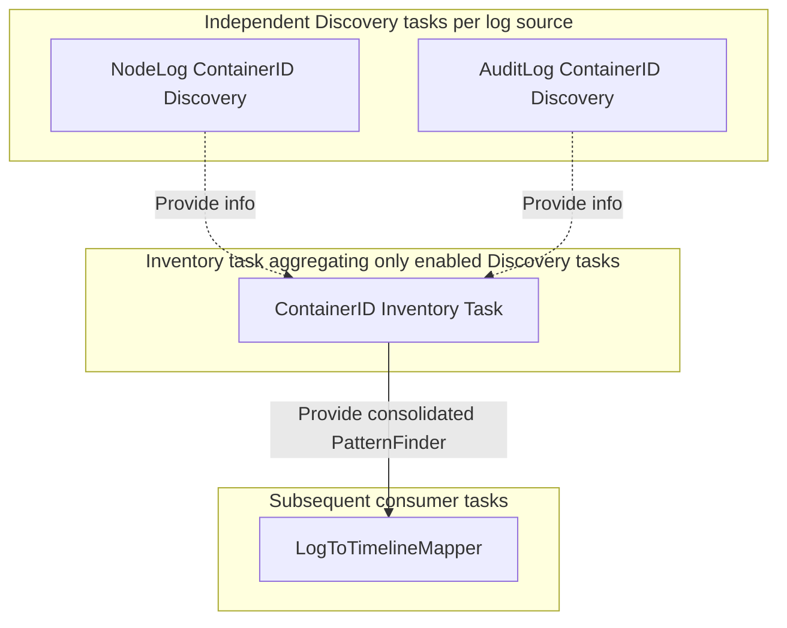

# Advanced Task Patterns and Utilities

[< Previous: Log Processing Cookbook](./02-log-processing-cookbook.md) | [Back to Index](../khi-task-system-concept.md)

---

This document explains the specifications and utilities used to build advanced analysis pipelines and UI integrations in KHI, including task registration, label selection, resource discovery, input forms, progress reporting, and caching strategies.

## 1. Registering Tasks to the Inspection Task Server

KHI build scripts automatically configure the system to call `Register()` during initialization if a `registration.go` file exists under `task/inspection/<package-name>/impl`.
To define a package that adds new tasks, register your tasks and Inspection Types inside this `Register()` function.

```go
// Register registers all googlecloudlogserialport inspection tasks to the registry.
func Register(registry coreinspection.InspectionTaskRegistry) error {
    err := registry.AddInspectionType(ossclusterk8s_contract.OSSKubernetesLogFilesInspectionType)
    if err != nil {
        return err
    }

    return coretask.RegisterTasks(registry,
        InputAuditLogFilesTask,
        InputNodeLogFilesTask,
        SerialPortLogIngesterTask,
    )
}
```

## 2. Inspection Task Labels

On the "New Inspection" screen in KHI, the system dynamically determines which tasks to include and run in the graph based on the selected environment and log types. To control this behavior, you can attach special labels to inspection tasks.

### 2.1 Filtering with General Label Selectors (`LabelSelector`)

In current KHI versions, you can attach arbitrary key-value metadata labels to tasks and filter them flexibly using **`LabelSelector`**, which evaluates boolean logic expressions (AND, OR, NOT, etc.) to enable tasks only in specific environments or modes.

```go
// Set task labels using the general LabelValue option
var AdvancedTask = task.NewTask(AdvancedTaskID, []taskid.UntypedTaskReference{}, func(ctx context.Context) (any, error) {
    return nil, nil
},
    coretask.LabelValue("environment", "gcp"),
    coretask.LabelValue("feature-stage", "beta"),
)
```

During server initialization or inspection configuration, KHI evaluates expressions like the following to select tasks:

```go
selector, _ := labelselector.Parse("environment=gcp && !feature-stage=deprecated")
compatibleTasks := taskSet.Select(selector)
```

### 2.2 Legacy Inspection Type Labels (`InspectionTypeLabel`)

For backward compatibility, you can still use traditional `InspectionTypeLabel` declarations.
This enables the task only for the Inspection Types listed in the label (e.g., GCP Cloud Logging, local log files, etc.).

```go
var MyTask = task.NewTask(MyTaskID, []taskid.UntypedTaskReference{}, func(ctx context.Context) (any, error) {
    return nil, nil
}, inspectioncore_contract.InspectionTypeLabel(
    "example.khi.google.com/inspection-type-1",
    "example.khi.google.com/inspection-type-2",
))
```

### 2.3 FeatureTask Labels

The FeatureTask label is a special label that exposes a task as a toggleable feature on KHI's "New Inspection" screen.
By specifying this label on main feature tasks such as mappers, you allow users to enable or disable the feature.

```go
inspectioncore_contract.FeatureTaskLabel("my-feature", "Feature label", "Detailed description of the feature", true, "gcp-gke")
```

## 3. Task Utilities for Discovering Information from Logs (`Inventory` and `Discovery` Tasks)

### 3.1 Why the Inventory-Discovery Pattern is Needed (Motivation)

A major feature of KHI is that users can freely enable or disable individual features (parser tasks) on the "New Inspection" screen.
For example, the relationship between a container ID and a Pod name **might be discovered from node logs, or it might be discovered from audit logs**.
If a subsequent mapper task directly depends on a specific parser task that extracts container IDs from node logs, **that parser task is forcibly included in the task graph and executed during dependency resolution even if the user disabled node log parsing**.

To support this feature-toggle independence and loosely coupled information integration from multiple sources, KHI uses the **`Inventory`-`Discovery` task pattern**.



Instead of depending directly on a specific parser, an **Inventory task** dynamically and transparently **aggregates results only from Discovery tasks that are currently enabled (available)** in the inspection environment, and provides the merged value to subsequent tasks.
This allows KHI to fully leverage information discovered from other enabled log sources (such as audit logs) without breaking graph resolution when specific log parsing features are disabled.

### 3.2 Creating Discovery Tasks and Integrating with Inventory Tasks

In KHI, use `inspectiontaskbase.NewInventoryTaskBuilder` to build **two or more independent `DiscoveryTask`s** corresponding to each log source, combined with a **single `InventoryTask`** that integrates them.

1. **`DiscoveryTask` is included in the graph only when requested by another task**:
   Each discovery task created by `.DiscoveryTask(...)` on the builder automatically receives `coretask.NewSubsequentTaskRefsTaskLabel`. As a result, **the discovery task itself is never included in the task graph unless requested as a dependency by a parser or feature task that uses it** (if the corresponding parser is disabled, the discovery task is excluded from the graph).
2. **Optional integration of enabled results by `InventoryTask`**:
   The inventory task created by `.InventoryTask(strategy)` on the builder uses `coretask.GetTaskResultOptional` to collect and merge **only the results of Discovery tasks that were actually included and executed in the graph**.

#### Example Code: Two Discovery Tasks (Node Log and Audit Log) and an Integrated Inventory Task

```go
// 1. Initialize the Inventory builder
var containerInventoryBuilder = inspectiontaskbase.NewInventoryTaskBuilder(ContainerIDInventoryTaskID)

// 2-A. Discovery task for container IDs from node logs (included in the graph only when depended on by node log parsers, etc.)
var NodeLogContainerIDDiscoveryTask = containerInventoryBuilder.DiscoveryTask(
    NodeLogContainerIDDiscoveryTaskID,
    []taskid.UntypedTaskReference{NodeLogParserTaskID.Ref()},
    func(ctx context.Context, taskMode inspectioncore_contract.InspectionTaskModeType, progress *inspectionmetadata.TaskProgressMetadata) (commonlogk8saudit_contract.ContainerIDToContainerIdentity, error) {
        logs := coretask.GetTaskResult(ctx, NodeLogParserTaskID.Ref())
        return extractContainersFromNodeLogs(logs), nil
    },
)

// 2-B. Discovery task for container IDs from audit logs (included in the graph only when depended on by audit log parsers, etc.)
var AuditLogContainerIDDiscoveryTask = containerInventoryBuilder.DiscoveryTask(
    AuditLogContainerIDDiscoveryTaskID,
    []taskid.UntypedTaskReference{AuditLogParserTaskID.Ref()},
    func(ctx context.Context, taskMode inspectioncore_contract.InspectionTaskModeType, progress *inspectionmetadata.TaskProgressMetadata) (commonlogk8saudit_contract.ContainerIDToContainerIdentity, error) {
        logs := coretask.GetTaskResult(ctx, AuditLogParserTaskID.Ref())
        return extractContainersFromAuditLogs(logs), nil
    },
)

// 3. Merge strategy that deduplicates and combines results from multiple sources (implementing InventoryMergerStrategy)
type containerIDMergeStrategy struct{}

func (c *containerIDMergeStrategy) Merge(results []commonlogk8saudit_contract.ContainerIDToContainerIdentity) (commonlogk8saudit_contract.ContainerIDToContainerIdentity, error) {
    result := map[string]*commonlogk8saudit_contract.ContainerIdentity{}
    for _, r := range results {
        for cid, s := range r {
            if current, ok := result[cid]; ok {
                // Merge and complement information if the same container ID already exists
                result[cid] = current.Merge(s)
            } else {
                result[cid] = s
            }
        }
    }
    return result, nil
}

var _ inspectiontaskbase.InventoryMergerStrategy[commonlogk8saudit_contract.ContainerIDToContainerIdentity] = (*containerIDMergeStrategy)(nil)

// 4. Inventory task that aggregates and merges results only from enabled Discovery tasks
var ContainerIDInventoryTask = containerInventoryBuilder.InventoryTask(&containerIDMergeStrategy{})
```

By delegating the choice to use discovery tasks and include them in the graph to individual log parsers, KHI achieves a resource inventory that operates safely and flexibly even when users disable certain log parsing features.

### 3.3 Building Searchers with PatternFinder to Reduce Complexity

If subsequent parsers and mappers repeatedly search raw lists aggregated by an `InventoryTask` in a loop, the computational complexity becomes `O(N * M)`, which takes an enormous amount of time.
To avoid this, KHI converts the aggregated inventory into high-speed search automatons (or prefix trees) based on the Aho-Corasick algorithm or binary search, called **`PatternFinder`**, using **`PatternFinderTask` / `DiscoveryTask`**.

Common Discovery / PatternFinder utilities:

- **`NodeNameDiscoveryTask`**: Aggregates mapping tables for node names, cluster information, and IP addresses.
- **`ResourceUIDDiscoveryTask` / `ResourceUIDPatternFinderTask`**: Records mappings between Kubernetes object UIDs (`metadata.uid`) and resource names or namespaces, enabling high-speed reverse lookups from audit logs that contain only UIDs.
- **`ContainerIDDiscoveryTask` / `ContainerIDPatternFinderTask`**: Instantly resolves Pod names and namespaces from long hashes (`6123c6aac...`) or prefixes output by container runtimes.
- **`IPLeaseHistoryDiscoveryTask`**: Tracks IP address allocation history over time to identify Pods and Nodes from an IP at a specific timestamp.

#### Using PatternFinders in Mapper Tasks

By adding the reference ID of a Discovery/PatternFinder task to your mapper task's `Dependencies()`, you can retrieve the searcher inside `ProcessLogByGroup` using `coretask.GetTaskResult(ctx, ...)` and perform high-speed O(1) to O(log N) association lookups using functions like `patternfinder.FindAllWithStarterRunes(...)`.

```go
func (m *MyMapper) ProcessLogByGroup(ctx context.Context, l *log.Log, prevData MyGroupData) (*khifilev6.TimelineChangeSet, MyGroupData, error) {
    // Get the container ID searcher
    containerFinder := coretask.GetTaskResult(ctx, commonlogk8saudit_contract.ContainerIDPatternFinderTaskID.Ref())

    originalMsg := l.Message // Message body
    // Scan high-speed for container ID patterns starting with alphabet or digit runes
    results := patternfinder.FindAllWithStarterRunes(originalMsg, containerFinder, false, '"')

    cs := khifilev6.NewTimelineChangeSet()
    for _, res := range results {
        // Add Pod timeline event based on the discovered container information
        podPath := commonlogk8saudit_contract.MustK8sPodTimeline(ctx, clusterName, res.Value.PodNamespace, res.Value.PodName)
        cs.AddEvent(podPath)
    }
    return cs, prevData, nil
}
```

## 4. Task Forms and User Input Fields (`formtask`)

To allow users to enter or select parameters (such as project IDs, locations, cluster names, time ranges, or log files) in KHI's "New Inspection" dialog, implement tasks using the declarative form task builder package (`github.com/GoogleCloudPlatform/khi/pkg/core/inspection/formtask`).

### 4.1 Types of Form Builders

Choose from the following 3 builder types depending on the input format:

- **`formtask.NewTextFormTaskBuilder(...)`**: Builds form tasks for string or text input (supporting autocomplete and regular expression validation).
- **`formtask.NewSetFormTaskBuilder(...)`**: Builds form tasks that let users select single or multiple values from options, such as dropdowns or checklists.
- **`formtask.NewFileFormTaskBuilder(...)`**: Builds form tasks that accept log file uploads or file path selections from the user's local environment.

### 4.2 Building Rich Input Forms and Autocomplete Integrations

Form builders provide various methods to support comfortable user input, such as UI validation and dynamic autocomplete suggestions:

- **`WithDescription(desc)`**: Sets the help description text displayed in the UI input field.
- **`WithDependencies(...)`**: Declares dependency tasks required to calculate default values or autocomplete suggestions.
- **`WithDefaultValueFunc(fn)`**: Dynamically calculates default values based on input history from previous inspection runs or dependency task results.
- **`WithSuggestionsFunc(fn)`**: Dynamically sorts and presents autocomplete suggestion lists from autocomplete task results as the user types (`common.SortForAutocomplete` is standard).
- **`WithValidator(fn)`**: Performs required field checks or regular expression checks, displaying error messages in the UI and blocking execution when input is invalid.

#### Example Code: Location Input Task with Autocomplete and Validation

The following is a declarative task implementation example used in the actual `InputLocationsTask`, incorporating autocomplete integration and validation (`Validator`):

```go
var InputLocationsTask = formtask.NewTextFormTaskBuilder(
    googlecloudcommon_contract.InputLocationsTaskID,
    googlecloudcommon_contract.PriorityForResourceIdentifierGroup+3000,
    "Location",
).
    WithDependencies([]taskid.UntypedTaskReference{
        googlecloudcommon_contract.AutocompleteLocationTaskID.Ref(),
    }).
    WithDescription("The location (region) to specify where the resource exists").
    WithDefaultValueFunc(func(ctx context.Context, previousValues []string) (string, error) {
        locations := coretask.GetTaskResult(ctx, googlecloudcommon_contract.AutocompleteLocationTaskID.Ref())
        if len(previousValues) > 0 && slices.Contains(locations.Values, previousValues[0]) {
            return previousValues[0], nil
        }
        if len(locations.Values) == 0 {
            return "", nil
        }
        return locations.Values[0], nil
    }).
    WithSuggestionsFunc(func(ctx context.Context, value string, previousValues []string) ([]string, error) {
        regions := coretask.GetTaskResult(ctx, googlecloudcommon_contract.AutocompleteLocationTaskID.Ref())
        return common.SortForAutocomplete(value, regions.Values), nil
    }).
    WithValidator(func(ctx context.Context, value string) (string, error) {
        if value == "" {
            return "location is required", nil
        }
        return "", nil
    }).
    Build()
```

### 4.3 Reading Input Values from Subsequent Tasks

Consumer tasks (such as log query tasks or resource identification tasks) that add the created input form task ID to their dependencies (`Dependencies()`) can safely read user-confirmed input values (`string`, etc.) with proper types by calling `coretask.GetTaskResult`:

```go
var ClusterIdentityTask = inspectiontaskbase.NewInspectionTask(
    googlecloudk8scommon_contract.ClusterIdentityTaskID,
    []taskid.UntypedTaskReference{
        googlecloudcommon_contract.InputLocationsTaskID.Ref(),
        googlecloudk8scommon_contract.InputClusterNameTaskID.Ref(),
    },
    func(ctx context.Context, taskMode inspectioncore_contract.InspectionTaskModeType) (GoogleCloudClusterIdentity, error) {
        // Get the entered location string
        location := coretask.GetTaskResult(ctx, googlecloudcommon_contract.InputLocationsTaskID.Ref())
        clusterName := coretask.GetTaskResult(ctx, googlecloudk8scommon_contract.InputClusterNameTaskID.Ref())

        return GoogleCloudClusterIdentity{
            Location:    location,
            ClusterName: clusterName,
        }, nil
    },
)
```

## 5. Low-Level Task Utilities

### 5.1 Dynamic Progress Reporting (`NewProgressReportableInspectionTask`)

When you want to dynamically report task progress to the frontend, such as during log fetching or large file parsing, create your task using `NewProgressReportableInspectionTask`.
This task receives `TaskProgressMetadata` in its logic and can notify the frontend of specific completion percentages or indeterminate states as execution proceeds.

#### 1. Example of Periodically Updating Quantitative Progress (`progressutil.NewProgressUpdater`)

When the total work amount (item count or byte size) is known, use `progressutil.NewProgressUpdater` to periodically update the progress ratio and status message at regular timer intervals (e.g., every second):

```go
var HeavyProcessingTask = inspectiontaskbase.NewProgressReportableInspectionTask(
    HeavyProcessingTaskID,
    []taskid.UntypedTaskReference{SourceLogsTaskID.Ref()},
    func(ctx context.Context, taskMode inspectioncore_contract.InspectionTaskModeType, progress *inspectionmetadata.TaskProgressMetadata) (ResultType, error) {
        if taskMode != inspectioncore_contract.TaskModeRun {
            return ResultType{}, nil
        }

        logs := coretask.GetTaskResult(ctx, SourceLogsTaskID.Ref())
        total := len(logs)
        processed := 0

        // Create a ProgressUpdater that updates progress every second
        updater := progressutil.NewProgressUpdater(progress, time.Second, func(tp *inspectionmetadata.TaskProgressMetadata) {
            tp.Percentage = float32(processed) / float32(total)
            tp.Message = fmt.Sprintf("Processed %d/%d logs", processed, total)
        })

        updater.Start(ctx)
        defer updater.Done()

        for _, l := range logs {
            // Execute heavy analysis or processing...
            processed++
        }

        return result, nil
    },
)
```

#### 2. Reporting Indeterminate Progress When Total Work Amount is Unknown (`MarkIndeterminate()`)

When the total work amount before task completion cannot be known in advance, such as when processing dynamic items from a channel, call `progress.MarkIndeterminate()` to mark the frontend progress bar as indeterminate:

```go
var UnknownLengthTask = inspectiontaskbase.NewProgressReportableInspectionTask(
    UnknownLengthTaskID,
    []taskid.UntypedTaskReference{SomeDependencyTaskID.Ref()},
    func(ctx context.Context, taskMode inspectioncore_contract.InspectionTaskModeType, progress *inspectionmetadata.TaskProgressMetadata) (ResultType, error) {
        if taskMode != inspectioncore_contract.TaskModeRun {
            return ResultType{}, nil
        }

        // Declare indeterminate progress because the total amount is unknown
        progress.MarkIndeterminate()

        // Process items discovered dynamically...
        for item := range dynamicItemsChannel {
            process(item)
        }

        return result, nil
    },
)
```

### 5.2 Caching Task Results (`NewGlobalCachedTask` and `NewInspectionCachedTask`)

For high-cost tasks where results depend only on input parameters, such as heavy computations or external API calls, you can create cache-enabled tasks that cache and reuse results.
KHI provides the following two creation functions depending on the cache lifetime (scope):

- **`inspectiontaskbase.NewGlobalCachedTask[T]`**: Creates a task cached permanently across the entire application (`GlobalSharedMap`). It reuses results across different inspections as long as the inputs are identical.
- **`inspectiontaskbase.NewInspectionCachedTask[T]`**: Creates a task cached only within the same inspection run (`InspectionSharedMap`). For example, it reuses results during DryRun updates when input forms change in the "New Inspection" dialog, or when re-querying within the same inspection.

Both functions pass a **`CacheableTaskResult[T]`** to your task logic containing the previous calculation result and dependency digest, allowing the task to compare the digest calculated from current parameters against the previous digest (`DependencyDigest`).

#### Example Code

The following is a complete implementation example of `NewInspectionCachedTask` that returns the previous cached value when input parameter digests remain unchanged:

```go
var CachedHeavyTask = inspectiontaskbase.NewInspectionCachedTask(
    CachedHeavyTaskID,
    []taskid.UntypedTaskReference{InputParamsTaskID.Ref()},
    func(ctx context.Context, prevResult inspectiontaskbase.CacheableTaskResult[ResultType]) (inspectiontaskbase.CacheableTaskResult[ResultType], error) {
        params := coretask.GetTaskResult(ctx, InputParamsTaskID.Ref())
        // Calculate the current digest from input parameters
        digest := calculateDigest(params)

        // If the digest matches the previous run, return the cached value immediately without recomputing
        if prevResult.DependencyDigest == digest {
            return prevResult, nil
        }

        // Recompute if this is the first run or the input digest changed
        newValue := doHeavyCalculation(params)
        return inspectiontaskbase.CacheableTaskResult[ResultType]{
            Value:            newValue,
            DependencyDigest: digest,
        }, nil
    },
)
```

> [!TIP]
> **Releasing Resources When an Inspection Ends**
> If you want to clean up cached data or resources created by `NewInspectionCachedTask` when the inspection is destroyed, you can tie into the inspection lifecycle using `context.AfterFunc` as follows:
>
> ```go
> inspectionContext := khictx.MustGetValue(ctx, inspectioncore_contract.InspectionContext)
> context.AfterFunc(inspectionContext, func() {
>     // Release resources such as closing sockets or deleting temporary files
> })
> ```

---

[< Previous: Log Processing Cookbook](./02-log-processing-cookbook.md) | [Back to Index](../khi-task-system-concept.md)
