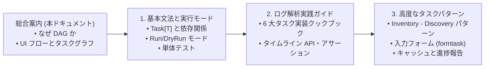
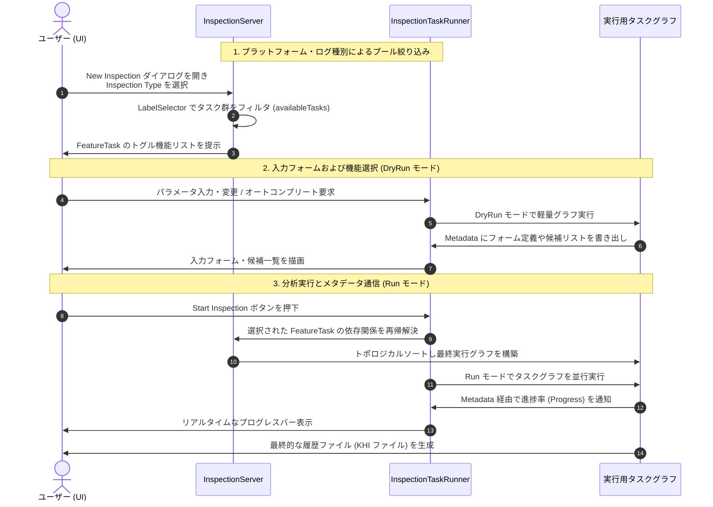

# KHI タスクシステム概念ドキュメント (総合案内)

Kubernetes History Inspector (KHI) は、膨大かつ多様なコンテナ・クラウドログからタイムラインベースの履歴ファイルを自動構築するために、非常に強力で柔軟な **有向非巡回グラフ (DAG) ベースのタスクシステム** を採用しています。

本ドキュメント群では、KHI のアーキテクチャの核心であるタスクシステムの基本概念から、開発者がプラグインやログパーサーを実装するための実践文法・クックブックまでを解説します。

---

## タスクシステムガイド 目次

学習段階や開発目的に合わせて、以下の各専門ドキュメントを参照してください:

1. **[タスクシステムの基本文法と実行モード](./task-system/01-syntax-and-modes.md)**
   - DAG の基本形式、タスクの型 (`Task[T]`) の宣言、依存関係モデル (`Dependency`: ポイント・ツー・ポイントおよびタグによるファンイン、必須/オプショナル、データ/順序制御、スコープ)、依存関係からの値の取得 (`GetTaskResult`, `GetOptionalTaskResult`, `GetTaskResultsWithTag`)、構造化ログ (`slog`)、パッケージ構成と命名規約 (`_contract`/`_impl`)、**インスペクション実行モード (`Run` と `DryRun`)**、**単体テスト (`tasktest`)** を収録しています。
2. **[ログ解析のためのタスク実装パターン (実践ガイド)](./task-system/02-log-processing-cookbook.md)**
   - ログ解析パイプラインの全体像と、**4 種類の主要タスク作成ユーティリティ (`LogFilterTask`, `LogGrouperTask`, `LogIngesterTask`, `LogToTimelineMapperTask`)** の実践レシピ、および最新の `*khifilev6.TimelinePath` と `testchangeset.AssertTimeline` を用いたタイムライン変換を収録しています。
3. **[高度なタスクパターンとユーティリティ](./task-system/03-advanced-and-form-tasks.md)**
   - インスペクションサーバーへの自動登録 (`Register`)、ラベルセレクタ (`LabelSelector`, `FeatureTask`)、複数ログソースから名前解決を行う **`Inventory` - `Discovery` タスクパターン (`InventoryTaskBuilder` と戦略)**、UI にリッチな入力欄を提示する **フォームタスク (`formtask` / オートコンプリート)**、および **進捗報告 / キャッシュ制御 (`NewGlobalCachedTask`, `NewInspectionCachedTask`)** を収録しています。

---

## 1. KHI タスクシステムの基本概念

### 1.1 ログ可視化システムの複雑性

Kubernetes クラスターにおける問題を診断するにあたって、多くの異なるシステムから様々な種類のログを収集する必要があります（例: Kubernetes Control Plane ログ、クラスター内のノードログ、Kubelet ログ、コンテナランタイムログ、ホストカーネルログなど）。

単一のログだけでは、そこで発生した事態の全貌を説明できません。特定された問題から実際の根本原因へと到達するには、複数の異なるシステムから出力されたログの間に存在する関係性を総合して結び付ける必要があります。
これにより、ログ解析・可視化ツールは以下の課題に直面します:

- **非同期性と順序の不確実性**: 分散システムのログは時刻の完全な順序性を保証しません。
- **データ依存関係の複雑化**: あるログを解釈するために、別のログから抽出されたメタデータ（例: コンテナ ID と Pod 名の対応表）が必要になります。
- **プラグインとカスタマイズの要求**: すべてのユーザーが同じ環境や同じログ種別を使用しているわけではありません（例: オンプレミス vs クラウド管理クラスタ）。

これらの課題に対し、逐次的なスクリプトや静的な手続き処理ではなく、データフロー間の依存関係を明確に宣言する **DAG (Directed Acyclic Graph: 有向非巡回グラフ)** タスクシステムを採用することで、KHI は並行処理による高いパフォーマンスと疎結合なプラグイン設計を両立しています。

### 1.2 KHI における UI フローとタスクグラフの関係

KHI では、インスペクション環境の初期化からユーザーによる画面操作、そして分析実行に至るまで、タスクシステムがシステム全体の「状態」と「実行フロー」を動的に制御します。

#### 1. プラットフォームと機能選択によるタスクグラフ構築（ビルドフェーズ）

1. **プラットフォーム・ログ種別による全体プールの絞り込み**:
   実際のログ処理に使用されるタスク群は、初期化時に `InspectionServer` のルートタスクセットへ登録されます。
   ユーザーが「New Inspection」ボタンをクリックし、最初のドロップダウンで **Inspection Type** を選択すると、KHI は登録されたすべてのタスクの中からラベルセレクタ式を評価し、選択されたインスペクション環境に適合するタスクのみをフィルタリングします (`availableTasks`)。
2. **FeatureTask ラベルに基づく機能選択 UI の提示**:
   次に、KHI は絞り込まれた `availableTasks` の中から **`FeatureTask`** ラベル（機能フラグ）を持つタスクを抽出して画面に提示します。
   ユーザーはこれらをチェックボックス等で切り替えることで、どのログ解析機能を今回のインスペクションに含めるかを選択できます。
3. **依存タスクの再帰解決とタスクグラフの構築**:
   ユーザーが選択した `FeatureTask` を起点として、それらの処理に必要となるすべての依存タスク（ログ収集タスク、パーサー、インベンター等）が利用可能タスク群の中から再帰的に解決されます。このとき、各依存関係が持つ **依存関係スコープ (`DependencyScope`)** に従って、どのタスクをグラフへ引き込む（pull-inする）かが厳密に制御されます。最後にトポロジカルソートを実行して最終的な実行用タスクグラフとして構築されます。

#### 2. タスク実行時の UI 通信とメタデータ共有（ランタイムフェーズ）

タスクグラフが構成された後、KHI はコンテキストを通じて **`Metadata`** と呼ばれる JSON シリアライズ可能な共有データストアを各タスクに渡します。
この `Metadata` はタスク実行中および完了後にサーバー外部やフロントエンド（UI）からアクセスでき、主に以下の目的で使用されます:

- **進捗状況のリアルタイム表示**:
  時間のかかるログ取得や重い解析処理を行うタスクは、実行中に `Metadata` 内の進捗情報 (`Progress`) を継続的に更新します。フロントエンドが定期的にタスクステータスを取得すると、この値が読み取られてプログレスバー等に反映されます。
- **動的な入力フォームや候補一覧のレンダリング**:
  「New Inspection」画面のフォーム操作時（`DryRun` モード時）には、パラメータ入力タスクやオートコンプリート候補取得タスクが、画面表示に必要なフィールド定義や候補リストを `Metadata` に書き込みます。フロントエンドはこの情報を取り出してインタラクティブな入力フォームを描画します。

### 1.3 タスクグラフのエッジと依存関係モデル (`Dependency`)

KHI では、DAG 内のタスク間の接続（エッジ）は `Dependency` インターフェース (`coretask.Dependency` / `taskid.DependencyDescriptor`) によって定義されます。単なる無制約なタスク参照ではなく、タスクグラフの解決と実行を制御する属性を明示的に宣言できます:

#### 1. カーディナリティ: ポイント・ツー・ポイント vs タグによるファンイン (Fan-In)

- **ポイント・ツー・ポイント (`TaskReference[T]`)**:
  特定のタスク参照に対する直接的な 1 対 1 の依存関係 (`taskID.Ref()`) を表します。後続のタスクは `coretask.GetTaskResult(ctx, ref)` を使用して先行タスクの型付きの戻り値を取得します。
- **タグによるファンイン (`TagReference[T]`)**:
  1 対 N の集約的な依存関係を表します。プロデューサタスクは `coretask.ProvidesTag(tag, opts...)` ラベルオプションを使用して提供するタグを宣言します。オプションとして `coretask.WithTagPriority(priority)` を指定することで、プロデューサごとの寄与度や優先度を付与できます。デフォルト値は 100 であり、数値が小さいほど高優先度として扱われます。コンシューマタスクは `tag.Ref()` を指定してタグに依存します。実行時、コンシューマは `coretask.GetTaskResultsWithTag(ctx, tag.Ref())` を呼び出すことで、バインドされたすべてのプロデューサタスクの結果のスライス (`[]T`) をまとめて取得します。これにより、ダウンストリームのタスクを変更することなく、新しいログパーサーやメタデータプロデューサを追加できます。
  また、クロスインベントリ依存など複数のプロデューサ間で相互依存が生じる場合、グラフリゾルバはサイクルを構成するファンインエッジを決定論的に除外することで、単一ステージで循環依存を自動解消します。詳細な前提条件と解決メカニズムは「[6. ファンインにおける循環依存の前提条件と Priority によるグラフ安定化](#6-ファンインにおける循環依存の前提条件と-priority-によるグラフ安定化)」を参照してください。

#### 2. エッジ種別: データエッジ vs 順序制御エッジ (Order-Only)

- **データエッジ (`taskid.EdgeKindData`)**:
  デフォルトの種別です。先行タスクから後続タスクへと型付きの実行結果データを渡します。
- **順序制御エッジ (`taskid.EdgeKindOrderOnly`)**:
  データの受け渡しを行わず、タスクの実行順序（先行タスクが完了してから後続タスクを実行する）のみを制御します。`taskid.OrderOnly` オプションや `coretask.ToOrderOnly(dep)`、または `coretask.NewTailTask(id, dependencies)` のようなバリアタスクで使用されます。

#### 3. 実行条件: 必須 (Required) vs オプショナル (Optional)

- **必須 (`taskid.ConditionRequired`)**:
  デフォルトの条件です。依存タスクがタスクグラフ内に解決され、正常に完了していなければなりません。
- **オプショナル (`taskid.ConditionOptional`)**:
  `taskid.Optional` オプションで指定します。依存先タスクがタスクグラフに含まれていない場合（ユーザーによって機能が無効化されている場合など）でも、依存元タスクはスキップされずに実行されます。コンシューマは `coretask.GetOptionalTaskResult(ctx, ref)` を呼び出し、`(T, bool)` で結果の存在を確認しながら安全に取得します。

#### 4. スコープ: 依存関係の解決境界 (`DependencyScope`)

##### なぜスコープが必要なのか (Why Scopes Exist)

KHI は、多数のクラウドプロバイダ、ログ種別、分析パーサーがモジュール化されて統合されたプラットフォームです。インスペクション実行時に登録されている利用可能なタスクプール (`availableTasks`) には、数百ものタスクが存在します。

もしすべての依存関係が全タスクプールから無制限にタスクを探索・解決してしまうと、以下のような問題が発生します:

- **グラフの爆発と不要タスクの意図しない巻き込み**:
  たとえば、タイムライン生成タスクが「ログエントリを提供するすべてのパーサー」をタグファンイン (`TagReference`) で集約しようとした場合、無制約であればユーザーが選択していない機能やログ種別（例: オンプレミス環境におけるクラウド監査ログクエリなど）まで連鎖的にグラフへ引き込まれてしまい、無駄な API 呼び出しやエラーの原因になります。
- **機能フラグ (`FeatureTask`) の無力化**:
  ユーザーが UI 上で特定の機能をオフにしていても、下流の集約タスクが無制約にプロデューサを探索・要求してしまうと、その機能が勝手に有効化されてしまいます。

これを防ぐため、KHI では依存関係ごとに **「どこまでの範囲からタスクを探索し、アクティブグラフへ引き込むか」** を決定する境界として **スコープ (`DependencyScope`)** の概念を導入しています。

##### 3 つのスコープレベルの意味論

1. **`ScopeActiveGraph` (パッシブ / 遅延バインド)**:
   - **動作**: 既に他の機能選択や必須依存によって実行グラフ（`currentGraphTasks`）に含まれることが確定しているタスクのみを対象にバインドします。
   - **特徴**: この依存関係自身が、新しい上流タスクをグラフへ引き込む（pull-inする）ことは絶対にありません。該当するプロデューサがアクティブグラフに存在しない場合、タグファンインでは空のスライスとして安全にスキップされ、オプショナル依存では未解決として扱われます。
   - **用途**: タグによるファンイン集約 (`tag.Ref()`) やオプショナル依存 (`taskID.Ref(taskid.Optional)`) のデフォルトです。「すでに今回のインスペクションで動いているタスクがあるならその結果を受け取るが、動いていないタスクを無理に起動させない」というユースケースを表現します。

2. **`ScopeActiveFeatures` (アクティブ機能境界)**:
   - **動作**: 今回のインスペクションでユーザーが選択した有効な機能 (`FeatureTask`) の傘下にあるプロデューサタスクの中から解決します。
   - **特徴**: プロデューサ自身の上流依存関係が、すべて既にアクティブなグラフ内のタスクに合流（マージ）できる場合にのみ、そのプロデューサをグラフへと引き込みます。
   - **用途**: 選択された機能群と協調して動作しつつ、前提条件が揃わないタスクの暴走を防ぐ中間スコープです。

3. **`ScopeAll` (アグレッシブ / 先行バインド)**:
   - **動作**: 登録されているすべての利用可能なタスクプール (`availableTasks`) 全体を探索対象とし、マッチするタスクとその上流依存関係を貪欲（eager）にグラフへと引き込みます。
   - **特徴**: 依存先が未登録でない限り、確実にグラフに組み込まれて実行されます。
   - **用途**: 通常の必須ポイント・ツー・ポイント依存 (`taskID.Ref()`) のデフォルトです。「Task B の処理には Task A の結果が絶対に不可欠である」という厳密な依存関係を表現します。

##### デフォルトのスコープ解決規則 (`ResolvedScope`)

コード上でスコープを明示的に指定しない場合 (`ScopeUnspecified`)、KHI は依存関係の性質に応じて安全なデフォルトスコープを自動決定します:

- **必須のポイント・ツー・ポイント依存 (`taskID.Ref()`)**: `ScopeAll`（必須タスクを確実に引き込む）。
- **オプショナルのポイント・ツー・ポイント依存 (`taskID.Ref(taskid.Optional)`)**: `ScopeActiveGraph`（他で有効化されている場合のみ受け取る）。
- **タグによるファンイン依存 (`tag.Ref()`)**: `ScopeActiveGraph`（アクティブになっているプロデューサのみを集約する）。

#### 5. 依存関係の重複排除と自動マージ

1 つのタスクが同一のタスク参照またはタグに対して複数の依存関係を受け取った場合（直接の宣言や共通定義を経由する場合など）、KHI は自動的にそれらを 1 つのエッジにマージします:

- **エッジ種別**: `Data` が `Order-Only` よりも優先されます。
- **実行条件**: `Required` が `Optional` よりも優先されます。
- **スコープ**: より広いスコープが優先されます (`ScopeAll` > `ScopeActiveFeatures` > `ScopeActiveGraph`)。

#### 6. ファンインにおける循環依存の前提条件と Priority によるグラフ安定化

##### なぜファンインで循環参照が生じるのか

監査ログパーサー単体やコンテナログパーサー単体のような個別の機能やパイプラインは、それぞれ独立した一方向の非循環 DAG として設計されています。しかし、複数のログパーサーが協調して動作する KHI の環境では、クロスインベントリによる相互依存によって実行時に循環参照が顕在化することがあります:

1. **メタデータインベントリの相互参照**:
   たとえば監査ログパーサーが確定的な IP アドレスのインベントリを生成して `IPAddressTag` にコントリビュートする一方、ログの抽出クエリを絞り込むためにコンテナ ID のインベントリ (`ContainerIDTag`) を消費したいとします。
   同時にコンテナログパーサーはコンテナ ID のインベントリを生成して `ContainerIDTag` にコントリビュートする一方、クエリを絞り込むために IP アドレスのインベントリ (`IPAddressTag`) を消費したいとします。
2. **動的機能選択と潜在的ループの顕在化**:
   どちらのパーサーも単独では正常な非循環 DAG です。しかし、ユーザーが両方の機能を同時に有効化した際、ファンイン集約 (`TagReference`) を介して以下の依存ループが形成されます:
   `監査ログパーサー -> IPAddressTag 集約 -> コンテナログパーサー -> ContainerIDTag 集約 -> 監査ログパーサー`
   このように、ユーザーが選択する機能の組み合わせによって、実行時に初めて循環依存が発生します。

##### Priority による決定論的枝刈りと安定したグラフの獲得

循環依存を解消するために、グラフリゾルバは一部のファンインエッジを切り落とす枝刈りを行う必要があります。しかし、切り落とすエッジを任意に選んでしまうと、タスクの登録順序や実行環境に依存してグラフの構造やデータの流れがブレてしまい、不安定なグラフになってしまいます。

KHI では以下の仕組みによって、常に一意かつ決定論的で安定したグラフを保証します:

1. **プロデューサによる決定度・優先度の宣言 (`WithTagPriority`)**:
   プロデューサタスクは `ProvidesTag(tag, WithTagPriority(priority))` を使用して、そのタグに対して自身が提供するデータの信頼度や決定度を宣言します。デフォルトは 100 であり、数値が小さいほど高優先度として扱われます。
   たとえば起動時に確定的なメタデータを提供するパーサーには `Priority: 10` など高い優先度を付与し、ログ解析の副産物として事後的にメタデータを補完するパーサーには `Priority: 100` などの低い優先度を付与します。
2. **優先度に基づく決定論的枝刈り**:
   ファンイン依存関係によって循環が検出された場合、グラフリゾルバは優先度順にプロデューサを評価し、サイクルを形成する候補ファンインエッジを決定論的に枝刈り（除外）することで、安全な非循環 DAG を導出します。

---

## 2. 次のステップ

ここから先のタスクの実装文法やコードサンプルについては、以下の専門ガイドへと進んでください:

- **[1. タスクシステムの基本文法と実行モード](./task-system/01-syntax-and-modes.md)** — タスク (`Task[T]`) の構文、`Run`/`DryRun` モード、単体テスト
- **[2. ログ解析のためのタスク実装パターン (実践ガイド)](./task-system/02-log-processing-cookbook.md)** — ログ解析パイプラインと 6 大タスクのクックブック
- **[3. 高度なタスクパターンとユーティリティ](./task-system/03-advanced-and-form-tasks.md)** — 自動登録、ラベル、インベントリ・ディスカバリ、入力フォーム (`formtask`)
