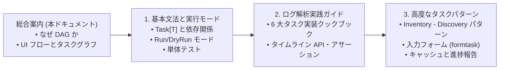
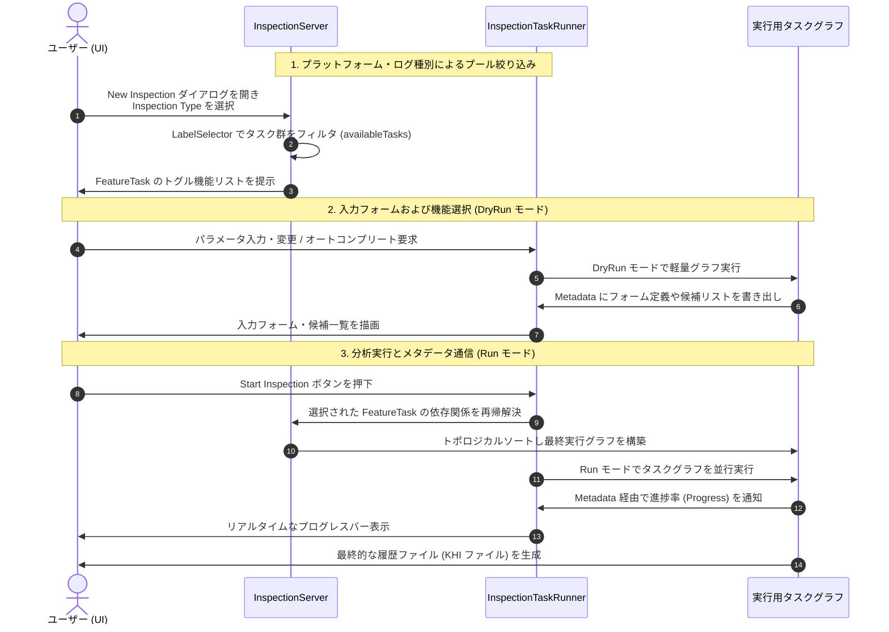

# KHI タスクシステム概念ドキュメント (総合案内)

Kubernetes History Inspector (KHI) は、膨大かつ多様なコンテナ・クラウドログからタイムラインベースの履歴ファイルを自動構築するために、非常に強力で柔軟な **有向非巡回グラフ (DAG) ベースのタスクシステム** を採用しています。

本ドキュメント群では、KHI のアーキテクチャの核心であるタスクシステムの基本概念から、開発者がプラグインやログパーサーを実装するための実践文法・クックブックまでを解説します。

---

## タスクシステムガイド 目次

学習段階や開発目的に合わせて、以下の各専門ドキュメントを参照してください:

1. **[タスクシステムの基本文法と実行モード](./task-system/01-syntax-and-modes.md)**
   - DAG の基本形式、タスクの型 (`Task[T]`) の宣言、依存関係からの値の取得 (`GetTaskResult`)、構造化ログ (`slog`)、パッケージ構成と命名規約 (`_contract`/`_impl`)、**インスペクション実行モード (`Run` と `DryRun`)**、**単体テスト (`tasktest`)** を収録しています。
2. **[ログ解析のためのタスク実装パターン (実践ガイド)](./task-system/02-log-processing-cookbook.md)**
   - ログ解析パイプラインの全体像と、**5 種類の主要タスク作成ユーティリティ (`FieldSetReadTask`, `LogGrouperTask`, `LogFilterTask`, `LogIngesterTask`, `LogToTimelineMapperTask`)** の実践レシピ、および最新の `*khifilev6.TimelinePath` と `testchangeset.AssertTimeline` を用いたタイムライン変換を収録しています。
3. **[高度なタスクパターンとユーティリティ](./task-system/03-advanced-and-form-tasks.md)**
   - インスペクションサーバーへの自動登録 (`Register`)、ラベルセレクタ (`LabelSelector`, `FeatureTask`)、複数ログソースから名前解決を行う **`Inventory` - `Discovery` タスクパターン (`InventoryTaskBuilder` と戦略)**、UI にリッチな入力欄を提示する **フォームタスク (`formtask` / オートコンプリート)**、および **進捗報告 / キャッシュ制御 (`NewGlobalCachedTask`, `NewInspectionCachedTask`)** を収録しています。

---

## 1. KHI タスクシステムの基本概念

### 1.1 ログ可視化システムの複雑性

Kubernetes クラスターにおける問題を診断するにあたって、多くの異なるシステムから様々な種類のログを収集する必要があります（例: Kubernetes Control Plane ログ、クラスター内のノードログ、Kubelet ログ、コンテナランタイムログ、ホストカーネルログなど）。

単一のログだけでは、そこで発生した事態の全貌を説明できません。特定された問題から実際の根本原因へと到達するには、複数の異なるシステムから出力されたログの間に存在する関係性を総合して結び付ける必要があります。
これにより、ログ解析・可視化ツールは以下の課題に直面します:

- **非同期性と順序の不確実性**: 分散システムのログは時刻の完全な順序性を保証しません。
- **データ依存関係の複雑化**: あるログを解釈するために、別のログから抽出されたメタデータ（例: コンテナ ID と Pod 名の対応表）が必要になります。
- **プラグインとカスタマイズの要求**: すべてのユーザーが同じ環境や同じログ種別を使用しているわけではありません（例: オンプレミス vs クラウド管理クラスタ）。

これらの課題に対し、逐次的なスクリプトや静的な手続き処理ではなく、データフロー間の依存関係を明確に宣言する **DAG (Directed Acyclic Graph: 有向非巡回グラフ)** タスクシステムを採用することで、KHI は並行処理による高いパフォーマンスと疎結合なプラグイン設計を両立しています。

### 1.2 KHI における UI フローとタスクグラフの関係

KHI では、インスペクション環境の初期化からユーザーによる画面操作、そして分析実行に至るまで、タスクシステムがシステム全体の「状態」と「実行フロー」を動的に制御します。

#### 1. プラットフォームと機能選択によるタスクグラフ構築（ビルドフェーズ）

1. **プラットフォーム・ログ種別による全体プールの絞り込み**:
   実際のログ処理に使用されるタスク群は、初期化時に `InspectionServer` のルートタスクセットへ登録されます。
   ユーザーが「New Inspection」ボタンをクリックし、最初のドロップダウンで **Inspection Type** を選択すると、KHI は登録されたすべてのタスクの中からラベルセレクタ式を評価し、選択されたインスペクション環境に適合するタスクのみをフィルタリングします (`availableTasks`)。
2. **FeatureTask ラベルに基づく機能選択 UI の提示**:
   次に、KHI は絞り込まれた `availableTasks` の中から **`FeatureTask`** ラベル（機能フラグ）を持つタスクを抽出して画面に提示します。
   ユーザーはこれらをチェックボックス等で切り替えることで、どのログ解析機能を今回のインスペクションに含めるかを選択できます。
3. **依存タスクの再帰解決とタスクグラフの構築**:
   ユーザーが選択した `FeatureTask` を起点として、それらの処理に必要となるすべての依存タスク（ログ収集タスク、パーサー、インベンター等）が利用可能タスク群の中から再帰的に解決され、トポロジカルソートを実行して最終的な実行用タスクグラフとして構築されます。

#### 2. タスク実行時の UI 通信とメタデータ共有（ランタイムフェーズ）

タスクグラフが構成された後、KHI はコンテキストを通じて **`Metadata`** と呼ばれる JSON シリアライズ可能な共有データストアを各タスクに渡します。
この `Metadata` はタスク実行中および完了後にサーバー外部やフロントエンド（UI）からアクセスでき、主に以下の目的で使用されます:

- **進捗状況のリアルタイム表示**:
  時間のかかるログ取得や重い解析処理を行うタスクは、実行中に `Metadata` 内の進捗情報 (`Progress`) を継続的に更新します。フロントエンドが定期的にタスクステータスを取得すると、この値が読み取られてプログレスバー等に反映されます。
- **動的な入力フォームや候補一覧のレンダリング**:
  「New Inspection」画面のフォーム操作時（`DryRun` モード時）には、パラメータ入力タスクやオートコンプリート候補取得タスクが、画面表示に必要なフィールド定義や候補リストを `Metadata` に書き込みます。フロントエンドはこの情報を取り出してインタラクティブな入力フォームを描画します。

---

## 2. 次のステップ

ここから先のタスクの実装文法やコードサンプルについては、以下の専門ガイドへと進んでください:

- **[1. タスクシステムの基本文法と実行モード](./task-system/01-syntax-and-modes.md)** — タスク (`Task[T]`) の構文、`Run`/`DryRun` モード、単体テスト
- **[2. ログ解析のためのタスク実装パターン (実践ガイド)](./task-system/02-log-processing-cookbook.md)** — ログ解析パイプラインと 6 大タスクのクックブック
- **[3. 高度なタスクパターンとユーティリティ](./task-system/03-advanced-and-form-tasks.md)** — 自動登録、ラベル、インベントリ・ディスカバリ、入力フォーム (`formtask`)
