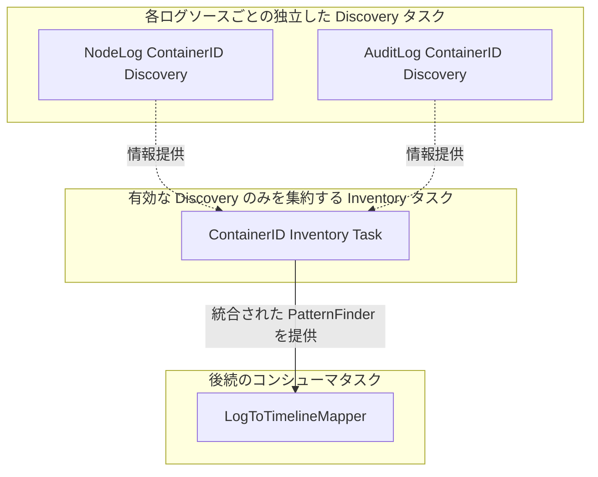

# 高度なタスクパターンとユーティリティ

[< 前へ: ログ解析のためのタスク実装パターン](./02-log-processing-cookbook.md) | [インデックスへ戻る](../khi-task-system-concept.md)

---

本ドキュメントでは、KHI のタスクシステムを用いてより高度な解析パイプラインや UI 連携（登録、ラベル選択、リソースディスカバリ、入力フォーム、進捗報告、キャッシュ戦略）を構築するための仕様とユーティリティについて解説します。

## 1. インスペクションタスクサーバーへのタスク登録

KHI のビルドスクリプトは、自動で初期化時に `task/inspection/<パッケージ名>/impl` 以下に `registration.go` が存在する場合に `Register()` を呼び出すよう構成します。
新しいタスクを追加するパッケージを定義するには、この `Register()` 関数の中で、タスクや Inspection Type を登録する必要があります。

```go
// Register registers all googlecloudlogserialport inspection tasks to the registry.
func Register(registry coreinspection.InspectionTaskRegistry) error {
    err := registry.AddInspectionType(ossclusterk8s_contract.OSSKubernetesLogFilesInspectionType)
    if err != nil {
        return err
    }

    return coretask.RegisterTasks(registry,
        InputAuditLogFilesTask,
        InputNodeLogFilesTask,
        SerialPortLogIngesterTask,
    )
}
```

## 2. インスペクションタスクのラベル

KHI の「New Inspection」画面では、選択された環境やログ種別に応じて、どのタスクをグラフに含めて実行するかが動的に決定されます。これらを制御するために、インスペクションタスクには特別なラベルを付与できます。

### 2.1 汎用ラベルセレクタによるフィルタリング (`LabelSelector`)

現在の KHI では、タスクに対して任意のキー・バリュー形式のメタデータラベルを付与し、それらをブール論理 (AND / OR / NOT 等) の式で表現した **`LabelSelector`** によって、特定の環境やモードでのみ有効化する柔軟なタスク絞り込みを行います。

```go
// 汎用の LabelValue オプションを利用したタスクラベル設定
var AdvancedTask = task.NewTask(AdvancedTaskID, []taskid.UntypedTaskReference{}, func(ctx context.Context) (any, error) {
    return nil, nil
},
    coretask.LabelValue("environment", "gcp"),
    coretask.LabelValue("feature-stage", "beta"),
)
```

これに対して、サーバー初期化時やインスペクション構成時に以下のような式を評価してタスクを抽出します:

```go
selector, _ := labelselector.Parse("environment=gcp && !feature-stage=deprecated")
compatibleTasks := taskSet.Select(selector)
```

### 2.2 レガシー Inspection Type ラベル (`InspectionTypeLabel`)

互換性のため、従来の `InspectionTypeLabel` も引き続き利用可能です。
このラベルにリストされている Inspection Type (例: GCP Cloud Logging, ローカルログファイル等) でのみタスクを有効化します。

```go
var MyTask = task.NewTask(MyTaskID, []taskid.UntypedTaskReference{}, func(ctx context.Context) (any, error) {
    return nil, nil
}, inspectioncore_contract.InspectionTypeLabel(
    "example.khi.google.com/inspection-type-1",
    "example.khi.google.com/inspection-type-2",
))
```

### 2.3 FeatureTask ラベル

FeatureTask ラベルは、そのタスクを KHI の「New Inspection」画面におけるトグル可能な機能として公開するための特別なラベルです。
マッパータスクなどの主機能となるタスクに指定することで、ユーザーは機能の有効/無効を選択できます。

```go
inspectioncore_contract.FeatureTaskLabel("my-feature", "機能ラベル", "機能詳細の説明文", true, "gcp-gke")
```

## 3. ログから情報を発見するためのタスクユーティリティ (`Inventory` と `Discovery` タスク)

### 3.1 なぜ Inventory - Discovery パターンが必要なのか（モチベーション）

KHI の大きな特徴は、ユーザーが「New Inspection」画面で任意の機能（パーサータスク）の有効・無効を自由に切り替えられる点にあります。
例えば、「コンテナ ID と Pod 名の対応関係」は、**ノードログから発見できる場合もあれば、監査ログから発見できる場合もあります**。
もし、後続のマッパータスクが「ノードログからコンテナ ID を解析する特定のパーサータスク」へ直接依存する設計にしてしまうと、**ユーザーがノードログのパースを無効化していても、依存関係解決の際にそのパーサータスクが強制的にタスクグラフへと含まれ、実行されてしまう問題**が発生します。

この「機能有効化／無効化の独立性」と「複数の情報源からの疎結合な情報統合」を両立させるために導入されているのが、**`Inventory` - `Discovery` タスクパターン**です。



**Inventory タスク**は、特定のパーサーに直接依存するのではなく、そのインスペクション環境において**現在有効になっている（利用可能な）Discovery タスクの結果のみを透過的に収集・統合**し、後続タスクに値を提供します。
これにより、特定のログパース機能が無効化されていてもグラフ解決を壊すことなく、有効な他のログソース（監査ログなど）から発見された情報だけを最大限活用することが可能になります。

### 3.2 Discovery タスクの作成と Inventory タスクによる統合

KHI では、`inspectiontaskbase.NewInventoryTaskBuilder` を使用して、情報収集元の各ログソースに対応する **2 つ以上の個別の `DiscoveryTask`** と、それらを統合する **単一の `InventoryTask`** を組み合わせて構築します。

1. **`DiscoveryTask` は別のタスクにリクエストされた場合のみグラフに含まれる**:
   ビルダの `.DiscoveryTask(...)` で生成された各ディスカバリタスクには、`coretask.NewSubsequentTaskRefsTaskLabel` が自動で付与されます。これにより、**ディスカバリタスク自体は、それを使用するパーサーや機能タスクから依存関係としてリクエストされない限り、タスクグラフにいっさい含まれません**（該当パーサーが無効ならグラフから除外されます）。
2. **`InventoryTask` による有効な結果のオプショナル統合**:
   ビルダの `.InventoryTask(strategy)` で生成されたインベントリタスクは、`coretask.GetTaskResultOptional` を用いて、**グラフに実際に含まれて実行された Discovery タスクの結果のみ** を回収・マージします。

#### 実装サンプル: ノードログと監査ログの 2 つの Discovery タスクと統合 Inventory タスク

```go
// 1. Inventory ビルダを初期化
var containerInventoryBuilder = inspectiontaskbase.NewInventoryTaskBuilder(ContainerIDInventoryTaskID)

// 2-A. ノードログからのコンテナID発見タスク (ノードログパーサー等から依存された場合のみグラフに含まれる)
var NodeLogContainerIDDiscoveryTask = containerInventoryBuilder.DiscoveryTask(
    NodeLogContainerIDDiscoveryTaskID,
    []taskid.UntypedTaskReference{NodeLogParserTaskID.Ref()},
    func(ctx context.Context, taskMode inspectioncore_contract.InspectionTaskModeType, progress *inspectionmetadata.TaskProgressMetadata) (commonlogk8saudit_contract.ContainerIDToContainerIdentity, error) {
        logs := coretask.GetTaskResult(ctx, NodeLogParserTaskID.Ref())
        return extractContainersFromNodeLogs(logs), nil
    },
)

// 2-B. 監査ログからのコンテナID発見タスク (監査ログパーサー等から依存された場合のみグラフに含まれる)
var AuditLogContainerIDDiscoveryTask = containerInventoryBuilder.DiscoveryTask(
    AuditLogContainerIDDiscoveryTaskID,
    []taskid.UntypedTaskReference{AuditLogParserTaskID.Ref()},
    func(ctx context.Context, taskMode inspectioncore_contract.InspectionTaskModeType, progress *inspectionmetadata.TaskProgressMetadata) (commonlogk8saudit_contract.ContainerIDToContainerIdentity, error) {
        logs := coretask.GetTaskResult(ctx, AuditLogParserTaskID.Ref())
        return extractContainersFromAuditLogs(logs), nil
    },
)

// 3. 複数ソースからの結果を重複排除・結合するマージ戦略 (InventoryMergerStrategy の実装)
type containerIDMergeStrategy struct{}

func (c *containerIDMergeStrategy) Merge(results []commonlogk8saudit_contract.ContainerIDToContainerIdentity) (commonlogk8saudit_contract.ContainerIDToContainerIdentity, error) {
    result := map[string]*commonlogk8saudit_contract.ContainerIdentity{}
    for _, r := range results {
        for cid, s := range r {
            if current, ok := result[cid]; ok {
                // 同一のコンテナ ID が既に存在する場合は情報を結合・補完
                result[cid] = current.Merge(s)
            } else {
                result[cid] = s
            }
        }
    }
    return result, nil
}

var _ inspectiontaskbase.InventoryMergerStrategy[commonlogk8saudit_contract.ContainerIDToContainerIdentity] = (*containerIDMergeStrategy)(nil)

// 4. 有効になっている Discovery タスクの結果のみを集計・マージする Inventory タスク
var ContainerIDInventoryTask = containerInventoryBuilder.InventoryTask(&containerIDMergeStrategy{})
```

このように、Discovery タスクの利用要否とタスクグラフへの包含を個々のログパーサー側に委ねることで、「ユーザーが一部のログパース機能をオフにしていても安全かつ柔軟に動作するリソースインベントリ」を実現しています。

### 3.3 PatternFinder による検索器の生成と計算量削減

`InventoryTask` で集約された raw リストを、後続の複数のパーサーやマッパーから毎回ループ探索すると計算量が `O(N * M)` となり膨大な時間がかかります。
これを避けるため、KHI では収集されたインベントリを **`PatternFinder`** と呼ばれる Aho-Corasick アルゴリズムや二分探索をベースにした高速検索オートマトン（またはプレフィックスツリー）へと変換する **`PatternFinderTask` / `DiscoveryTask`** を構成します。

代表的な Discovery / PatternFinder ユーティリティ:

- **`NodeNameDiscoveryTask`**: ノード名とクラスタ情報、IP アドレスの対応表を集約。
- **`ResourceUIDDiscoveryTask` / `ResourceUIDPatternFinderTask`**: Kubernetes オブジェクトの UID (`metadata.uid`) とリソース名・Namespace の対応を記録し、UID しか持たない監査ログからの高速逆引きを実現。
- **`ContainerIDDiscoveryTask` / `ContainerIDPatternFinderTask`**: コンテナランタイムが出力した長いハッシュ (`6123c6aac...`) やプレフィックスから、Pod 名・Namespace を即座に解決。
- **`IPLeaseHistoryDiscoveryTask`**: 時系列で変動する IP アドレスの割り当て履歴を追跡し、特定の時刻における IP から Pod や Node を特定。

#### マッパータスクからの利用法

これら Discovery/PatternFinder タスクの参照 ID をマッパータスクの `Dependencies()` に追加することで、マッパーの `ProcessLogByGroup` 内から `coretask.GetTaskResult(ctx, ...)` で検索器を取得し、以下のように `patternfinder.FindAllWithStarterRunes(...)` 等を用いて O(1)〜O(log N) の高速な関連付け解決を実行できます。

```go
func (m *MyMapper) ProcessLogByGroup(ctx context.Context, l *log.Log, prevData MyGroupData) (*khifilev6.TimelineChangeSet, MyGroupData, error) {
    // コンテナID検索器の取得
    containerFinder := coretask.GetTaskResult(ctx, commonlogk8saudit_contract.ContainerIDPatternFinderTaskID.Ref())

    originalMsg := l.Message // メッセージ本文
    // アルファベット/数字で始まるコンテナIDパターンを高速に走査
    results := patternfinder.FindAllWithStarterRunes(originalMsg, containerFinder, false, '"')

    cs := khifilev6.NewTimelineChangeSet()
    for _, res := range results {
        // 発見されたコンテナ情報をもとに Pod のタイムラインイベントを追加
        podPath := commonlogk8saudit_contract.MustK8sPodTimeline(ctx, clusterName, res.Value.PodNamespace, res.Value.PodName)
        cs.AddEvent(podPath)
    }
    return cs, prevData, nil
}
```

## 4. タスクフォームとユーザー入力フィールド (`formtask`)

KHI の「New Inspection」ダイアログでユーザーからパラメータ（プロジェクト ID、ロケーション、クラスタ名、期間、ログファイル等）を入力・選択させるために、タスクは宣言的なフォームタスクビルダパッケージ (`github.com/GoogleCloudPlatform/khi/pkg/core/inspection/formtask`) を使用して実装されます。

### 4.1 フォームビルダの種類

入力形式に応じて、以下の 3 種類のビルダを使い分けます:

- **`formtask.NewTextFormTaskBuilder(...)`**: 文字列やテキスト入力用（オートコンプリートや正規表現バリデーション対応）のフォームタスクを構築します。
- **`formtask.NewSetFormTaskBuilder(...)`**: ドロップダウンやチェックリストなど、選択肢から単一または複数の値を選択させるフォームタスクを構築します。
- **`formtask.NewFileFormTaskBuilder(...)`**: ユーザーのローカル環境からのログファイルアップロードやファイルパス選択を受け取るフォームタスクを構築します。

### 4.2 リッチな入力フォームの構築とオートコンプリート連携

ビルダには、UI 上でのバリデーションや動的なオートコンプリート候補の提示など、快適な入力をサポートするための多様なメソッドが用意されています:

- **`WithDescription(desc)`**: UI の入力欄に表示するヘルプ説明文を設定します。
- **`WithDependencies(...)`**: デフォルト値の算出やオートコンプリートに必要な依存タスクを宣言します。
- **`WithDefaultValueFunc(fn)`**: 前回のインスペクション実行時の入力履歴や依存タスク結果をもとに、動的にデフォルト値を算出します。
- **`WithSuggestionsFunc(fn)`**: ユーザーが入力中の文字列に合わせて、オートコンプリートタスクの結果から動的に候補リストを並べ替えて提示します (`common.SortForAutocomplete` の利用が標準的です)。
- **`WithValidator(fn)`**: 必須入力チェックや正規表現チェックなどを行い、不正な入力に対してエラーメッセージを表示して実行をブロックします。

#### 実装サンプル: オートコンプリートとバリデーションを備えたロケーション入力タスク

以下は、実際の `InputLocationsTask` に用いられている、オートコンプリート連携および妥当性検証 (`Validator`) を組み込んだ宣言的タスク実装例です:

```go
var InputLocationsTask = formtask.NewTextFormTaskBuilder(
    googlecloudcommon_contract.InputLocationsTaskID,
    googlecloudcommon_contract.PriorityForResourceIdentifierGroup+3000,
    "Location",
).
    WithDependencies([]taskid.UntypedTaskReference{
        googlecloudcommon_contract.AutocompleteLocationTaskID.Ref(),
    }).
    WithDescription("The location (region) to specify where the resource exists").
    WithDefaultValueFunc(func(ctx context.Context, previousValues []string) (string, error) {
        locations := coretask.GetTaskResult(ctx, googlecloudcommon_contract.AutocompleteLocationTaskID.Ref())
        if len(previousValues) > 0 && slices.Contains(locations.Values, previousValues[0]) {
            return previousValues[0], nil
        }
        if len(locations.Values) == 0 {
            return "", nil
        }
        return locations.Values[0], nil
    }).
    WithSuggestionsFunc(func(ctx context.Context, value string, previousValues []string) ([]string, error) {
        regions := coretask.GetTaskResult(ctx, googlecloudcommon_contract.AutocompleteLocationTaskID.Ref())
        return common.SortForAutocomplete(value, regions.Values), nil
    }).
    WithValidator(func(ctx context.Context, value string) (string, error) {
        if value == "" {
            return "location is required", nil
        }
        return "", nil
    }).
    Build()
```

### 4.3 後続タスクからの入力値の取得方法

このように作成された入力フォームタスク ID を依存関係 (`Dependencies()`) に追加したコンシューマタスク側（ログクエリタスクやリソース特定タスクなど）は、以下のように `coretask.GetTaskResult` を呼び出すことで、ユーザーが画面で確定した入力値（`string` 等）を型安全に取得できます:

```go
var ClusterIdentityTask = inspectiontaskbase.NewInspectionTask(
    googlecloudk8scommon_contract.ClusterIdentityTaskID,
    []taskid.UntypedTaskReference{
        googlecloudcommon_contract.InputLocationsTaskID.Ref(),
        googlecloudk8scommon_contract.InputClusterNameTaskID.Ref(),
    },
    func(ctx context.Context, taskMode inspectioncore_contract.InspectionTaskModeType) (GoogleCloudClusterIdentity, error) {
        // 入力されたロケーション文字列を取得
        location := coretask.GetTaskResult(ctx, googlecloudcommon_contract.InputLocationsTaskID.Ref())
        clusterName := coretask.GetTaskResult(ctx, googlecloudk8scommon_contract.InputClusterNameTaskID.Ref())

        return GoogleCloudClusterIdentity{
            Location:    location,
            ClusterName: clusterName,
        }, nil
    },
)
```

## 5. 低レベルタスクユーティリティ

### 5.1 動的な進捗報告 (`NewProgressReportableInspectionTask`)

ログフェッチや大容量ファイルの解析など、タスクの進捗状況を動的にフロントエンドへ報告したい場合は、`NewProgressReportableInspectionTask` を使用してタスクを作成します。
このタスクはロジック内に `TaskProgressMetadata` を受け取り、実行の進み具合に応じて具体的なパーセンテージや不定状態をフロントエンドへ通知できます。

#### 1. 定量的な進捗を定期更新する例 (`progressutil.NewProgressUpdater`)

処理総量（件数やバイト数）が既知である場合、`progressutil.NewProgressUpdater` を利用してタイマー間隔（例: 1秒ごと）で進行度とステータスメッセージを定期反映させる実装が標準的です:

```go
var HeavyProcessingTask = inspectiontaskbase.NewProgressReportableInspectionTask(
    HeavyProcessingTaskID,
    []taskid.UntypedTaskReference{SourceLogsTaskID.Ref()},
    func(ctx context.Context, taskMode inspectioncore_contract.InspectionTaskModeType, progress *inspectionmetadata.TaskProgressMetadata) (ResultType, error) {
        if taskMode != inspectioncore_contract.TaskModeRun {
            return ResultType{}, nil
        }

        logs := coretask.GetTaskResult(ctx, SourceLogsTaskID.Ref())
        total := len(logs)
        processed := 0

        // 1秒ごとに progress を更新する ProgressUpdater を生成
        updater := progressutil.NewProgressUpdater(progress, time.Second, func(tp *inspectionmetadata.TaskProgressMetadata) {
            tp.Percentage = float32(processed) / float32(total)
            tp.Message = fmt.Sprintf("Processed %d/%d logs", processed, total)
        })

        updater.Start(ctx)
        defer updater.Done()

        for _, l := range logs {
            // 重い解析・処理の実行...
            processed++
        }

        return result, nil
    },
)
```

#### 2. 処理総量が不明な際の不定進捗の報告 (`MarkIndeterminate()`)

チャンネルからの動的処理など、タスク完了までの処理総量が事前に判明しない場合は、`progress.MarkIndeterminate()` を呼び出すことで、フロントエンドのプログレスバーを不定モード（インデターミネイト表示）としてマークできます:

```go
var UnknownLengthTask = inspectiontaskbase.NewProgressReportableInspectionTask(
    UnknownLengthTaskID,
    []taskid.UntypedTaskReference{SomeDependencyTaskID.Ref()},
    func(ctx context.Context, taskMode inspectioncore_contract.InspectionTaskModeType, progress *inspectionmetadata.TaskProgressMetadata) (ResultType, error) {
        if taskMode != inspectioncore_contract.TaskModeRun {
            return ResultType{}, nil
        }

        // 総量が判別できないため不定進捗として宣言
        progress.MarkIndeterminate()

        // 動的に発見されるアイテム等の処理...
        for item := range dynamicItemsChannel {
            process(item)
        }

        return result, nil
    },
)
```

### 5.2 タスク結果のキャッシュ (`NewGlobalCachedTask` と `NewInspectionCachedTask`)

計算量が多い計算や外部 API 呼び出しなど、結果が入力パラメータのみに依存する高コストなタスクの場合は、タスク結果をキャッシュして再利用するキャッシュ対応タスクを作成できます。
KHI では、キャッシュの生存期間（スコープ）に応じて以下の 2 つの作成関数を用意しています:

- **`inspectiontaskbase.NewGlobalCachedTask[T]`**: アプリケーション全体 (`GlobalSharedMap`) を通じて永続的にキャッシュされるタスクを作成します。異なるインスペクション間でも同じ入力であれば結果を再利用できます。
- **`inspectiontaskbase.NewInspectionCachedTask[T]`**: 同一のインスペクション実行内 (`InspectionSharedMap`) のみでキャッシュされるタスクを作成します。例えば、「New Inspection」ダイアログでの入力フォーム変更に伴う Dryrun 更新時や、同じインスペクションでの再クエリ時に結果を再利用します。

いずれの関数も、タスクロジックに対して前回の計算結果と依存ダイジェストを保持する **`CacheableTaskResult[T]`** を渡し、タスクが「現在のパラメータから算出されたダイジェスト」と「前回のダイジェスト (`DependencyDigest`)」を比較できるように設計されています。

#### 実装サンプル

以下は、入力パラメータのダイジェストが変更されていない場合に前回のキャッシュ値を返す `NewInspectionCachedTask` の完全実装例です:

```go
var CachedHeavyTask = inspectiontaskbase.NewInspectionCachedTask(
    CachedHeavyTaskID,
    []taskid.UntypedTaskReference{InputParamsTaskID.Ref()},
    func(ctx context.Context, prevResult inspectiontaskbase.CacheableTaskResult[ResultType]) (inspectiontaskbase.CacheableTaskResult[ResultType], error) {
        params := coretask.GetTaskResult(ctx, InputParamsTaskID.Ref())
        // 入力パラメータから現在のダイジェスト値を算出
        digest := calculateDigest(params)

        // 前回の実行結果のダイジェストと一致すれば、再計算せずキャッシュを即座に返す
        if prevResult.DependencyDigest == digest {
            return prevResult, nil
        }

        // 初回実行、または入力が変わってダイジェストが変化した場合は再計算を行う
        newValue := doHeavyCalculation(params)
        return inspectiontaskbase.CacheableTaskResult[ResultType]{
            Value:            newValue,
            DependencyDigest: digest,
        }, nil
    },
)
```

> [!TIP]
> **インスペクション終了時のリソース解放**
> `NewInspectionCachedTask` で生成されたキャッシュデータや割り当てたリソースをインスペクションの破棄時にクリーンアップしたい場合は、以下のように `context.AfterFunc` を使用してライフサイクルを紐付けることができます:
>
> ```go
> inspectionContext := khictx.MustGetValue(ctx, inspectioncore_contract.InspectionContext)
> context.AfterFunc(inspectionContext, func() {
>     // ソケットのクローズやテンポラリファイルの削除などの解放処理
> })
> ```

---

[< 前へ: ログ解析のためのタスク実装パターン](./02-log-processing-cookbook.md) | [インデックスへ戻る](../khi-task-system-concept.md)
