# 共通 K8s 監査ログインスペクションタスク

本パッケージ (`commonlogk8saudit`) は、Kubernetes 監査ログを処理するためのインスペクションタスク群を提供します。
監査ログを解析してマニフェストを生成・復元し、リソースの状態変化やインベントリ情報（コンテナ ID、ノード名、リソース UID、IP リース履歴等）を追跡してタイムラインを構築します。

## タスクグラフ (Task Graph)

```mermaid
graph TD
    %% 外部依存 (External Dependencies)
    Provider[K8sAuditLogProviderRef]
    MergeConfig[K8sResourceMergeConfigTask]

    classDef external stroke-dasharray: 5 5;
    class Provider,MergeConfig external;

    Serializer[K8sAuditLogSerializerTask]
    SuccessFilter[SuccessLogFilterTask]
    NonSuccessFilter[NonSuccessLogFilterTask]
    LogSorter[LogSorterTask]
    
    %% グルーパー (Groupers)
    LogSummaryGrouper[LogSummaryGrouperTask]
    NonSuccessGrouper[NonSuccessLogGrouperTask]
    ChangeTargetGrouper[ChangeTargetGrouperTask]
    
    %% マニフェスト・ライフタイム・インベントリ (Manifest, Lifetime & Inventory)
    ManifestGenerator[ManifestGeneratorTask]
    LifetimeTracker[ResourceLifetimeTrackerTask]
    
    NodeNameDiscovery[NodeNameDiscoveryTask]
    ResourceUIDDiscovery[ResourceUIDDiscoveryTask]
    ResourceUIDPF[ResourceUIDPatternFinderTask]
    ContainerIDDiscovery[ContainerIDDiscoveryTask]
    ContainerIDPF[ContainerIDPatternFinderTask]
    IPLeaseDiscovery[IPLeaseHistoryDiscoveryTask]
    
    %% 履歴モディファイア (History Modifiers)
    NamespaceRequestHM[NamespaceRequestHistoryModifierTask]
    LogSummaryHM[LogSummaryHistoryModifierTask]
    NonSuccessHM[NonSuccessLogHistoryModifierTask]
    RevisionHM[ResourceRevisionHistoryModifierTask]
    OwnerRefHM[ResourceOwnerReferenceModifierTask]
    EndpointHM[EndpointResourceHistoryModifierTask]
    PodPhaseHM[PodPhaseHistoryModifierTask]
    ContainerHM[ContainerHistoryModifierTask]
    ConditionHM[ConditionHistoryModifierTask]

    %% 接続関係 (Connections)
    Provider --> Serializer
    Provider --> SuccessFilter
    Provider --> NonSuccessFilter
    Provider --> LogSummaryGrouper
    Provider --> NodeNameDiscovery
    Provider --> ResourceUIDDiscovery
    Provider --> ContainerIDDiscovery
    Provider --> IPLeaseDiscovery
    
    ResourceUIDDiscovery --> ResourceUIDPF
    ContainerIDDiscovery --> ContainerIDPF
    
    SuccessFilter --> LogSorter
    NonSuccessFilter --> NonSuccessGrouper
    
    LogSorter --> ChangeTargetGrouper
    
    ChangeTargetGrouper --> ManifestGenerator
    MergeConfig --> ManifestGenerator
    
    ManifestGenerator --> LifetimeTracker
    Serializer --> LifetimeTracker

    ManifestGenerator --> NamespaceRequestHM
    Serializer --> NamespaceRequestHM
    
    %% 各種履歴モディファイアへの依存関係
    LogSummaryGrouper --> LogSummaryHM
    Serializer --> LogSummaryHM
    
    NonSuccessGrouper --> NonSuccessHM
    Serializer --> NonSuccessHM
    
    LifetimeTracker --> RevisionHM
    Serializer --> RevisionHM
    
    LifetimeTracker --> OwnerRefHM
    Serializer --> OwnerRefHM
    
    LifetimeTracker --> EndpointHM
    Serializer --> EndpointHM
    
    LifetimeTracker --> PodPhaseHM
    Serializer --> PodPhaseHM
    
    LifetimeTracker --> ContainerHM
    Serializer --> ContainerHM
    
    LifetimeTracker --> ConditionHM
    Serializer --> ConditionHM
```

## タスク詳細説明 (Task Descriptions)

### 共通タスク (Filter, Grouper, Serializers 等)

- **`K8sAuditLogProviderRef`**: 外部から生 Kubernetes 監査ログの配列を提供するタスク参照です。
- **`K8sAuditLogSerializerTask`**: イベントやリビジョンの紐付け前に、ログデータを履歴データストアにシリアライズ・登録します。
- **`SuccessLogFilterTask`**: クラスタ状態を変える正常成功レスポンスのログのみを抽出します。
- **`NonSuccessLogFilterTask`**: エラーやアクセス権拒否など、非成功レスポンスのログのみを抽出します。
- **`LogSorterTask`**: 正常ログをタイムスタンプ順にソートします。
- **`LogSummaryGrouperTask`**: リソースパスごとにログをグループ化し、各リソースに対する操作サマリー生成用データを構築します。
- **`NonSuccessLogGrouperTask`**: 非成功ログをリソースパスごとにグループ化します。
- **`ChangeTargetGrouperTask`**: サブリソース（`status`, `scale` 等）の操作や一括削除（delete collection）操作を解決し、実際の変更対象リソースパスごとにログをグループ化します。

### インベントリ・ディスカバリ系タスク (Discovery / Inventory Tasks)

- **`NodeNameDiscoveryTask`**: 監査ログを走査してクラスタに出現するノード名一覧を発見・収集します。
- **`ResourceUIDDiscoveryTask`**: 各リソース（Pod 等）の UID とリソース ID (Kind, Namespace, Name) のマッピングを収集します。
- **`ResourceUIDPatternFinderTask`**: 収集された UID のパターン検索器（`PatternFinder`）を構築し、他のタスクからの高速参照を可能にします。
- **`ContainerIDDiscoveryTask`**: Pod 作成時等に出現するコンテナ ID とコンテナ識別子（Pod 名、コンテナ名等）のマッピング情報を収集します。
- **`ContainerIDPatternFinderTask`**: 収集されたコンテナ ID のパターン検索器を構築します。
- **`IPLeaseHistoryDiscoveryTask`**: 監査ログ中に記録された IP アドレス割り当て（リース）の履歴を収集し、特定のタイムスタンプにおける IP から Pod への名前解決情報を提供します。

### 履歴モディファイア (History Modifiers)

- **`ResourceLifetimeTrackerTask`**: マニフェスト生成結果から各リソースの生成・削除時点（ライフタイム）を判定・追跡します。
- **`ResourceRevisionHistoryModifierTask`**: 各リソースのステータスやマニフェスト差分を持つリビジョンをタイムライン上に記録します。
- **`ResourceOwnerReferenceModifierTask`**: リソース間の所有関係（Owner Reference）を追跡して関連を付与します。
- **`EndpointResourceHistoryModifierTask` / `PodPhaseHistoryModifierTask` / `ContainerHistoryModifierTask` / `ConditionHistoryModifierTask`**: それぞれ Endpoint リソース、Pod Phase 遷移、コンテナ状態遷移、リソース Condition 履歴を解析・タイムラインへ記録します。
