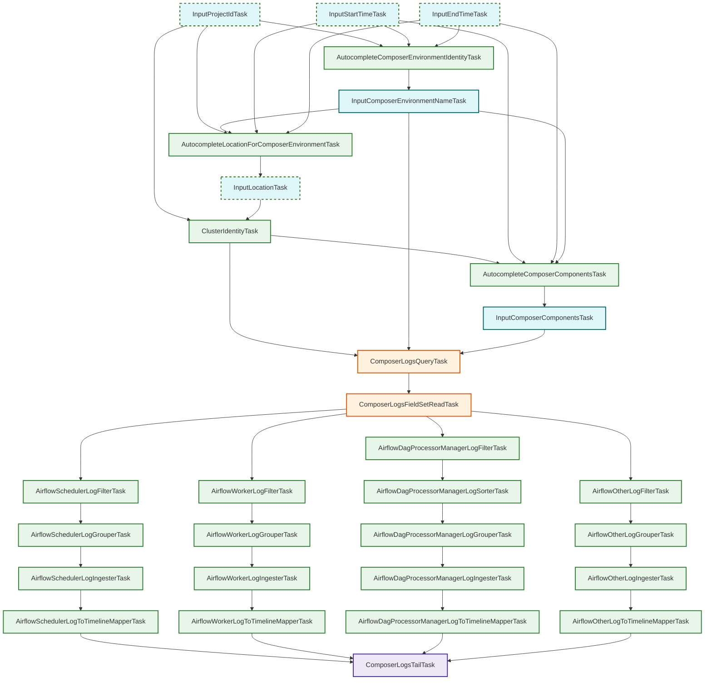

# Cloud Composer Inspection Tasks

This package (`googlecloudclustercomposer`) contains the tasks for inspecting Google Cloud Composer environments. It performs environment discovery, log fetching, filtering, parsing, and mapping into Kubernetes History Inspector (KHI) timeline events.

## Task Overview

The Composer inspection pipeline can be divided into four main phases:

1. **Discovery & Inputs**: Resolving the target Composer environment and the components the user wants to inspect.
2. **Log Fetching**: Querying Cloud Logging for the target log entries.
3. **Parsing & Mapping Pipelines**: Reading log fields and mapping them to KHI timeline events. The pipeline splits into parallel streams depending on the Airflow component (Scheduler, Worker, DAG Processor Manager, or Other fallback).
4. **Aggregation**: Unifying the pipelines into a final feature task sequence.

### 1. Discovery & Inputs

- **`AutocompleteComposerEnvironmentIdentityTask`**: Suggests available Composer environments.
- **`AutocompleteLocationForComposerEnvironmentTask`**: Suggests the location of the selected environment.
- **`InputComposerEnvironmentNameTask`**: Captures the user-selected environment name.
- **`AutocompleteComposerComponentsTask`**: Queries Cloud Monitoring (`logging.googleapis.com/log_entry_count`) to dynamically suggest available Airflow components (e.g. `scheduler`, `worker`, `dag-processor-manager`, `webserver`, etc.).
- **`InputComposerComponentsTask`**: Captures the user-selected components to inspect.

### 2. Log Fetching

- **`ComposerLogsQueryTask`**: Generates the Cloud Logging query based on input properties and fetches the raw logs.
- **`ComposerLogsFieldSetReadTask`**: Parses the raw logs into `ComposerFieldSet` structs to extract component names and IDs.

### 3. Parsing & Mapping Pipelines

Based on the `ComposerFieldSet`, logs are filtered into specific component streams. Each stream typically follows the pattern of:
`Filter` -> `[Sorter]` -> `Grouper` -> `Ingester` -> `Mapper`

- **Scheduler Pipeline**: Handles `airflow-scheduler` component logs.
  - Tasks: `AirflowSchedulerLogFilterTask`, `AirflowSchedulerLogGrouperTask`, `AirflowSchedulerLogIngesterTask`, `AirflowSchedulerLogToTimelineMapperTask`.
- **Worker Pipeline**: Handles `airflow-worker` component logs.
  - Tasks: `AirflowWorkerLogFilterTask`, `AirflowWorkerLogGrouperTask`, `AirflowWorkerLogIngesterTask`, `AirflowWorkerLogToTimelineMapperTask`.
- **Dag Processor Manager Pipeline**: Handles `airflow-dag-processor-manager` logs (requires sorting by time).
  - Tasks: `AirflowDagProcessorManagerLogFilterTask`, `AirflowDagProcessorManagerLogSorterTask`, `AirflowDagProcessorManagerLogGrouperTask`, `AirflowDagProcessorManagerLogIngesterTask`, `AirflowDagProcessorManagerLogToTimelineMapperTask`.
- **Other Pipeline (Fallback)**: Catches any component logs that do not match the above three (e.g., `webserver`, `triggerer`).
  - Tasks: `AirflowOtherLogFilterTask`, `AirflowOtherLogGrouperTask`, `AirflowOtherLogIngesterTask`, `AirflowOtherLogToTimelineMapperTask`.

### 4. Aggregation

- **`ComposerLogsTailTask`**: Collects the outputs of all `...LogToTimelineMapperTask` tasks to unify the Composer logs feature on the timeline.

## Task Relationship Diagram

The following Mermaid diagram illustrates the dependencies and data flow through the Composer inspection tasks.

