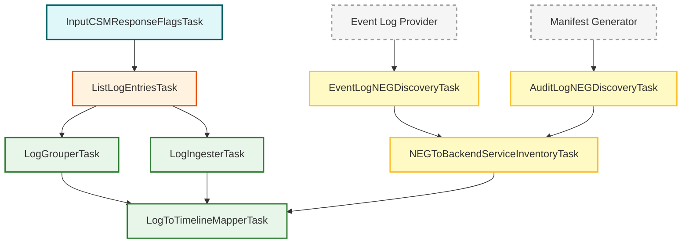

# Cloud Service Mesh (CSM) インスペクションタスク

このパッケージ (`googlecloudlogcsm`) は、Cloud Service Mesh (CSM) のトラフィックログを検査するためのタスクを含んでいます。ログのクエリ、Envoy 関連フィールドのパース、および KHI タイムラインイベントへのマッピングを処理します。

## タスクの概要

CSM インスペクションパイプラインは以下を処理します:

1. **入力**: Envoy レスポンスフラグなどのユーザー指定フィルターの取得。
2. **ログ取得**: Cloud Logging から CSM トラフィックログを取得。
3. **インベントリ**: Kubernetes Event ログおよび Audit ログから NEG (Network Endpoint Group) と BackendService のマッピングを抽出。
4. **パース & マッピング**: ログフィールドを読み取り、リソースタイムラインへマッピング。

### インベントリタスク

これらのタスクは、トラフィックログ内に直接存在しないものの、適切なリソースマッピングに必要な関連付けを発見するために使用されます。共通の Google Cloud コンポーネントおよびログプロバイダーパッケージから提供されます。

- **`EventLogNEGDiscoveryTask`** (`googlecloudlogk8sevent` 内): Kubernetes Event ログをパースして NEG と BackendService のマッピングを発見。
- **`AuditLogNEGDiscoveryTask`** (`googlecloudlogk8saudit` 内): Kubernetes Audit ログ (リソースマニフェスト経由) をパースして NEG と BackendService のマッピングを発見。
- **`NEGToBackendServiceInventoryTask`** (`googlecloudk8scommon` 内): 発見結果を統合された 1 つのインベントリマップに集約。

### CSM トラフィックログパイプライン

- **`InputCSMResponseFlagsTask`**: Envoy レスポンスフラグによるログフィルタリング用フォーム入力。
- **`ListLogEntriesTask`**: Cloud Logging から CSM トラフィックログを取得。
- **`LogIngesterTask`**: ログを最終的な KHI 履歴に登録。
- **`LogGrouperTask`**: レポーター Pod ごとにログをグループ化。
- **`LogToTimelineMapperTask`**: 正確なサービス関連付けのために NEG インベントリを利用して、CSM トラフィックログイベントをリソースタイムラインにマッピング。

## タスク関係図

