# Managed Airflow Private Inspection Tasks

This package (`privatecomposer`) contains internal tasks specifically for inspecting Managed Airflow environments. It extends the generic Composer and Kubernetes inspection capabilities by accommodating the Managed Airflow architecture, where Kubernetes resources reside in a Google-managed tenant project while Managed Airflow-specific logs reside in the customer project.

## Task Overview

The pipeline in this package acts as a discovery and override layer, and provides Cloud SQL log parsing for Managed Airflow environments. It can be divided into three main logical groups:

1. **Discovery & Inputs**: Resolving the Tenant Project ID, getting the Managed Airflow cluster name prefix, and autocompleting available cluster names using metrics from the tenant project.
2. **Cluster Identity Overrides**: Supplying the correct project identity depending on whether KHI is querying underlying Kubernetes logs (Tenant Project) or Managed Airflow-specific application logs (Customer Project).
3. **Cloud SQL Logs & Audit Logs (Tenant Project)**: Querying, parsing, and mapping Cloud SQL database engine logs (`postgres.log`, etc.) and Cloud SQL activity audit logs from the tenant project onto resource timelines.

## Task Relationship Diagram

The following Mermaid diagram illustrates the dependencies and data flows for the tasks implemented in this package.

```mermaid
graph TD
    classDef external fill:#fff,stroke-dasharray: 5 5,stroke:#333,stroke-width:2px;
    classDef feature fill:#fff,stroke:#8e24aa,stroke-width:2px;

    %% External Tasks
    ProjectIDInput[InputProjectIdTask]:::external
    StartTime[InputStartTimeTask]:::external
    EndTime[InputEndTimeTask]:::external
    LocationInput[InputLocationsTask]:::external
    MetricsTypeAuto[AutocompleteMetricsK8sContainerTask]:::external
    ClientFactory[APIClientFactoryTask]:::external
    CallOptionInjector[APIClientCallOptionsInjectorTask]:::external
    InputClusterName[InputClusterNameTask]:::external

    %% Current Package Tasks
    Justification[JustificationFormTask]:::external
    TenantProjectInput[InputComposerTenantProjectIdTask]
    PrefixTask[ComposerV3ClusterNamePrefixTask]
    ClusterAuto[AutocompleteComposerClusterNamesTask]
    ClusterIdentity[ClusterIdentityTask]:::feature
    ComposerIdentity[ComposerClusterIdentityTask]:::feature

    %% Cloud SQL Tasks
    CloudSQLQuery[CloudSQLLogsQueryTask]
    CloudSQLIngester[CloudSQLLogsIngesterTask]
    CloudSQLGrouper[CloudSQLLogsGrouperTask]
    CloudSQLMapper[CloudSQLLogsTimelineMapperTask]:::feature

    %% Cloud SQL Audit Tasks
    CloudSQLAuditQuery[CloudSQLAuditLogsQueryTask]
    CloudSQLAuditIngester[CloudSQLAuditLogsIngesterTask]
    CloudSQLAuditGrouper[CloudSQLAuditLogsGrouperTask]
    CloudSQLAuditMapper[CloudSQLAuditLogsTimelineMapperTask]:::feature

    %% Dependencies for Tenant Project Input
    ProjectIDInput --> TenantProjectInput
    Justification --> TenantProjectInput

    %% Dependencies for AutocompleteComposerClusterNames
    PrefixTask --> ClusterAuto
    TenantProjectInput --> ClusterAuto
    StartTime --> ClusterAuto
    EndTime --> ClusterAuto
    MetricsTypeAuto --> ClusterAuto
    ClientFactory --> ClusterAuto
    CallOptionInjector --> ClusterAuto

    %% Dependencies for ClusterIdentityTask (Generic K8s)
    TenantProjectInput --> ClusterIdentity
    InputClusterName --> ClusterIdentity
    LocationInput --> ClusterIdentity
    PrefixTask --> ClusterIdentity

    %% Dependencies for ComposerClusterIdentityTask (Composer Logs)
    ProjectIDInput --> ComposerIdentity
    LocationInput --> ComposerIdentity

    %% Dependencies for Cloud SQL Logs
    TenantProjectInput --> CloudSQLQuery
    CloudSQLQuery --> CloudSQLIngester
    CloudSQLQuery --> CloudSQLGrouper
    CloudSQLIngester --> CloudSQLMapper
    CloudSQLGrouper --> CloudSQLMapper
    TenantProjectInput --> CloudSQLMapper

    %% Dependencies for Cloud SQL Audit Logs
    TenantProjectInput --> CloudSQLAuditQuery
    CloudSQLAuditQuery --> CloudSQLAuditIngester
    CloudSQLAuditQuery --> CloudSQLAuditGrouper
    CloudSQLAuditIngester --> CloudSQLAuditMapper
    CloudSQLAuditGrouper --> CloudSQLAuditMapper
    TenantProjectInput --> CloudSQLAuditMapper
```

## Task Descriptions

### Discovery & Inputs

- **`InputComposerTenantProjectIdTask`**: Prompts the user to input the Managed Airflow tenant project ID (which must end with `-tp`). If KHI is opened via Google Admin, it validates IAM token availability.
- **`ComposerV3ClusterNamePrefixTask`**: Provides the prefix string for Managed Airflow cluster names. Currently, it returns an empty string.
- **`AutocompleteComposerClusterNamesTask`**: Queries the Cloud Monitoring API in the tenant project to suggest available Kubernetes cluster names based on `k8s_container` metrics.

### Cluster Identity Overrides

- **`ClusterIdentityTask`**: Overrides the standard `googlecloudk8scommon` cluster identity to ensure generic Kubernetes logs (e.g., Pods, Nodes) are read from the **Tenant Project ID**.
- **`ComposerClusterIdentityTask`**: Overrides the `googlecloudclustercomposer` cluster identity to ensure Managed Airflow-specific queries (e.g., Scheduler, Worker logs) are read from the original **Customer Project ID**.

### Cloud SQL Logs (Tenant Project)

- **`CloudSQLLogsQueryTask`**: Queries Cloud SQL database engine logs (`postgres.log`, `postgres-audit.log`, `postgres-upgrade.log`) from the tenant project.
- **`CloudSQLLogsTimelineMapperTask`**: Parses and maps Cloud SQL database engine logs to database instance and log file timelines.
- **`CloudSQLAuditLogsQueryTask`**: Queries Cloud SQL activity audit logs (`cloudaudit.googleapis.com/activity`) from the tenant project.
- **`CloudSQLAuditLogsTimelineMapperTask`**: Tracks Cloud SQL instance operations and lifecycle revisions (e.g., creation, deletion) on instance timelines.
