# Managed Airflow プライベート検査タスク

このパッケージ（`privatecomposer`）には、Managed Airflow 環境を検査するための内部タスクが含まれています。Kubernetes リソースが Google 管理のテナントプロジェクトに配置され、Managed Airflow 固有のログがカスタマープロジェクトに配置される Managed Airflow のアーキテクチャに対応することで、汎用的な Composer および Kubernetes 検査機能を拡張します。

## タスクの概要

このパッケージのパイプラインはディスカバリーおよびオーバーライド層として機能し、さらに Managed Airflow 環境向けの Cloud SQL ログ解析を提供します。主に以下の3つのグループに分かれます。

1. **ディスカバリーと入力**: テナントプロジェクト ID の解決、Managed Airflow クラスター名のプレフィックス取得、およびテナントプロジェクトのメトリクスを使用したクラスター名の自動補完。
2. **クラスター ID のオーバーライド**: 基盤の Kubernetes ログ（テナントプロジェクト）または Managed Airflow 固有のアプリケーションログ（カスタマープロジェクト）のどちらをクエリするかに応じて、適切なプロジェクト ID を提供。
3. **Cloud SQL ログ・監査ログ（テナントプロジェクト）**: テナントプロジェクトからの Cloud SQL データベースエンジンログ（`postgres.log` など）および Cloud SQL アクティビティ監査ログのクエリ、解析、タイムラインへのマッピング。

## タスク関係図

以下の Mermaid 図は、このパッケージで実装されているタスクの依存関係とデータフローを示しています。

```mermaid
graph TD
    classDef external fill:#fff,stroke-dasharray: 5 5,stroke:#333,stroke-width:2px;
    classDef feature fill:#fff,stroke:#8e24aa,stroke-width:2px;

    %% External Tasks
    ProjectIDInput[InputProjectIdTask]:::external
    StartTime[InputStartTimeTask]:::external
    EndTime[InputEndTimeTask]:::external
    LocationInput[InputLocationsTask]:::external
    MetricsTypeAuto[AutocompleteMetricsK8sContainerTask]:::external
    ClientFactory[APIClientFactoryTask]:::external
    CallOptionInjector[APIClientCallOptionsInjectorTask]:::external
    InputClusterName[InputClusterNameTask]:::external

    %% Current Package Tasks
    Justification[JustificationFormTask]:::external
    TenantProjectInput[InputComposerTenantProjectIdTask]
    PrefixTask[ComposerV3ClusterNamePrefixTask]
    ClusterAuto[AutocompleteComposerClusterNamesTask]
    ClusterIdentity[ClusterIdentityTask]:::feature
    ComposerIdentity[ComposerClusterIdentityTask]:::feature

    %% Cloud SQL Tasks
    CloudSQLQuery[CloudSQLLogsQueryTask]
    CloudSQLIngester[CloudSQLLogsIngesterTask]
    CloudSQLGrouper[CloudSQLLogsGrouperTask]
    CloudSQLMapper[CloudSQLLogsTimelineMapperTask]:::feature

    %% Cloud SQL Audit Tasks
    CloudSQLAuditQuery[CloudSQLAuditLogsQueryTask]
    CloudSQLAuditIngester[CloudSQLAuditLogsIngesterTask]
    CloudSQLAuditGrouper[CloudSQLAuditLogsGrouperTask]
    CloudSQLAuditMapper[CloudSQLAuditLogsTimelineMapperTask]:::feature

    %% Dependencies for Tenant Project Input
    ProjectIDInput --> TenantProjectInput
    Justification --> TenantProjectInput

    %% Dependencies for AutocompleteComposerClusterNames
    PrefixTask --> ClusterAuto
    TenantProjectInput --> ClusterAuto
    StartTime --> ClusterAuto
    EndTime --> ClusterAuto
    MetricsTypeAuto --> ClusterAuto
    ClientFactory --> ClusterAuto
    CallOptionInjector --> ClusterAuto

    %% Dependencies for ClusterIdentityTask (Generic K8s)
    TenantProjectInput --> ClusterIdentity
    InputClusterName --> ClusterIdentity
    LocationInput --> ClusterIdentity
    PrefixTask --> ClusterIdentity

    %% Dependencies for ComposerClusterIdentityTask (Composer Logs)
    ProjectIDInput --> ComposerIdentity
    LocationInput --> ComposerIdentity

    %% Dependencies for Cloud SQL Logs
    TenantProjectInput --> CloudSQLQuery
    CloudSQLQuery --> CloudSQLIngester
    CloudSQLQuery --> CloudSQLGrouper
    CloudSQLIngester --> CloudSQLMapper
    CloudSQLGrouper --> CloudSQLMapper
    TenantProjectInput --> CloudSQLMapper

    %% Dependencies for Cloud SQL Audit Logs
    TenantProjectInput --> CloudSQLAuditQuery
    CloudSQLAuditQuery --> CloudSQLAuditIngester
    CloudSQLAuditQuery --> CloudSQLAuditGrouper
    CloudSQLAuditIngester --> CloudSQLAuditMapper
    CloudSQLAuditGrouper --> CloudSQLAuditMapper
    TenantProjectInput --> CloudSQLAuditMapper
```

## タスクの説明

### ディスカバリーと入力

- **`InputComposerTenantProjectIdTask`**: Managed Airflow テナントプロジェクト ID（末尾が `-tp` である必要があります）の入力を求めます。KHI が Google Admin から開かれた場合、IAM トークンの有効性を検証します。
- **`ComposerV3ClusterNamePrefixTask`**: Managed Airflow クラスター名のプレフィックス文字列を提供します。現在は空文字列を返します。
- **`AutocompleteComposerClusterNamesTask`**: テナントプロジェクト内の Cloud Monitoring API にクエリを実行し、`k8s_container` メトリクスに基づいて利用可能な Kubernetes クラスター名を提案します。

### クラスター ID のオーバーライド

- **`ClusterIdentityTask`**: 標準の `googlecloudk8scommon` クラスター ID をオーバーライドし、汎用 Kubernetes ログ（Pod、Node など）が**テナントプロジェクト ID** から読み取られるようにします。
- **`ComposerClusterIdentityTask`**: `googlecloudclustercomposer` クラスター ID をオーバーライドし、Managed Airflow 固有のクエリ（Scheduler、Worker ログなど）が元の**カスタマープロジェクト ID** から読み取られるようにします。

### Cloud SQL ログ（テナントプロジェクト）

- **`CloudSQLLogsQueryTask`**: テナントプロジェクトから Cloud SQL データベースエンジンログ（`postgres.log`、`postgres-audit.log`、`postgres-upgrade.log`）をクエリします。
- **`CloudSQLLogsTimelineMapperTask`**: Cloud SQL データベースエンジンログを解析し、データベースインスタンスおよびログファイルのタイムラインにマッピングします。
- **`CloudSQLAuditLogsQueryTask`**: テナントプロジェクトから Cloud SQL アクティビティ監査ログ（`cloudaudit.googleapis.com/activity`）をクエリします。
- **`CloudSQLAuditLogsTimelineMapperTask`**: Cloud SQL インスタンスの操作およびライフサイクルの変更（作成、削除など）をインスタンスタイムライン上で追跡します。
