# Managed Airflow 3 Private Inspection Tasks

This package (`privatecomposerv3`) contains internal tasks specifically for inspecting Managed Airflow 3 environments. It extends the generic Composer and Kubernetes inspection capabilities by accommodating the Managed Airflow 3 architecture, where Kubernetes resources reside in a Google-managed tenant project while Managed Airflow 3-specific logs reside in the customer project.

## Task Overview

The pipeline in this package acts as a discovery and override layer. It can be divided into two main logical groups:

1. **Discovery & Inputs**: Resolving the Tenant Project ID, getting the Managed Airflow 3 cluster name prefix, and autocompleting available cluster names using metrics from the tenant project.
2. **Cluster Identity Overrides**: Supplying the correct project identity depending on whether KHI is querying underlying Kubernetes logs (Tenant Project) or Managed Airflow 3-specific application logs (Customer Project).

## Task Relationship Diagram

The following Mermaid diagram illustrates the dependencies and data flows for the tasks implemented in this package.

```mermaid
graph TD
    classDef external fill:#fff,stroke-dasharray: 5 5,stroke:#333,stroke-width:2px;
    classDef feature fill:#fff,stroke:#8e24aa,stroke-width:2px;

    %% External Tasks
    ProjectIDInput[InputProjectIdTask]:::external
    StartTime[InputStartTimeTask]:::external
    EndTime[InputEndTimeTask]:::external
    LocationInput[InputLocationsTask]:::external
    MetricsTypeAuto[AutocompleteMetricsK8sContainerTask]:::external
    ClientFactory[APIClientFactoryTask]:::external
    CallOptionInjector[APIClientCallOptionsInjectorTask]:::external
    InputClusterName[InputClusterNameTask]:::external

    %% Current Package Tasks
    Justification[JustificationFormTask]:::external
    TenantProjectInput[InputComposerV3TenantProjectIdTask]
    PrefixTask[ComposerV3ClusterNamePrefixTask]
    ClusterAuto[AutocompleteComposerClusterNamesTask]
    ClusterIdentity[ClusterIdentityTask]:::feature
    ComposerIdentity[ComposerClusterIdentityTask]:::feature

    %% Dependencies for Tenant Project Input
    ProjectIDInput --> TenantProjectInput
    Justification --> TenantProjectInput

    %% Dependencies for AutocompleteComposerClusterNames
    PrefixTask --> ClusterAuto
    TenantProjectInput --> ClusterAuto
    StartTime --> ClusterAuto
    EndTime --> ClusterAuto
    MetricsTypeAuto --> ClusterAuto
    ClientFactory --> ClusterAuto
    CallOptionInjector --> ClusterAuto

    %% Dependencies for ClusterIdentityTask (Generic K8s)
    TenantProjectInput --> ClusterIdentity
    InputClusterName --> ClusterIdentity
    LocationInput --> ClusterIdentity
    PrefixTask --> ClusterIdentity

    %% Dependencies for ComposerClusterIdentityTask (Composer Logs)
    ProjectIDInput --> ComposerIdentity
    LocationInput --> ComposerIdentity
```

## Task Descriptions

### Discovery & Inputs

- **`InputComposerV3TenantProjectIdTask`**: Prompts the user to input the Managed Airflow 3 tenant project ID (which must end with `-tp`). If KHI is opened via Google Admin, it validates IAM token availability.
- **`ComposerV3ClusterNamePrefixTask`**: Provides the prefix string for Managed Airflow 3 cluster names. Currently, it returns an empty string.
- **`AutocompleteComposerClusterNamesTask`**: Queries the Cloud Monitoring API in the tenant project to suggest available Kubernetes cluster names based on `k8s_container` metrics.

### Cluster Identity Overrides

- **`ClusterIdentityTask`**: Overrides the standard `googlecloudk8scommon` cluster identity to ensure generic Kubernetes logs (e.g., Pods, Nodes) are read from the **Tenant Project ID**.
- **`ComposerClusterIdentityTask`**: Overrides the `googlecloudclustercomposer` cluster identity to ensure Managed Airflow 3-specific queries (e.g., Scheduler, Worker logs) are read from the original **Customer Project ID**.
