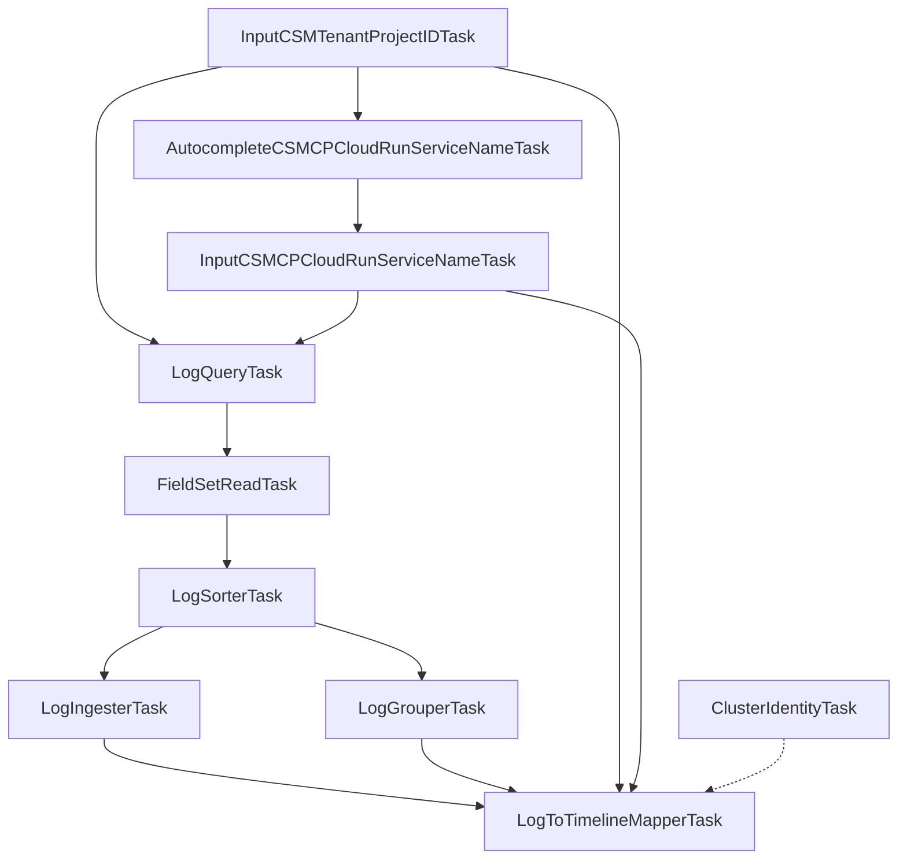

# privatecsmcp

The `privatecsmcp` package is responsible for fetching, parsing, and visualizing Cloud Service Mesh (CSM) Control Plane logs as a timeline in the Kubernetes History Inspector (KHI).

## Directory Structure

- `contract/`: Contains interfaces, constants, and type definitions that are depended on by other packages or the `impl` directory.
  - `taskid.go`: Task ID definitions provided by this package.
  - `revision_state.go`: Definitions of revision states displayed on the timeline (e.g., connection establishment states).
  - `timeline.go`, `timeline_type.go`: Helper functions for timeline hierarchy retrieval and timeline type definitions.
  - `fieldset.go`: Struct definitions for data extracted from logs and identifier parsing logic (e.g., Pod names).
  - `log_type.go`: Constant definitions for identifying the types of logs to be parsed.
- `impl/`: Contains the actual implementations of tasks that fetch, parse, and build timelines based on the definitions in `contract`.
  - `registration.go`: The entry point that registers all defined tasks to KHI's Inspection Task Registry.
  - `form_task.go`: Form tasks that receive user inputs for "CSM Tenant Project ID" and "Cloud Run Service Name" and perform validation.
  - `query_task.go`: The task that executes a query against Cloud Logging to fetch the relevant CSM CP logs.
  - `parser_tasks.go`: Implementations of data processing tasks (`LogSorterTask`, `LogIngesterTask`, `LogGrouperTask`, `LogToTimelineMapperTask`) that parse fetched logs and map them as timeline events.

## Role and Data Flow

1. **Form Input (`form_task.go`)**  
   On the KHI UI, the user inputs the CSM Tenant Project ID and the target Cloud Run Service Name (input validation and autocomplete are also handled here).
2. **Log Query (`query_task.go`)**  
   Based on the input parameters, it searches and fetches the corresponding CSM CP logs (e.g., xDS connection logs) from Cloud Logging.
3. **Data Processing & Timeline Generation (`parser_tasks.go`)**  
   - `LogSorterTask`: Sorts the fetched logs into precise chronological order (by occurrence time).
   - `LogIngesterTask`: Parses individual log messages and extracts them as history information (`LogChangeSet`) representing state changes.
   - `LogGrouperTask`: Groups the parsed log information by the target Cloud Run instance, Pod, and connection.
   - `LogToTimelineMapperTask`: Maps and places the grouped history information into the final KHI timeline hierarchy.

## Task Graph

The following Mermaid diagram illustrates the task dependencies within the `privatecsmcp` package:

## Log Parsing and Timeline Mapping Rules

### Target Logs

The package queries `run.googleapis.com/stdout` and `run.googleapis.com/stderr` logs from Cloud Run revisions running within the specified CSM Tenant Project.

### Mapping Conditions

1. **Cloud Run Instance Timeline**
   - **Condition**: All successfully parsed logs matching the CSM CP Cloud Run Service Name.
   - **Action**: An event is added to the respective Cloud Run Instance timeline.

2. **Pod Timeline**
   - **Condition**: The log must be an **xDS log**. An xDS log is identified if its text payload starts with an upper-case prefix followed by a colon (e.g., `ADS:`, `CDS:`). Additionally, the log must contain extractable Pod identifiers, and the K8s cluster name must be resolved.
   - **Action**: An event is added to the CSM CP Pod Log timeline under the specific Pod's hierarchy.

3. **Connection Timeline**
   - **Condition**: The log must be an xDS log that contains a valid Connection ID associated with a Pod.
   - **Actions**:
     - If the log message contains `"new connection for"`, a `Connected` revision state is added to the Connection's timeline.
     - If the log message contains `"terminated"`, a `Terminated` revision state is added. If this is the first time the connection is seen (meaning no prior `"new connection for"` log was found in the fetched time window), a `ConnectedLogNotFound` revision state is inserted at the beginning of the timeline (epoch time) to indicate the connection was established before the queried logs.

### Timeline Hierarchy

The timelines generated by this package are mapped into the following hierarchical structures within KHI:

1. **Cloud Run Service Instance Hierarchy**
   - GCP Project (`<Tenant Project ID>`)
     - Cloud Run Service (`<Service Name>`)
       - Cloud Run Service Instance (`<Instance ID>`)

2. **CSM CP Pod and Connection Hierarchy**
   - Kubernetes Cluster (`<Cluster Name>`)
     - API Version (`core/v1`)
       - Kind (`pod`)
         - Namespace (`<Namespace>`)
           - Pod (`<Pod Name>`)
             - CSM CP (Pod Log Timeline)
             - connection-`<Connection ID>` (Connection Timeline)
