# Private GKE Master Inspection Tasks

This package (`privategkemaster`) provides internal tasks for analyzing Google Kubernetes Engine (GKE) Master (Control Plane) logs from the tenant project. It retrieves logs via a provided standard master log link and processes them into KHI timeline events.

## Task Overview / Pipeline Description

The Private GKE Master inspection pipeline is designed to extract control plane logs (like `kube-apiserver`, `kube-scheduler`, `kube-controller-manager`, `kubelet`, and `containerd`) and can be divided into four logical phases:

1. **Discovery & Inputs**: Collecting the necessary inputs to perform the queries. It requires a Google Cloud Pantheon link to the master logs (from which the tenant project ID is derived) and an optional component filter.
2. **Log Fetching**: Generating Cloud Logging queries based on the provided inputs and executing them to fetch raw logs. It also initializes the log ingester.
3. **Parsing & Mapping Pipelines**: The pipeline splits into parallel streams depending on the parsed master component:
   - **Scheduler**: Processes `kube-scheduler` logs.
   - **Controller Manager**: Processes `kube-controller-manager` and `cloud-controller-manager` logs.
   - **Kubelet**: Processes `kubelet` logs.
   - **Containerd**: Processes container runtime logs and executes additional discovery tasks for container IDs and Pod sandbox IDs.
   - **Other**: A fallback pipeline for any remaining components.
4. **Aggregation**: `TailTask` waits for all mapping components to finish and unifies the events on the timeline under the feature label.

## Task Relationship Diagram

```mermaid
graph TD
    classDef external fill:#fff,stroke-dasharray: 5 5,stroke:#333,stroke-width:2px;
    classDef feature fill:#fff,stroke:#8e24aa,stroke-width:2px;

    %% External Tasks
    ClusterIdentity[ClusterIdentityTask]:::external
    Justification[JustificationFormTask]:::external
    ContainerIDPatternFinder[ContainerIDPatternFinderTask]:::external

    %% Inputs
    LogSource[InputGKEMasterLogSourceTask]
    ComponentFilter[InputPrivateGKEMasterComponentNameFilterTask]

    %% Log Fetching
    ListLogEntries[ListLogEntriesTask]
    LogIngester[LogIngesterTask]

    %% Pipelines
    %% Scheduler
    SchedFilter[SchedulerLogFilterTask]
    SchedGrouper[SchedulerLogGrouperTask]
    SchedMapper[SchedulerLogToTimelineMapperTask]

    %% Controller Manager
    CtrlFilter[ControllerManagerLogFilterTask]
    CtrlGrouper[ControllerManagerGrouperTask]
    CtrlMapper[ControllerManagerLogToTimelineMapperTask]

    %% Kubelet
    KubeletFilter[KubeletLogFilterTask]
    KubeletGrouper[KubeletLogGroupTask]
    KubeletMapper[KubeletLogLogToTimelineMapperTask]

    %% Containerd
    ContFilter[ContainerdLogFilterTask]
    ContGrouper[ContainerdLogGroupTask]
    ContPodSandboxDiscovery[PodSandboxIDDiscoveryTask]
    ContIDDiscovery[ContainerIDDiscoveryTask]
    ContMapper[ContainerdLogLogToTimelineMapperTask]

    %% Other
    OtherFilter[OtherLogFilterTask]
    OtherGrouper[OtherGrouperTask]
    OtherMapper[OtherLogToTimelineMapperTask]

    %% Tail
    Tail[TailTask]:::feature

    %% Dependencies
    ClusterIdentity --> LogSource
    Justification --> LogSource

    LogSource --> ListLogEntries
    ComponentFilter --> ListLogEntries

    ListLogEntries --> LogIngester

    %% Pipeline Routes
    ListLogEntries --> SchedFilter
    SchedFilter --> SchedGrouper
    SchedGrouper --> SchedMapper
    LogIngester --> SchedMapper

    ListLogEntries --> CtrlFilter
    CtrlFilter --> CtrlGrouper
    CtrlGrouper --> CtrlMapper
    LogIngester --> CtrlMapper

    ListLogEntries --> KubeletFilter
    KubeletFilter --> KubeletGrouper
    KubeletGrouper --> KubeletMapper
    LogIngester --> KubeletMapper

    ListLogEntries --> ContFilter
    ContFilter --> ContGrouper
    ContFilter --> ContPodSandboxDiscovery
    ContFilter --> ContIDDiscovery
    ContGrouper --> ContMapper
    ContPodSandboxDiscovery --> ContMapper
    ContainerIDPatternFinder --> ContMapper
    LogIngester --> ContMapper

    ListLogEntries --> OtherFilter
    OtherFilter --> OtherGrouper
    OtherGrouper --> OtherMapper
    LogIngester --> OtherMapper

    %% Aggregation
    SchedMapper --> Tail
    CtrlMapper --> Tail
    KubeletMapper --> Tail
    ContMapper --> Tail
    OtherMapper --> Tail
```

## Task Descriptions

### Inputs & Log Fetching

- **`InputGKEMasterLogSourceTask`**: Prompts the user to provide a Pantheon link to the GKE Master logs (resolves tenant project ID, log view).
- **`InputPrivateGKEMasterComponentNameFilterTask`**: Allows the user to filter logs by specific master components (e.g., `kube-apiserver`, `kube-scheduler`).
- **`ListLogEntriesTask`**: A standard query task to interact with Cloud Logging API and list master logs based on inputs.
- **`LogIngesterTask`**: Marks matching core logs for inclusion into the final KHI output dataset.

### Parse & Map / Modifiers

#### Scheduler

- **`SchedulerLogFilterTask`**: Filters incoming logs for `kube-scheduler` component types.
- **`SchedulerLogGrouperTask`**: Groups scheduler logs together.
- **`SchedulerLogToTimelineMapperTask`**: Maps scheduler logs into corresponding KHI timeline events related to Pod scheduling.

#### Controller Manager

- **`ControllerManagerLogFilterTask`**: Filters logs for `kube-controller-manager` and `cloud-controller-manager`.
- **`ControllerManagerGrouperTask`**: Groups controller manager logs.
- **`ControllerManagerLogToTimelineMapperTask`**: Maps controller manager logs to timeline events.

#### Kubelet

- **`KubeletLogFilterTask`**: Filters logs for `kubelet`.
- **`KubeletLogGroupTask`**: Groups kubelet logs by the target node and specific operations.
- **`KubeletLogLogToTimelineMapperTask`**: Maps kubelet operation logs to timeline events.

#### Containerd

- **`ContainerdLogFilterTask`**: Filters logs for the `containerd` runtime component.
- **`ContainerdLogGroupTask`**: Groups containerd logs by host and pod ID.
- **`PodSandboxIDDiscoveryTask`**: Discovers Pod Sandbox IDs and mappings by scanning containerd traces for `RunPodSandbox` logs.
- **`ContainerIDDiscoveryTask`**: Discovers Container IDs related to Pod sandboxes by scanning for `CreateContainer` logs.
- **`ContainerdLogLogToTimelineMapperTask`**: Uses Sandbox and Container ID mappings to map containerd trace details into correctly anchored pod and container timeline items.

#### Other (Fallback)

- **`OtherLogFilterTask`**: Filters all remaining master component logs that fall out of the prior specialized categories.
- **`OtherGrouperTask`**: Groups fallback logs.
- **`OtherLogToTimelineMapperTask`**: Maps miscellaneous component logs to timeline events.

### Aggregation

- **`TailTask`**: A trailing aggregator task that ensures all specific component mapper tasks (`SchedulerLogToTimelineMapperTask`, `ControllerManagerLogToTimelineMapperTask`, etc.) are completed and bounds the feature with the standard UI Label.
